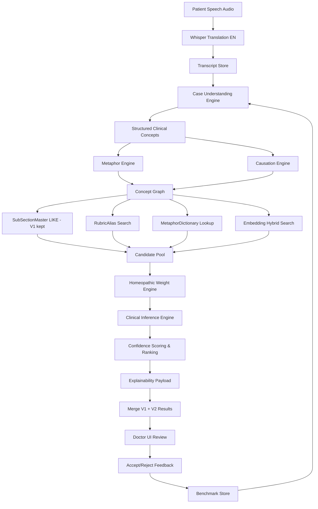

# HomeoCentrum — Audio Case Taking AI Engine V2
## Enterprise Architecture & Implementation Plan (Review Document)

**Status:** Architecture review — decisions **LOCKED** in approval pack (see below)  
**Version:** 2.0-approved-decisions  
**Date:** June 2026  
**Applies to:** New_API + NigaHomeopathy-UI + HomeoCentrum_Production DB  
**Goal:** Raise rubric suggestion accuracy from ~65–70% to **95%+** (stretch 98%)  
**Constraint:** **Zero breaking changes** to existing APIs, UI flows, and current LIKE-based matching

> **APPROVED DECISIONS:** See `AUDIO_CASE_TAKING_AI_ENGINE_V2_APPROVAL_PACK.md` for locked stakeholder decisions (manual approval only, JSON embeddings, Kent+Complete first, all doctors rollout, 250 gold cases, full admin UI, dual 95% metrics). **No implementation until Section 14 sign-off is complete.**

---

## Table of Contents

1. [Executive Summary](#1-executive-summary)
2. [Current State Analysis](#2-current-state-analysis)
3. [Root Cause of Clinical Errors](#3-root-cause-of-clinical-errors)
4. [Target Architecture Overview](#4-target-architecture-overview)
5. [Design Principles & Compatibility Contract](#5-design-principles--compatibility-contract)
6. [Phase 1 — Case Understanding Engine](#6-phase-1--case-understanding-engine)
7. [Phase 2 — Metaphor Interpretation Engine](#7-phase-2--metaphor-interpretation-engine)
8. [Phase 3 — Causation Engine](#8-phase-3--causation-engine)
9. [Phase 4 — Rubric Alias Database](#9-phase-4--rubric-alias-database)
10. [Phase 5 — Hybrid Embedding Search](#10-phase-5--hybrid-embedding-search)
11. [Phase 6 — Homeopathic Weight Engine](#11-phase-6--homeopathic-weight-engine)
12. [Phase 7 — Clinical Inference Rubrics](#12-phase-7--clinical-inference-rubrics)
13. [Phase 8 — Doctor Explainability (UI)](#13-phase-8--doctor-explainability-ui)
14. [Phase 9 — Advanced Repertory Matching](#14-phase-9--advanced-repertory-matching)
15. [Phase 10 — Accuracy Benchmarking](#15-phase-10--accuracy-benchmarking)
16. [Database Schema (New Tables)](#16-database-schema-new-tables)
17. [API Changes (Backward Compatible)](#17-api-changes-backward-compatible)
18. [Backend Service Architecture](#18-backend-service-architecture)
19. [AI Prompt Library Strategy](#19-ai-prompt-library-strategy)
20. [Frontend UI Enhancements](#20-frontend-ui-enhancements)
21. [Migration Scripts Plan](#21-migration-scripts-plan)
22. [Testing Strategy](#22-testing-strategy)
23. [Security, Safety & Audit](#23-security-safety--audit)
24. [Performance & Cost Model](#24-performance--cost-model)
25. [Impacted Files Matrix](#25-impacted-files-matrix)
26. [Phased Implementation Roadmap](#26-phased-implementation-roadmap)
27. [Success Metrics & Acceptance Criteria](#27-success-metrics--acceptance-criteria)
28. [Risks & Mitigations](#28-risks--mitigations)
29. [Open Decisions for Stakeholder Approval](#29-open-decisions-for-stakeholder-approval)

---

## 1. Executive Summary

The current Audio Case Taking module successfully delivers transcription, conversation, summary, and basic rubric suggestions. Its **weakness is rubric intelligence**: the engine behaves like a **keyword search** over English `SubSectionMaster.SubSectionName`, not like an experienced homeopath.

**V2 introduces a parallel, enterprise-grade reasoning stack** that sits **beside** (not instead of) the existing pipeline:

```
Existing V1 Pipeline (preserved)
  Whisper → GPT extraction → LIKE + Jaccard → top 20

New V2 Intelligence Stack (additive)
  Case Understanding → Metaphor → Causation → Alias/Embedding retrieval
  → Homeopathic weighting → Clinical inference → Explainable ranking
  → Merge with V1 → Doctor review → Benchmark feedback loop
```

Rollout is **feature-flagged** (`EnableRubricIntelligenceV2`) so production remains stable while V2 is validated against doctor acceptance data.

---

## 2. Current State Analysis

### 2.1 What Exists Today (V1)

| Layer | Implementation | Location |
|-------|------------------|----------|
| Audio upload & session | Full | `AudioCaseTakingService`, 7 audit tables |
| English translation | Whisper `/audio/translations` | `AudioCaseAiProcessor` |
| Symptom extraction | GPT-4o JSON | `ExtractCaseDataAsync` |
| DB rubric search | `LIKE '%term%'` on `SubSectionName` | `SubSectionRepository.SearchSubSectionsByHotspotAsync` |
| Semantic score | Jaccard token overlap (local, not embeddings) | `ComputeTextSimilarity` |
| AI fallback rubrics | GPT when DB match low | `SuggestAiRubricsAsync`, negative SubSectionId |
| Auto repertorization | Up to 20 rubrics | `AudioCasePanel.js` |
| Audit | Event, AI request, rubric match, doctor action logs | SQL tables |

### 2.2 Current Scoring (V1)

```
keywordScore = 0.75 (if LIKE matched)
semanticScore = Jaccard(symptomPhrase, subSectionName)
finalScore = 0.75 × 0.6 + semanticScore × 0.4
```

**Problem:** Both inputs are surface strings. No clinical meaning, no causation, no SRP weighting, no metaphor resolution.

### 2.3 Accuracy Ceiling of V1

Estimated **65–70%** doctor acceptance for real Indian multilingual cases because:

- Patients speak in **symptom language**, not **repertory language**
- **Metaphors** map to wrong anatomical rubrics (vibration → BACK-VIBRATION)
- **Causation chains** (anger → convulsion) are lost
- **No alias layer** beyond exact substring of English rubric name
- **No embedding** semantic search across repertory
- **No homeopathic hierarchy** (SRP > mental > general > particular)

---

## 3. Root Cause of Clinical Errors

### Example (from requirements)

**Patient (translated):**  
*"10 seconds before the fit, vibration starts in my hands."*

| V1 behavior | V2 expected behavior |
|-------------|----------------------|
| Extract: `vibration`, `fit`, `hands` | Understand: **aura before convulsion**, motor warning, epileptic prodrome |
| LIKE `vibration` → BACK-VIBRATION, CHEST-VIBRATION | Rank: **GENERALITIES-CONVULSIONS-AURA**, **EXTREMITIES-DROPPING THINGS**, **MIND-FEAR-CONVULSIONS** |
| Clinically wrong anatomical matches | Clinically reasoned homeopathic rubrics |

**Core insight:** Rubric selection is a **clinical reasoning problem**, not a string matching problem.

---

## 4. Target Architecture Overview

### 4.1 High-Level Pipeline (V2)



### 4.2 New Orchestrator (Backend)

**New class:** `RubricIntelligenceOrchestrator`  
**Invoked from:** `AudioCaseTakingService.RunExtractionAndRubricsAsync` when `EnableRubricIntelligenceV2 = true`

```csharp
// Pseudocode — backward compatible
var v1Rubrics = await MatchRubricsV1Async(...);  // existing method renamed/wrapped
if (!_options.EnableRubricIntelligenceV2)
    return v1Rubrics;

var v2Result = await _rubricIntelligenceOrchestrator.AnalyzeAsync(session, transcript, extraction);
return RubricResultMerger.Merge(v1Rubrics, v2Result, maxCount: 20);
```

V1 always runs. V2 **enhances and re-ranks**; if V2 fails, V1 result is returned unchanged.

---

## 5. Design Principles & Compatibility Contract

| Rule | Implementation |
|------|----------------|
| No API removal | All existing endpoints unchanged |
| No response breaking | Add optional fields to `AudioCaseSuggestedRubricModel` |
| V1 fallback | Feature flag off = current behavior exactly |
| SOLID | One engine interface per phase; orchestrator coordinates |
| DI | All engines registered in `ApplicationServiceExtensions` |
| Audit everything | New `AudioCaseIntelligenceLog` table per stage |
| Doctor in control | No auto-accept without review option (configurable) |
| Safety | Confidence thresholds; low-confidence rubrics marked "Review required" |

### 5.1 Extended DTO (Backward Compatible Additions)

```csharp
public class AudioCaseSuggestedRubricModel
{
    // EXISTING — unchanged
    public int SubSectionId { get; set; }
    public string SubSectionName { get; set; }
    public decimal MatchScore { get; set; }
    public bool IsAiSuggested { get; set; }

    // NEW V2 — optional, ignored by old UI
    public decimal ConfidenceScore { get; set; }
    public string? RubricTier { get; set; }           // Primary | Secondary | Confirmatory | Inference
    public string? PatientStatement { get; set; }
    public string? ClinicalMeaning { get; set; }
    public string? HomeopathicMeaning { get; set; }
    public string? WhySuggested { get; set; }
    public string? MatchLayer { get; set; }           // Database | Alias | Metaphor | Embedding | Inference
    public string? CausationChain { get; set; }
    public decimal HomeopathicWeight { get; set; }
    public bool RequiresDoctorReview { get; set; }
}
```

Old React components continue to work; new UI reads extended fields when present.

---

## 6. Phase 1 — Case Understanding Engine

### 6.1 Purpose

Transform raw transcript fragments into **clinically interpreted concepts** before any rubric search.

### 6.2 Service

**Interface:** `ICaseUnderstandingEngine`  
**Implementation:** `CaseUnderstandingEngine`  
**Input:** English transcript + GPT extraction (symptoms, summary)  
**Output:** `List<ClinicalConceptModel>`

```json
{
  "conceptId": "guid",
  "rawStatement": "10 seconds before fit vibration starts in hands",
  "clinicalMeaning": "Prodromal aura with sensory warning before convulsive episode; begins in extremities",
  "homeopathicMeaning": "Aura before convulsion; peculiar warning symptom; SRP candidate",
  "category": "general|mental|particular|modality|concomitant",
  "isStrangeRarePeculiar": true,
  "modalities": ["before attack"],
  "concomitants": [],
  "sequence": ["aura", "then convulsion"],
  "confidence": 0.94,
  "sourceLanguage": "en",
  "originalPhrase": "..."
}
```

### 6.3 AI Strategy

- **Primary:** GPT-4o structured JSON with homeopathic physician system prompt
- **Validation:** JSON schema enforcement; reject empty clinicalMeaning
- **Caching:** Hash transcript segment → cache in `AudioCaseConceptCache` (optional Phase 1.1)

### 6.4 Detectors Inside Engine

| Detector | Output |
|----------|--------|
| Hidden symptom detector | Implied symptoms not literally spoken |
| Emotional meaning | Fear, anxiety, grief beneath physical complaint |
| Causation hints | "after anger", "since loss" |
| Modality detector | better/worse, time, weather |
| Peculiar symptom flag | SRP marking |
| Concomitant linker | symptoms occurring together |
| Event sequence | before/during/after ordering |

### 6.5 Deliverables

- `CaseUnderstandingEngine.cs`
- `ClinicalConceptModel.cs`
- Prompt template `Prompts/CaseUnderstanding_v1.txt`
- Unit tests with epilepsy aura example
- Log to `AudioCaseIntelligenceLog` (Stage=CaseUnderstanding)

---

## 7. Phase 2 — Metaphor Interpretation Engine

### 7.1 Purpose

Map **patient expressions** (EN/HI/MR) to **repertory meanings** before search.

### 7.2 Service

**Interface:** `IMetaphorInterpretationEngine`  
**Pipeline:**

1. Rule/DB lookup in `RubricMetaphorDictionary` (fast, deterministic)
2. If no high-confidence hit → GPT metaphor resolver with constrained output
3. Return mapped concepts appended to clinical concept graph

### 7.3 Database Table: `RubricMetaphorDictionary`

| Column | Type | Notes |
|--------|------|-------|
| MetaphorId | BIGINT PK | Identity |
| PatientExpression | NVARCHAR(500) | e.g. "body vibrates before fit" |
| NormalizedExpression | NVARCHAR(500) | lower, trimmed |
| ClinicalMeaning | NVARCHAR(1000) | Clinical interpretation |
| RubricMeaning | NVARCHAR(500) | Target repertory concept |
| SubSectionId | INT NULL | FK if mapped to known rubric |
| Language | NVARCHAR(10) | en, hi, mr, mixed |
| ConfidenceWeight | DECIMAL(5,4) | 0–1 |
| IsActive | BIT | |
| EnteredDate | DATETIME | |

**Seed data:** Start with 500–1000 high-value metaphors (clinical team + GPT-assisted batch), grow via doctor feedback.

### 7.4 Example Mappings (Seed)

| PatientExpression | RubricMeaning | SubSectionId (example) |
|-------------------|---------------|------------------------|
| body vibrates before fit | Aura before convulsion | TBD from DB |
| head will burst | Head pain bursting | TBD |
| heart jumps | Palpitation | TBD |
| current passes through body | Shock sensation | TBD |
| chest becomes stone | Constriction chest | TBD |
| I become blank | Absent minded / confusion | TBD |

### 7.5 Deliverables

- SQL migration + seed script
- `MetaphorInterpretationEngine.cs`
- Admin API (Phase 2.1) to CRUD metaphor dictionary
- Multilingual normalization (Devanagari → transliteration optional)

---

## 8. Phase 3 — Causation Engine

### 8.1 Purpose

Detect **cause → effect** chains and boost rubrics representing **both** cause and effect, with **effect/consequence rubrics ranked higher** when clinically appropriate.

### 8.2 Service

**Interface:** `ICausationDetectionEngine`  
**Output:** `List<CausationLinkModel>`

```json
{
  "cause": "anger",
  "effect": "convulsion",
  "causeConceptId": "...",
  "effectConceptId": "...",
  "confidence": 0.98,
  "suggestedRubricPairs": [
    { "rubricName": "MIND-ANGER", "role": "cause", "weight": 7 },
    { "rubricName": "GENERALITIES-CONVULSIONS", "role": "effect", "weight": 10 }
  ]
}
```

### 8.3 Detection Methods

1. GPT structured extraction with homeopathic causation examples
2. Pattern rules: "after X", "since X", "because of X", "X se", "X mule"
3. Link to concepts from Phase 1

### 8.4 Ranking Impact

Causation-derived rubrics receive **multiplier** in Phase 6 weight engine (e.g. effect rubric × 1.3).

### 8.5 Deliverables

- `CausationDetectionEngine.cs`
- Extend `AudioCaseRubricMatchLog` with `CausationJson` column (nullable)
- Prompt template with 50+ causation examples

---

## 9. Phase 4 — Rubric Alias Database

### 9.1 Purpose

Expand retrieval beyond `SubSectionName` exact substring match.

### 9.2 Table: `RubricAlias`

| Column | Type |
|--------|------|
| RubricAliasId | BIGINT PK |
| SubSectionId | INT FK → SubSectionMaster |
| AliasText | NVARCHAR(500) |
| NormalizedAlias | NVARCHAR(500) |
| Language | NVARCHAR(10) |
| AliasType | NVARCHAR(50) | synonym, patient phrase, clinical term, translated |
| Weight | DECIMAL(5,4) DEFAULT 1.0 |
| Source | NVARCHAR(50) | manual, imported, ai_suggested, doctor_confirmed |
| IsActive | BIT |
| EnteredBy | INT |
| EnteredDate | DATETIME |

**Indexes:** `NormalizedAlias`, `SubSectionId`, full-text (optional)

### 9.3 Search Order (Hybrid Retrieval Stage)

For each clinical concept search phrase:

1. `SubSectionMaster.SubSectionName` LIKE (V1 — **kept**)
2. `RubricAlias.NormalizedAlias` LIKE / full-text
3. `RubricMetaphorDictionary` lookup
4. Embedding similarity (Phase 5)

### 9.4 Alias Population Strategy

| Source | Method |
|--------|--------|
| Bulk import | Parse Complete/Kent rubric cross-refs where available |
| SubSectionNameAlias column | Migrate existing `SubSectionNameAlias` if populated |
| GPT batch | Generate patient-language aliases per top 10k rubrics |
| Doctor feedback | Accept alias from UI → insert with `doctor_confirmed` |

### 9.5 Deliverables

- SQL migration
- `IRubricAliasRepository` + `RubricAliasService`
- Extend `MatchRubricsAsync` retrieval to call alias search
- Admin import script CSV format

---

## 10. Phase 5 — Hybrid Embedding Search

### 10.1 Purpose

Replace Jaccard-only semantic matching with **OpenAI embeddings** + cosine similarity while **keeping LIKE**.

### 10.2 Table: `RubricEmbeddingIndex`

| Column | Type |
|--------|------|
| EmbeddingId | BIGINT PK |
| SourceType | NVARCHAR(30) | SubSection, Alias, Metaphor |
| SourceId | BIGINT |
| SubSectionId | INT |
| TextNormalized | NVARCHAR(1000) |
| EmbeddingModel | NVARCHAR(50) | text-embedding-3-small |
| EmbeddingVector | VARBINARY(MAX) or NVARCHAR(MAX) | JSON float array or SQL vector type |
| Hash | CHAR(64) | Change detection |
| UpdatedDate | DATETIME |

**Note:** If SQL Server 2022+ vector type available on production, use native `VECTOR(1536)`. Otherwise store JSON array and compute cosine in application layer with cached index loaded in memory for hot path.

### 10.3 Hybrid Score Formula (V2 Final Ranking)

```
finalScore =
    0.40 × semanticEmbeddingScore
  + 0.30 × aliasMatchScore
  + 0.20 × clinicalMeaningMatchScore
  + 0.10 × keywordLikeScore
```

Then multiply by **HomeopathicWeight** (Phase 6).

### 10.4 Embedding Build Pipeline

**Background job:** `RubricEmbeddingIndexerBackgroundService`

- Nightly rebuild of changed rubrics/aliases
- Batch OpenAI embeddings API (cost controlled)
- Store in `RubricEmbeddingIndex`

**Query flow:**

1. Embed clinical concept `homeopathicMeaning` text
2. Top-K cosine search (K=50) across index
3. Merge with LIKE/alias candidates
4. Deduplicate by SubSectionId

### 10.5 Deliverables

- `IEmbeddingSearchService` + OpenAI embedding client
- Indexer background service
- Config: `EnableEmbeddingSearch`, `EmbeddingTopK`, model name
- Fallback to Jaccard if embedding API fails

---

## 11. Phase 6 — Homeopathic Weight Engine

### 11.1 Purpose

Apply **homeopathic hierarchy** so SRP and mental symptoms outrank common particulars.

### 11.2 Service

**Interface:** `IHomeopathicWeightEngine`

### 11.3 Weight Table (Configurable in DB)

| Category | Default Weight |
|----------|----------------|
| Strange Rare Peculiar (SRP) | 10 |
| Mental general | 9 |
| Emotional / fear rubrics | 9 |
| Physical general | 7 |
| Modality | 6 |
| Particular (key) | 5 |
| Concomitant | 5 |
| Common symptom | 3 |
| Accessory (desire/aversion unrelated) | 2 |

### 11.4 Inputs

- Concept flags from Case Understanding (isStrangeRarePeculiar)
- Causation role (cause vs effect)
- Rubric section (MIND, GENERALS, etc. parsed from SubSectionName prefix)
- GPT classification fallback

### 11.5 Output

Each candidate rubric gets `HomeopathicWeight` multiplier applied to hybrid score.

**Epilepsy example weights:**

| Rubric | Weight |
|--------|--------|
| Aura before fit | 10 |
| Fear before fit | 9 |
| Drops objects before fit | 9 |
| Forgetfulness after fit | 8 |
| Constipation | 3 |
| Mutton desire | 2 |

### 11.6 Deliverables

- `HomeopathicWeightEngine.cs`
- `HomeopathicWeightRule` config table (optional admin tuning)
- Unit tests for hierarchy ordering

---

## 12. Phase 7 — Clinical Inference Rubrics

### 12.1 Purpose

Generate **reasoned** rubrics when retrieval fails but clinical inference is strong — **not random hallucination**.

### 12.2 Service

**Interface:** `IClinicalInferenceEngine`

### 12.3 Rules

- Only fires when concept confidence ≥ 0.85 AND no DB/alias/embedding match ≥ 0.70
- Output must include **Reason** and **SourceSymptom**
- Must map to **existing SubSectionId** when possible (inference validates against nearest embedding neighbor)
- If no neighbor within threshold → mark as `IsAiSuggested=true`, `RubricTier=Inference`, `RequiresDoctorReview=true`

### 12.4 Table Extension: `AudioCaseClinicalInferenceLog`

| Column | Purpose |
|--------|---------|
| InferenceLogId | PK |
| AudioCaseSessionId | FK |
| SourceConceptId | Link to concept |
| InferredRubricName | |
| SubSectionId | NULL if pure inference |
| Reason | Required |
| Confidence | |
| DoctorAccepted | NULL until feedback |

### 12.5 Example

**Input:** "10 seconds before fit vibration starts"  
**Inference:**

```
Rubric: GENERALITIES - CONVULSIONS - AURA
Reason: Symptom occurs immediately before seizure; classic prodromal aura
Confidence: 0.91
SourceSymptom: "vibration before fit"
```

### 12.6 Deliverables

- `ClinicalInferenceEngine.cs`
- Strict GPT prompt with "must cite clinical reasoning" constraint
- Never auto-apply inference rubrics without doctor review (config flag)

---

## 13. Phase 8 — Doctor Explainability (UI)

### 13.1 Purpose

Every suggested rubric shows **why** it was selected — mandatory for clinical AI trust.

### 13.2 UI Component

**New:** `AudioCaseRubricExplainabilityPanel.js`  
**Enhancement:** `AudioCaseRubricSuggestions.js` → expandable row details

### 13.3 Display Fields (Per Rubric)

| Field | Example |
|-------|---------|
| Patient Statement | "Things fall from my hands" |
| Clinical Meaning | Loss of grip before attack |
| Homeopathic Meaning | Motor weakness prodrome before convulsion |
| Suggested Rubric | EXTREMITIES - DROPPING THINGS |
| Match Layer | Alias + Embedding |
| Confidence | 96% |
| Why Suggested | Matched alias "things fall from hands" + high semantic similarity |
| Tier | Primary |
| Review Required | No |

### 13.4 Doctor Actions (Extended)

| Action | API |
|--------|-----|
| Accept rubric | Existing `doctor-action` + benchmark log |
| Reject rubric | New `ActionType=RubricRejected` + reason |
| Correct rubric | New `ActionType=RubricCorrected` + preferred SubSectionId |
| Confirm inference | New `ActionType=InferenceConfirmed` |

Feedback feeds Phase 10 benchmark + alias/metaphor seed growth.

### 13.5 Confidence Visualization

- Color bands: ≥90% green, 75–89% amber, <75% red "Review required"
- Sort by confidence × homeopathic weight
- Filter: Primary / Secondary / Confirmatory / Inference

---

## 14. Phase 9 — Advanced Repertory Matching

### 14.1 Scope (Phased)

Full multi-repertory support is large; V2.9 delivers **framework + Kent/Complete priority**.

### 14.2 New Tables (Future-Ready)

| Table | Purpose |
|-------|---------|
| `RepertorySource` | Kent, Complete, Boericke, Phatak |
| `RubricRepertoryMap` | SubSectionId ↔ source ↔ sourceRubricKey |
| `RubricCrossReference` | Related/see-also rubric links |

### 14.3 Engine Behavior

- Retrieve candidates from all mapped sources
- **Primary rubrics:** direct concept match, high confidence
- **Secondary rubrics:** cross-reference expansion
- **Confirmatory rubrics:** supporting symptoms from same case cluster

### 14.4 Deliverables (Phase 9 — later sprint)

- Schema + import pipeline for repertory metadata
- `IRepertoryCrossReferenceService`
- UI tier badges (Primary/Secondary/Confirmatory)

---

## 15. Phase 10 — Accuracy Benchmarking

### 15.1 Purpose

Measure and improve accuracy over time with **doctor feedback as ground truth**.

### 15.2 Table: `AudioCaseRubricBenchmark`

| Column | Purpose |
|--------|---------|
| BenchmarkId | PK |
| AudioCaseSessionId | FK |
| AiSuggestedCount | |
| DoctorAcceptedCount | |
| DoctorRejectedCount | |
| DoctorCorrectedCount | |
| Precision | computed |
| Recall | computed |
| F1Score | computed |
| AcceptanceRate | computed |
| EngineVersion | v1 / v2 |
| CalculatedDate | |

### 15.3 Table: `AudioCaseRubricFeedback`

| Column | Purpose |
|--------|---------|
| FeedbackId | PK |
| AudioCaseSessionId | |
| SubSectionId | |
| RubricName | |
| FeedbackType | Accepted / Rejected / Corrected |
| OriginalMatchLayer | |
| CorrectedSubSectionId | nullable |
| Reason | |
| DoctorUserId | |
| EnteredDate | |

### 15.4 Metrics Definitions

```
Precision = Accepted / (Accepted + Rejected)
Recall = Accepted / (Accepted + MissedManualAdds)  [requires optional doctor manual add tracking]
F1 = 2 × (Precision × Recall) / (Precision + Recall)
AcceptanceRate = Accepted / TotalSuggested
```

### 15.5 Dashboard (Admin UI — Phase 10.2)

- Weekly acceptance rate trend
- V1 vs V2 comparison (A/B when flag enabled per doctor)
- Top rejected rubrics → alias improvement queue
- Metaphor dictionary gap report

---

## 16. Database Schema (New Tables)

### 16.1 Summary of New Tables

| # | Table | Phase |
|---|-------|-------|
| 1 | RubricMetaphorDictionary | 2 |
| 2 | RubricAlias | 4 |
| 3 | RubricEmbeddingIndex | 5 |
| 4 | HomeopathicWeightRule | 6 |
| 5 | AudioCaseClinicalConcept | 1 |
| 6 | AudioCaseCausationLink | 3 |
| 7 | AudioCaseClinicalInferenceLog | 7 |
| 8 | AudioCaseIntelligenceLog | All |
| 9 | AudioCaseRubricFeedback | 10 |
| 10 | AudioCaseRubricBenchmark | 10 |
| 11 | RepertorySource | 9 |
| 12 | RubricRepertoryMap | 9 |
| 13 | RubricCrossReference | 9 |

### 16.2 Core Concept Storage (Phase 1)

**AudioCaseClinicalConcept**

| Column | Type |
|--------|------|
| ConceptId | UNIQUEIDENTIFIER PK |
| AudioCaseSessionId | UNIQUEIDENTIFIER FK |
| RawStatement | NVARCHAR(1000) |
| ClinicalMeaning | NVARCHAR(2000) |
| HomeopathicMeaning | NVARCHAR(2000) |
| Category | NVARCHAR(50) |
| IsSRP | BIT |
| Confidence | DECIMAL(5,4) |
| SequenceJson | NVARCHAR(MAX) |
| EnteredDate | DATETIME |

### 16.3 Intelligence Stage Log

**AudioCaseIntelligenceLog**

| Column | Type |
|--------|------|
| LogId | BIGINT PK |
| AudioCaseSessionId | FK |
| Stage | NVARCHAR(50) | CaseUnderstanding, Metaphor, Causation, Retrieval, Weighting, Inference, Ranking |
| InputHash | CHAR(64) |
| OutputJson | NVARCHAR(MAX) |
| LatencyMs | INT |
| ModelName | NVARCHAR(100) |
| IsSuccess | BIT |
| EnteredDate | DATETIME |

### 16.4 Migration Script Naming

```
New_API/Database/Scripts/
  AudioCaseIntelligenceV2_001_MetaphorDictionary.sql
  AudioCaseIntelligenceV2_002_RubricAlias.sql
  AudioCaseIntelligenceV2_003_EmbeddingIndex.sql
  AudioCaseIntelligenceV2_004_ClinicalConcepts.sql
  AudioCaseIntelligenceV2_005_Benchmark.sql
  AudioCaseIntelligenceV2_Seed_Metaphors_EN_HI_MR.sql
  AudioCaseIntelligenceV2_Seed_Aliases_Batch001.sql
```

All scripts: **IF NOT EXISTS** safe re-run pattern (same as V1 script).

### 16.5 Extended Existing Table

**AudioCaseRubricMatchLog** — add nullable columns:

- ClinicalMeaning NVARCHAR(1000)
- HomeopathicMeaning NVARCHAR(1000)
- WhySuggested NVARCHAR(2000)
- ConfidenceScore DECIMAL(5,4)
- HomeopathicWeight DECIMAL(5,2)
- RubricTier NVARCHAR(30)
- MatchLayer NVARCHAR(50)
- CausationJson NVARCHAR(MAX)

---

## 17. API Changes (Backward Compatible)

### 17.1 Existing Endpoints — NO breaking changes

All current endpoints remain identical in route and required fields.

### 17.2 Extended Response (Optional Fields)

`GET /AudioCaseTaking/{sessionId}/result` → `suggestedRubrics[]` gains V2 explainability fields (Section 5.1).

Old clients ignore unknown JSON properties.

### 17.3 New Optional Endpoints (V2)

| Method | Route | Purpose |
|--------|-------|---------|
| POST | `/AudioCaseTaking/{sessionId}/rubrics/{subSectionId}/feedback` | Accept/reject/correct |
| GET | `/AudioCaseTaking/{sessionId}/concepts` | Clinical concepts for explainability |
| GET | `/AudioCaseIntelligence/benchmark/summary` | Admin dashboard metrics |
| GET | `/AudioCaseIntelligence/metaphors` | Admin CRUD list |
| POST | `/AudioCaseIntelligence/metaphors` | Admin add metaphor |
| GET | `/AudioCaseIntelligence/aliases` | Admin alias management |

All new routes under `[Authorize]` with doctor/admin role checks.

### 17.4 Swagger

- Tag: `AudioCaseIntelligence`
- XML comments on all new DTO fields
- Example payloads for epilepsy aura case

---

## 18. Backend Service Architecture

### 18.1 Folder Structure (Clean Architecture)

```
Niga-Domain/
  Services/
    AudioCaseIntelligence/
      RubricIntelligenceOrchestrator.cs
      CaseUnderstandingEngine.cs
      MetaphorInterpretationEngine.cs
      CausationDetectionEngine.cs
      HomeopathicWeightEngine.cs
      ClinicalInferenceEngine.cs
      RubricCandidateMerger.cs
      RubricConfidenceScorer.cs
      RubricResultMerger.cs          // V1 + V2 merge
  Services/
    AudioCaseIntelligence/
      Retrieval/
        SubSectionLikeRetriever.cs     // wraps existing V1
        RubricAliasRetriever.cs
        MetaphorDictionaryRetriever.cs
        EmbeddingHybridRetriever.cs
  Repositories/
    RubricAliasRepository.cs
    RubricMetaphorRepository.cs
    RubricEmbeddingRepository.cs
    AudioCaseBenchmarkRepository.cs
  Interfaces/
    AudioCaseIntelligence/
      ICaseUnderstandingEngine.cs
      IMetaphorInterpretationEngine.cs
      ... (one interface per engine)
  DTOs/
    AudioCaseIntelligence/
      ClinicalConceptModel.cs
      CausationLinkModel.cs
      RubricCandidateModel.cs
      RubricIntelligenceResultModel.cs
  Configuration/
    RubricIntelligenceOptions.cs
  Prompts/
    CaseUnderstanding_v1.txt
    MetaphorResolution_v1.txt
    CausationDetection_v1.txt
    ClinicalInference_v1.txt
```

### 18.2 Orchestrator Sequence

```csharp
public async Task<RubricIntelligenceResult> AnalyzeAsync(...)
{
    await LogStage("CaseUnderstanding", ...);
    var concepts = await _caseUnderstanding.AnalyzeAsync(transcript, extraction);

    await LogStage("Metaphor", ...);
    concepts = await _metaphor.EnrichAsync(concepts);

    await LogStage("Causation", ...);
    var causations = await _causation.DetectAsync(concepts, transcript);

    await LogStage("Retrieval", ...);
    var candidates = await _retrievalPipeline.RetrieveAsync(concepts, causations);
    // Pipeline runs: LIKE → Alias → Metaphor DB → Embedding

    await LogStage("Weighting", ...);
    candidates = _weightEngine.ApplyWeights(candidates, concepts, causations);

    await LogStage("Inference", ...);
    var inferred = await _inference.InferMissingAsync(concepts, candidates);

    await LogStage("Ranking", ...);
    var ranked = _scorer.RankAndExplain(candidates.Concat(inferred), topN: 20);

    return ranked;
}
```

### 18.3 Configuration: `RubricIntelligenceOptions`

```json
"RubricIntelligence": {
  "EnableV2": false,
  "EnableCaseUnderstanding": true,
  "EnableMetaphorEngine": true,
  "EnableCausationEngine": true,
  "EnableAliasSearch": true,
  "EnableEmbeddingSearch": true,
  "EnableClinicalInference": true,
  "EnableAutoApplyInferenceRubrics": false,
  "MinConfidenceForAutoApply": 0.90,
  "EmbeddingTopK": 50,
  "MaxConceptsPerCase": 25,
  "HybridWeights": {
    "Semantic": 0.40,
    "Alias": 0.30,
    "ClinicalMeaning": 0.20,
    "Keyword": 0.10
  }
}
```

**Production rollout:** `EnableV2=false` until Phase 1–5 tested; then pilot with selected doctors.

---

## 19. AI Prompt Library Strategy

### 19.1 Prompt Design Rules

- Homeopathic physician persona in system prompt
- Structured JSON output only
- Must distinguish **literal** vs **clinical** vs **homeopathic** meaning
- Must flag SRP
- Must not invent symptoms absent from transcript
- Low temperature (0.1–0.2) for extraction; 0.2–0.3 for inference
- Include 5–10 few-shot examples per prompt (epilepsy aura, anger→convulsion, dropping things)

### 19.2 Prompt Files (Versioned)

| File | Phase |
|------|-------|
| CaseUnderstanding_v1.txt | 1 |
| MetaphorResolution_v1.txt | 2 |
| CausationDetection_v1.txt | 3 |
| ClinicalInference_v1.txt | 7 |
| RubricAliasGeneration_batch.txt | 4 seed |

### 19.3 Multilingual Handling

| Stage | Language handling |
|-------|-------------------|
| Audio | Whisper translations → English (existing) |
| Metaphor DB | Store EN + HI + MR expressions |
| Alias DB | Language tag per alias |
| GPT prompts | English with glossary of common HI/MR patient phrases |

### 19.4 Safety Guardrails

- Hallucination check: concept must reference transcript span (character offset or quote)
- Inference blocked if no supporting quote
- Log all prompts/responses in `AudioCaseAiRequestLog` (existing) + `AudioCaseIntelligenceLog`

---

## 20. Frontend UI Enhancements

### 20.1 Modified Components

| Component | Change |
|-----------|--------|
| `AudioCaseRubricSuggestions.js` | Tiers, confidence bar, expand explainability, reject button |
| `AudioCasePanel.js` | Optional: disable auto-apply for inference rubrics |
| `AudioCaseProcessingStatus.js` | Show V2 stage progress when enabled |

### 20.2 New Components

| Component | Purpose |
|-----------|---------|
| `AudioCaseRubricExplainabilityPanel.js` | Full why-suggested detail |
| `AudioCaseConceptTimeline.js` | Show clinical concepts + causation chain |
| `AudioCaseRubricFeedbackButtons.js` | Accept / Reject / Correct |
| `Admin/RubricIntelligenceDashboard.js` | Phase 10 metrics (admin only) |

### 20.3 Redux Extensions

```javascript
// audioCaseTaking reducer additions
clinicalConcepts: [],
causationLinks: [],
rubricFeedbackPending: [],
engineVersion: 'v1' | 'v2',
```

### 20.4 Thunks

- `submitRubricFeedback(sessionId, subSectionId, feedback)`
- `fetchClinicalConcepts(sessionId)` (optional detail view)

---

## 21. Migration Scripts Plan

| Order | Script | Depends on |
|-------|--------|------------|
| 1 | ClinicalConcept + IntelligenceLog tables | AudioCaseSession exists |
| 2 | RubricMetaphorDictionary + seed | — |
| 3 | RubricAlias + seed batch | SubSectionMaster |
| 4 | RubricEmbeddingIndex | Alias + SubSection |
| 5 | Benchmark + Feedback tables | — |
| 6 | Alter AudioCaseRubricMatchLog columns | — |
| 7 | RepertorySource tables | Phase 9 |

**Execution:** Manual on `HomeoCentrum_Production` (same as V1 policy).

---

## 22. Testing Strategy

### 22.1 Unit Tests (xUnit)

| Engine | Test cases |
|--------|------------|
| CaseUnderstanding | Epilepsy aura, head burst metaphor, anger causation |
| Metaphor | Dictionary hit, GPT fallback mock |
| Causation | anger→convulsion, fear→palpitation |
| Weight | SRP ranks above constipation |
| Merger | V1+V2 dedup by SubSectionId |
| Scorer | Hybrid formula weights |

### 22.2 Integration Tests

- Full pipeline with mocked OpenAI responses
- Real DB with test SubSectionMaster + alias seed
- Verify existing V1 API contract unchanged (snapshot tests)

### 22.3 Clinical Test Case Library (Minimum 50 cases)

Categories:

- Epilepsy / neurological prodrome
- GI cases with modalities
- Mental/emotional with causation
- Skin eruptions with suppression history
- Mixed Marathi-English transcripts
- Pediatric cases

Each case defines:

- Expected primary rubrics (gold standard from senior homeopath)
- Acceptable secondary rubrics
- Known false positives to avoid

**Target:** ≥90% primary rubric in top-5 suggestions on gold library before production EnableV2=true.

---

## 23. Security, Safety & Audit

| Requirement | Implementation |
|-------------|----------------|
| Doctor-only access | JWT + existing Authorize |
| Admin metaphor/alias CRUD | Role check |
| PHI in logs | Hash transcript in intelligence log optional; configurable redaction |
| AI audit | All stages in AudioCaseIntelligenceLog + AudioCaseAiRequestLog |
| Doctor feedback audit | AudioCaseRubricFeedback + DoctorActionLog |
| Inference safety | RequiresDoctorReview flag; no silent auto-apply default |
| Rate limiting | OpenAI call budget per session (max concepts, max embedding queries) |

---

## 24. Performance & Cost Model

### 24.1 Latency Estimate (V2 Enabled)

| Stage | Approx time |
|-------|-------------|
| V1 pipeline (existing) | 30–90 sec |
| Case Understanding (GPT) | +5–15 sec |
| Metaphor + Causation (GPT) | +5–10 sec |
| Retrieval (DB + embedding) | +2–5 sec |
| Inference (GPT, conditional) | +5–10 sec |
| **Total** | ~60–130 sec |

Mitigation: parallel GPT calls where independent; cache embeddings.

### 24.2 OpenAI Cost Per Case (Estimate)

| Call | Tokens (approx) |
|------|-----------------|
| Whisper translation | audio minutes based |
| Case understanding | 2–4k |
| Metaphor/causation | 2–3k |
| Inference (optional) | 1–2k |
| Embeddings (indexer nightly) | bulk, amortized |

**Budget guard:** `MaxAiCallsPerSession` config.

---

## 25. Impacted Files Matrix

### 25.1 Backend — Modify (wrap, not replace)

| File | Change |
|------|--------|
| `AudioCaseTakingService.cs` | Call orchestrator; extend MatchRubrics log columns |
| `AudioCaseAiProcessor.cs` | Optional: split prompts to files; keep existing methods |
| `AudioCaseTakingModels.cs` | Add V2 DTO fields (optional) |
| `AudioCaseTakingOptions.cs` | Add RubricIntelligenceOptions section |
| `ApplicationServiceExtensions.cs` | Register V2 engines |
| `NIGACentrumContext.cs` | New DbSets + fluent config |
| `SubSectionRepository.cs` | Keep; add alias repository separately |

### 25.2 Backend — New Files (~25–35 files)

All under `Services/AudioCaseIntelligence/`, repositories, DTOs, prompts, tests.

### 25.3 Frontend — Modify

| File | Change |
|------|--------|
| `AudioCaseRubricSuggestions.js` | Explainability UI |
| `AudioCasePanel.js` | Feedback actions, inference review |
| `audioCaseTaking/reducer.js` | V2 state |
| `audioCaseTaking/thunk.js` | Feedback API |
| `realbackend_helper.js` | New optional endpoints |
| `url_helper.js` | New routes |

### 25.4 Frontend — New

- `AudioCaseRubricExplainabilityPanel.js`
- `AudioCaseConceptTimeline.js`
- Admin dashboard (Phase 10)

### 25.5 Documentation

| File | Update |
|------|--------|
| `AUDIO_CASE_TAKING_FULL_DOCUMENTATION.md` | Add V2 section after implementation |
| This document | Living architecture spec |

---

## 26. Phased Implementation Roadmap

### Sprint 0 — Foundation (1 week)

- [ ] Approve this architecture
- [ ] Create `RubricIntelligenceOptions` + feature flag (default off)
- [ ] SQL: IntelligenceLog + ClinicalConcept tables
- [ ] Orchestrator skeleton with V1 passthrough
- [ ] Unit test harness + epilepsy gold case

### Sprint 1 — Phase 1 Case Understanding (2 weeks)

- [ ] CaseUnderstandingEngine + prompt
- [ ] Store concepts in DB
- [ ] Log stages
- [ ] Integration test

### Sprint 2 — Phase 2 + 4 Metaphor & Alias (2–3 weeks)

- [ ] RubricMetaphorDictionary + 500 seeds EN/HI/MR
- [ ] RubricAlias table + import tool
- [ ] MetaphorInterpretationEngine
- [ ] Alias retriever integrated in pipeline

### Sprint 3 — Phase 3 Causation (1 week)

- [ ] CausationDetectionEngine
- [ ] CausationLink storage
- [ ] Weight multiplier hooks

### Sprint 4 — Phase 5 Embedding (2 weeks)

- [ ] RubricEmbeddingIndex table
- [ ] Nightly indexer job
- [ ] Hybrid retriever + scoring formula
- [ ] Keep LIKE as 10% weight

### Sprint 5 — Phase 6 + 7 Weight & Inference (2 weeks)

- [ ] HomeopathicWeightEngine
- [ ] ClinicalInferenceEngine with strict guards
- [ ] Extended rubric DTO + match log columns

### Sprint 6 — Phase 8 UI Explainability (2 weeks)

- [ ] Rubric explainability panel
- [ ] Accept/reject/correct feedback
- [ ] Confidence visualization
- [ ] Disable auto-apply for low confidence / inference

### Sprint 7 — Phase 10 Benchmark (1–2 weeks)

- [ ] Feedback tables + metrics calculation
- [ ] Admin dashboard
- [ ] A/B comparison V1 vs V2

### Sprint 8 — Phase 9 Repertory (3+ weeks, optional)

- [ ] RepertorySource schema
- [ ] Cross-reference expansion
- [ ] Primary/Secondary/Confirmatory tiers

**Total estimated:** 14–18 weeks for Phases 1–8 + 10 (Phase 9 parallel/ later)

---

## 27. Success Metrics & Acceptance Criteria

| Metric | V1 Baseline | V2 Target |
|--------|-------------|-----------|
| Doctor acceptance rate (top 20) | ~65–70% | **≥90%** |
| Primary rubric in top-5 | ~50% | **≥85%** |
| False anatomical keyword matches | frequent | **rare** |
| Epilepsy aura gold case | fails | **passes** |
| Explainability coverage | none | **100% of suggestions** |
| API breaking changes | — | **0** |
| Production incidents | — | **0 regression** |

**Go-live criteria for EnableV2=true globally:**

1. Gold case library ≥90% primary-in-top-5
2. Pilot with ≥5 doctors for 30 days, acceptance ≥85%
3. No increase in API error rate
4. Senior homeopath sign-off on 20 reviewed cases

---

## 28. Risks & Mitigations

| Risk | Mitigation |
|------|------------|
| GPT hallucinated rubrics | Inference guards + RequiresDoctorReview + quote anchoring |
| Increased latency | Feature flag; async progress UI; parallel calls |
| OpenAI cost | Caps per session; cache embeddings |
| Alias/metaphor seed quality | Doctor feedback loop + admin review queue |
| SQL Server vector support | Fallback JSON embeddings + in-memory cosine |
| Regression in V1 | V1 always runs; merger with fallback |
| Multilingual metaphor gaps | Prioritize HI/MR seed batch from real cases |

---

## 29. Open Decisions — RESOLVED (See Approval Pack)

All decisions are **locked** in:

**`AUDIO_CASE_TAKING_AI_ENGINE_V2_APPROVAL_PACK.md`**

| # | Decision |
|---|----------|
| 1 | Manual approval only — NO auto-apply inference rubrics |
| 2 | JSON embeddings in `RubricEmbeddings` table |
| 3 | Kent + Complete first (Phase 9.1) |
| 4 | All doctors rollout with feature flag + rollback |
| 5 | Internal gold dataset 250+ cases |
| 6 | Full admin UI for metaphors/aliases |
| 7 | Both metrics mandatory: ≥95% acceptance AND ≥95% primary-in-top-5 |

**Awaiting:** Section 14 sign-off checklist in approval pack before Phase 0 coding begins.

---

## Appendix A — Epilepsy Aura Gold Test Case

**Transcript (EN):**  
*"Doctor, about 10 seconds before the fit comes, my hands start vibrating. Sometimes things fall from my hands. I am very afraid the attack will come."*

**Expected Primary Rubrics (examples — exact SubSectionId from your DB):**

- GENERALITIES - CONVULSIONS - AURA (or nearest equivalent)
- EXTREMITIES - DROPPING THINGS
- MIND - FEAR - convulsions / epilepsy

**Must NOT rank high:**

- BACK - VIBRATION
- CHEST - VIBRATION
- ABDOMEN - VIBRATION

**V2 validation:** All primary in top-5; vibration anatomical rubrics below rank 10 or excluded.

---

## Appendix B — Backward Compatibility Checklist

- [ ] `POST /upload` unchanged
- [ ] `GET /status` unchanged
- [ ] `GET /result` — additive JSON fields only
- [ ] `GET /download` unchanged
- [ ] `POST /reanalyze` unchanged
- [ ] `POST /doctor-action` unchanged
- [ ] `GET /latest` unchanged
- [ ] Existing `AudioCaseRubricMatchLog` rows valid after ALTER
- [ ] UI works with V2 disabled (no new fields required)
- [ ] Repertorization `handleIntensityChipClick` unchanged for DB rubrics

---

**END OF ARCHITECTURE DOCUMENT**

**Next step:** Complete Section 14 sign-off in `AUDIO_CASE_TAKING_AI_ENGINE_V2_APPROVAL_PACK.md` → begin Phase 0 implementation.

**Related document:** `AUDIO_CASE_TAKING_FULL_DOCUMENTATION.md` (V1 current state)
