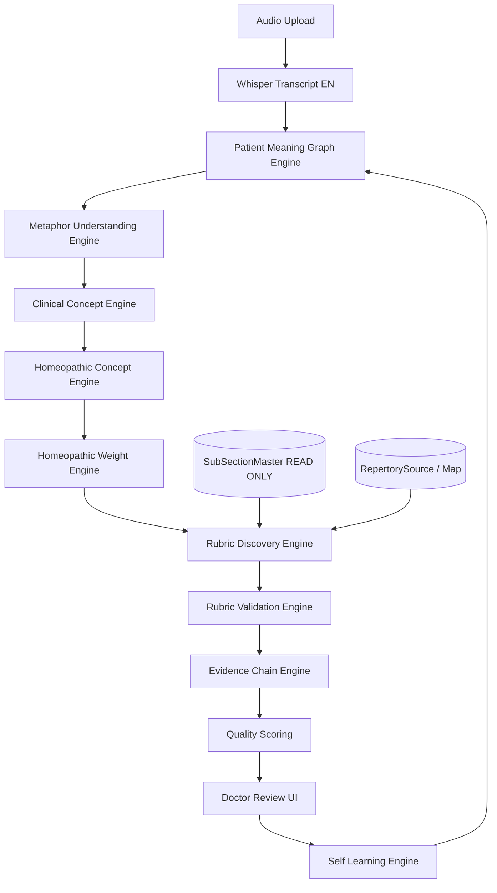

# HomeoCentrum AI Rubric Intelligence Platform V3

## Enterprise Clinical Concept Architecture

**Status:** Architecture review — **awaiting stakeholder approval before implementation**  
**Version:** 3.0-draft  
**Date:** June 2026  
**Applies to:** New_API + NigaHomeopathy-UI + HomeoCentrum_Production DB  
**Constraint:** **Zero modifications** to `SectionMaster`, `SubSectionMaster`, or existing repertory tables (READ ONLY)

---

## Table of Contents

1. [Executive Summary](#1-executive-summary)
2. [Codebase Analysis — Current State](#2-codebase-analysis--current-state)
3. [Root Cause — Why V2 Still Misses 95%](#3-root-cause--why-v2-still-misses-95)
4. [Architecture Gaps (V2 → V3)](#4-architecture-gaps-v2--v3)
5. [V3 Target Architecture — Concept Graph First](#5-v3-target-architecture--concept-graph-first)
6. [Concept Graph Model](#6-concept-graph-model)
7. [Phase-by-Phase Service Design (V3 Phases 1–10)](#7-phase-by-phase-service-design-v3-phases-1–10)
8. [Database Design (New Tables Only)](#8-database-design-new-tables-only)
9. [API Design](#9-api-design)
10. [AI Model Separation & Prompt Design](#10-ai-model-separation--prompt-design)
11. [Enterprise Requirements (Phase 13)](#11-enterprise-requirements-phase-13)
12. [Success Metrics (Phase 14)](#12-success-metrics-phase-14)
13. [Migration Plan — V2/V2.1 → V3](#13-migration-plan--v2v21--v3)
14. [Implementation Roadmap](#14-implementation-roadmap)
15. [Backward Compatibility Contract](#15-backward-compatibility-contract)
16. [Risks & Mitigations](#16-risks--mitigations)
17. [Approval Checklist](#17-approval-checklist)

---

## 1. Executive Summary

HomeoCentrum has a working Audio Case Taking pipeline (Whisper → GPT extraction → rubric matching) and a substantial V2 intelligence stack (case understanding, metaphors, embeddings, inference, V2.1 validation). **Despite this, real cases (e.g. epilepsy) still produce clinically wrong rubrics** because the system ultimately **searches the repertory from strings and vectors** rather than **reasoning through a structured clinical graph** the way an experienced homeopath does.

**V3 is not an incremental tuning of keyword or embedding search.**  
**V3 is a paradigm shift:**

```
STOP:  Audio → Transcript → GPT → Rubric Search → Result

BUILD: Audio → Transcript → Patient Meaning Graph → Clinical Concept Graph
       → Homeopathic Concept Graph → Rubric Discovery → Validation
       → Evidence Chain → Doctor Review → Learning Engine
```

**Rubrics are the final outcome, not the first interpretation.**

V2 components are **reused where they fit** (Whisper, session audit, doctor UI, feedback tables, repertory READ ONLY access). V3 adds a **persisted Concept Graph** and **separated AI pipelines** with mandatory evidence chains.

---

## 2. Codebase Analysis — Current State

### 2.1 Production Pipeline Today

| Step | Component | Location |
|------|-----------|----------|
| Upload / consent / queue | `AudioCaseTakingService` | `Niga-Domain/Repositories/AudioCaseTakingService.cs` |
| Whisper translation | `AudioCaseAiProcessor.TranslateAudioToEnglishAsync` | `Niga-Domain/Services/AudioCaseAiProcessor.cs` |
| GPT symptom extraction | `ExtractCaseDataAsync` (no full transcript echo) | same |
| V2 orchestrator | `RubricIntelligenceOrchestrator.AnalyzeAsync` | `.../Orchestration/RubricIntelligenceOrchestrator.cs` |
| V1 LIKE + Jaccard | `MatchRubricsV1Async` | `AudioCaseTakingService.cs` |
| Merge V1 + V2 | `RubricResultMerger.Merge` | `.../Merging/RubricResultMerger.cs` |
| V2.1 validation | `ClinicalValidationEngine` | `.../Validation/ClinicalValidationEngine.cs` |
| Doctor UI | `AudioCasePanel.js`, rubric approval | `NigaHomeopathy-UI/src/Components/CaseTaking/` |

### 2.2 V2 Engine Inventory (29 services)

| Layer | Engines | V3 disposition |
|-------|---------|----------------|
| Meaning / understanding | `CaseUnderstandingEngine` (single GPT blob) | **Replace** with `PatientMeaningGraphEngine` + separated models |
| Metaphor | `MetaphorInterpretationEngine` (admin dictionary) | **Replace** with AI `MetaphorUnderstandingEngine` + learning |
| Clinical | `ClinicalReasoningEngine` (small heuristics) | **Replace** with `ClinicalConceptEngine` |
| Homeopathic | `HomeopathicReasoningEngine`, `HomeopathicWeightEngine` | **Evolve** into `HomeopathicConceptEngine` + weight on graph nodes |
| Discovery | `RubricAliasEngine`, `HybridRetrievalEngine`, `ClinicalInferenceEngine`, V1 LIKE | **Replace** with `RubricDiscoveryEngine` (concept-driven only) |
| Validation | V2.1 validators (hard-coded rules) | **Evolve** into Phase 6 validators + DB-backed rules |
| Evidence | `EvidenceChainBuilder` (flat, post-hoc) | **Replace** with mandatory graph `EvidenceChainEngine` |
| Learning | `DoctorFeedbackLearningEngine` (alias/metaphor) | **Evolve** into graph-aware `SelfLearningEngine` |
| Repertory | `RepertoryTierEngine` | **Keep** (READ ONLY mapping) |

### 2.3 Existing DB (V2 — new tables only)

Scripts under `New_API/Database/Scripts/AudioCaseIntelligenceV2/`:

- `AudioCaseClinicalConcept`, `AudioCaseCausationLink`, `AudioCaseIntelligenceLog`
- `RubricMetaphorDictionary`, `RubricAlias`, `RubricEmbeddings`, `HomeopathicWeightRule`
- `AudioCaseRubricFeedback`, `AudioCaseRubricBenchmark`, `GoldCaseLibrary`
- `RepertorySource`, `RubricRepertoryMap`
- V2.1: `601_Create_RubricValidationRules.sql` (partially wired — validators use hard-coded rules)

**Master tables untouched:** `SectionMaster`, `SubSectionMaster` — compliant with V3 constraint.

### 2.4 What Works (Preserve)

- Audio session lifecycle, audit logs, consent, retention
- Whisper English pipeline (`OutputEnglishOnly`)
- Doctor manual approval UI and feedback API
- Feature flags (`RubricIntelligence:EnableV2`, `EnableClinicalValidationV21`, rollback)
- Repertory tier mapping (Kent/Complete)
- Benchmark dashboard foundation

---

## 3. Root Cause — Why V2 Still Misses 95%

### 3.1 Epilepsy Case (Production Evidence)

| Patient statement | Wrong V2 rubric | Why it happened |
|-------------------|-----------------|-----------------|
| Fear before fit | `ABDOMEN-FALLING SENSATION` | Embedding/inference semantic drift; no domain gate before merge in early V2 |
| Shiver before fit | `EAR-RINGING BEFORE FIT` | Keyword/vector similarity on "before fit" |
| Male patient | `MENSES-*` rubrics | Gender not in pipeline until V2.1; V1 path unfiltered historically |

V2.1 validation **filters** these after discovery — but **discovery still generates junk**. Validation is a gate, not reasoning.

### 3.2 Structural Root Causes

1. **Two GPT passes** — `ExtractCaseDataAsync` then `CaseUnderstandingEngine` — split meaning formation; no unified graph.
2. **Flat concept list** — `ClinicalConceptModel[]` + separate causation links; not a queryable graph.
3. **Discovery inputs wrong** — Hybrid retrieval still uses `searchTerms`, embeddings, aliases, and V1 LIKE **in parallel with concepts**.
4. **Rubrics discovered before reasoning completes** — retrieval runs mid-orchestrator, not after homeopathic concepts finalized.
5. **Metaphors depend on admin dictionary** — violates V3 "no manual dictionary" goal; doesn't scale for Marathi/Hindi colloquial speech.
6. **Evidence chain is post-hoc** — built to justify rubrics already found, not to require complete chain before acceptance.
7. **Learning updates aliases/metaphors only** — does not refine concept graph edges or discovery weights.

### 3.3 Accuracy Ceiling

| Approach | Estimated ceiling |
|----------|-------------------|
| V1 LIKE + Jaccard | ~65–70% |
| V2 hybrid + inference | ~75–85% |
| V2 + V2.1 validation | ~85–90% (fewer false positives, still misses primary) |
| **V3 concept graph** | **Target ≥95%** |

---

## 4. Architecture Gaps (V2 → V3)

| V3 Requirement | V2 Status | Gap |
|----------------|-----------|-----|
| Patient Meaning Graph | `RawStatement` on flat concept | No graph nodes/edges, no multi-language meaning layer |
| AI metaphor (no admin dict) | `RubricMetaphorDictionary` + admin UI | Manual maintenance; not dynamic inference |
| Clinical Concept Engine | Thin heuristics + GPT fields | No persisted clinical ontology per case |
| Homeopathic Concept Engine | `HomeopathicMeaning` string | Not a separate typed layer driving discovery |
| Rubric Discovery from concepts only | Alias + embedding + LIKE + inference | **Direct transcript/keyword search still active** |
| Mandatory evidence chain | Post-hoc `EvidenceChainBuilder` | Chain can be incomplete; rubric already ranked |
| 8 separate AI models | 2–3 GPT calls, combined prompts | Monolithic prompts; no model separation |
| Self-learning without admin | Partial (`DoctorFeedbackLearningEngine`) | No graph edge learning |
| Concept Graph storage | JSON blobs on session | No `AIConceptGraph` normalized tables |

---

## 5. V3 Target Architecture — Concept Graph First

### 5.1 High-Level Flow



### 5.2 Layer Responsibilities

| Layer | Produces | Must NOT produce |
|-------|----------|------------------|
| Patient Meaning | Normalized patient meanings (multilingual) | Rubrics, search terms |
| Metaphor | Literal → clinical expression mapping | Rubrics |
| Clinical Concept | Medical/clinical concepts + domain | Rubrics |
| Homeopathic Concept | SRP, hierarchy, convulsion aura, etc. | Rubrics |
| Rubric Discovery | Candidate rubrics + match reason | Final ranked list without validation |
| Validation | Accept/reject per validator | New rubrics |
| Evidence Chain | Full chain per accepted rubric | Partial chains |
| Learning | Graph edge weight updates | Manual dictionary edits |

### 5.3 Example — Epilepsy Reasoning Chain

```
Patient (MR): "फिट येण्याच्या आधी शरीरात कंपन येते"
        ↓
Meaning: "vibration in body before seizure" (confidence 0.96)
        ↓
Metaphor: none (literal prodrome)
        ↓
Clinical Concept: Aura (Neurology, 0.95)
        ↓
Homeopathic Concept: Convulsion Aura (High, 0.97)
        ↓
Discovery: GENERALITIES-CONVULSIONS-AURA, MIND-FEAR-convulsions, ...
        ↓
Validation: pass domain, gender, evidence
        ↓
Evidence Chain: transcript → meaning → clinical → homeopathic → rubric (96%)
```

**Invalid paths never reach discovery** (e.g. jumping from "fear" to `ABDOMEN-FALLING` without homeopathic concept support).

---

## 6. Concept Graph Model

### 6.1 Why a Graph, Not Just Tables

Tables store facts. The **Concept Graph** stores **reasoning relationships**:

```
(AIPatientMeaning) ──interprets──▶ (AIMetaphorResolution?)
        │
        derives
        ▼
(AIClinicalConcept) ──maps──▶ (AIHomeopathicConcept)
        │                              │
        │                              discovers
        │                              ▼
        └──────────────────────▶ (AIRubricDiscovery) ──evidence──▶ (AIRubricEvidence)
                                           │
                                           validates
                                           ▼
                                    (AIRubricValidation)
```

### 6.2 Node Types

| NodeType | Example | Key fields |
|----------|---------|------------|
| `PatientMeaning` | vibration before seizure | rawStatement, normalizedMeaning, language, confidence |
| `MetaphorMapping` | current through body → electric shock | expression, literalMeaning, clinicalMeaning |
| `ClinicalConcept` | Aura | conceptName, domain, confidence |
| `HomeopathicConcept` | Convulsion Aura | conceptName, importance, symptomClass, confidence |
| `RubricCandidate` | GENERALITIES-CONVULSIONS-AURA | subSectionId, matchReason, confidence |

### 6.3 Edge Types (`AIConceptGraph`)

| EdgeType | From → To | Example |
|----------|-----------|---------|
| `Interprets` | Meaning → Metaphor | Marathi phrase → electric shock sensation |
| `DerivesClinical` | Meaning → Clinical | vibration before fit → Aura |
| `MapsHomeopathic` | Clinical → Homeopathic | Aura → Convulsion Aura |
| `DiscoversRubric` | Homeopathic → Rubric | Convulsion Aura → CONVULSIONS-AURA |
| `ConcomitantWith` | Concept ↔ Concept | fear ↔ convulsion |
| `Causation` | Concept → Concept | fright → convulsion |
| `ModalityOf` | Modality → Concept | worse morning → headache |
| `RejectedDiscovery` | Homeopathic → Rubric | audit only — failed validation |

### 6.4 Graph Storage Strategy

- **Normalized tables** per node type (queryable, auditable)
- **`AIConceptGraph`** edge table (fromNodeId, toNodeId, edgeType, weight, confidence, sessionId)
- **Session snapshot JSON** on `AudioCaseSession` for UI timeline (backward compatible extension)
- Graph **versioned per session** — re-analyze rebuilds graph with audit trail in `AIReasoningAudit`

---

## 7. Phase-by-Phase Service Design (V3 Phases 1–10)

### Phase 1 — PatientMeaningGraphEngine

**Interface:** `IPatientMeaningGraphEngine.BuildAsync(sessionId, transcript, languageHint)`

**Input:** Utterances from transcript (segmented by speaker if available)

**Output:** `List<PatientMeaningNode>` — **no rubrics, no searchTerms**

**Rules:**
- One meaning node per distinct patient clinical expression
- Preserve raw statement + normalized English meaning
- Language detection per node (mr, hi, en, mixed)

**V2 reuse:** Replace first-pass dependency on `ExtractCaseDataAsync` symptoms as primary input; extraction becomes supplementary for UI summary only.

---

### Phase 2 — MetaphorUnderstandingEngine

**Interface:** `IMetaphorUnderstandingEngine.EnrichAsync(meaningNodes, language)`

**AI-only inference** — no required admin dictionary at runtime.

**Output:** Optional `MetaphorResolution` attached to meaning nodes.

**Learning:** Approved doctor cases reinforce metaphor patterns in `AICaseLearning` (not admin CRUD).

**V2 migration:** `RubricMetaphorDictionary` becomes **seed/bootstrap only**, deprecated for runtime.

---

### Phase 3 — ClinicalConceptEngine

**Interface:** `IClinicalConceptEngine.DeriveAsync(meaningGraph)`

**Output:** Clinical concept nodes + `DerivesClinical` edges.

**Examples:**
- vibration before seizure → Aura (Neurology)
- things fall from hands → Loss of Grip (Neurology)

**Not rubrics.** Stored in `AIClinicalConcept`.

---

### Phase 4 — HomeopathicConceptEngine

**Interface:** `IHomeopathicConceptEngine.MapAsync(clinicalGraph, caseContext)`

**Output:** Homeopathic concept nodes — thinks like senior classical homeopath.

**Examples:**
- Aura → Convulsion Aura (High)
- Fear before seizure → Fear Before Convulsion (High)

**V2 reuse:** SRP classification logic from `HomeopathicReasoningEngine` migrated into typed output.

---

### Phase 5 — RubricDiscoveryEngine

**Interface:** `IRubricDiscoveryEngine.DiscoverAsync(homeopathicConcepts, patientContext)`

**CRITICAL RULE:** Discovery inputs **ONLY** `AIHomeopathicConcept` nodes.

**Allowed retrieval mechanisms:**
1. Concept → rubric mapping table (learned from feedback)
2. Controlled embedding search **scoped to candidate rubrics suggested by concept mapping**
3. READ ONLY lookup on `SubSectionMaster` by ID

**FORBIDDEN as primary input:**
- Raw transcript
- GPT `searchTerms`
- V1 LIKE on symptom phrases
- Unscoped embedding search across full repertory

**V2 retirement:** `HybridRetrievalEngine` and V1 merge **disabled when `EnableV3ConceptGraph: true`**.

---

### Phase 6 — RubricValidationEngine

Validators (all must pass):

| Validator | Purpose |
|-----------|---------|
| `DomainValidator` | Neurology concept → no GI rubrics |
| `ClinicalValidator` | Concept–rubric clinical plausibility |
| `GenderValidator` | Male → no MENSES (0% target) |
| `AgeValidator` | Age-inappropriate rubrics |
| `EvidenceValidator` | Chain completeness |
| `HallucinationValidator` | No unsupported rubrics |

**V2 reuse:** Port V2.1 validators; load rules from `AIRubricValidation` / DB seeds.

---

### Phase 7 — EvidenceChainEngine

**Mandatory chain for every accepted rubric:**

```
Transcript Statement → Meaning → Clinical Concept → Homeopathic Concept → Rubric → Confidence
```

**Reject if any link missing** (not post-hoc fill).

**UI:** Extend `AudioCaseRubricExplainabilityPanel` to show full graph chain.

---

### Phase 8 — HomeopathicWeightEngine (Enhanced)

Classify and weight on graph:

1. Strange Rare Peculiar  
2. Mental General  
3. Physical General  
4. Modality  
5. Concomitant  
6. Particular  

**Ranking:** Aura before fit **always** above constipation for same case.

**V2 reuse:** `HomeopathicWeightRule` table + engine logic.

---

### Phase 9 — SelfLearningEngine

**No admin dictionary maintenance required.**

On doctor **accept:** reinforce graph edges + discovery mapping + confidence.

On doctor **reject:** weaken edges, store rejection reason, prevent repeat in similar context.

**Stores:** `AIDoctorFeedback`, `AICaseLearning`

**V2 reuse:** Extend `DoctorFeedbackLearningEngine` to write graph weights, not only aliases.

---

### Phase 10 — Multi-Language AI

Handled in Phase 1 + 2:

- Marathi, Hindi, English, mixed cases
- Meaning normalization to English for repertory layer
- Language stored per meaning node

Whisper already provides English transcript; meaning engine also processes **raw language segments** when mixed speech detected.

---

## 8. Database Design (New Tables Only)

**Prefix:** `AI` (V3 namespace — distinct from V2 `AudioCase*` tables)

**DO NOT MODIFY:** `SectionMaster`, `SubSectionMaster`, existing repertory tables.

### 8.1 Core Graph Tables

#### `AIPatientMeaning`

| Column | Type | Notes |
|--------|------|-------|
| PatientMeaningId | BIGINT PK | |
| AudioCaseSessionId | UNIQUEIDENTIFIER FK | |
| RawStatement | NVARCHAR(2000) | Original language |
| NormalizedMeaning | NVARCHAR(1000) | English clinical meaning |
| LanguageCode | NVARCHAR(10) | mr, hi, en, mixed |
| Confidence | DECIMAL(5,4) | |
| SequenceOrder | INT | |
| ModelVersion | NVARCHAR(20) | e.g. v3-m1 |
| EnteredDate | DATETIME2 | |

#### `AIClinicalConcept`

| Column | Type |
|--------|------|
| ClinicalConceptId | BIGINT PK |
| AudioCaseSessionId | UNIQUEIDENTIFIER |
| PatientMeaningId | BIGINT FK nullable |
| ConceptName | NVARCHAR(500) |
| Domain | NVARCHAR(100) |
| Confidence | DECIMAL(5,4) |
| ModelVersion | NVARCHAR(20) |

#### `AIHomeopathicConcept`

| Column | Type |
|--------|------|
| HomeopathicConceptId | BIGINT PK |
| AudioCaseSessionId | UNIQUEIDENTIFIER |
| ClinicalConceptId | BIGINT FK |
| ConceptName | NVARCHAR(500) |
| Importance | NVARCHAR(20) |
| SymptomClass | NVARCHAR(50) |
| IsSRP | BIT |
| Weight | DECIMAL(6,3) |
| Confidence | DECIMAL(5,4) |

#### `AIConceptGraph`

| Column | Type |
|--------|------|
| ConceptGraphEdgeId | BIGINT PK |
| AudioCaseSessionId | UNIQUEIDENTIFIER |
| FromNodeType | NVARCHAR(50) |
| FromNodeId | BIGINT |
| ToNodeType | NVARCHAR(50) |
| ToNodeId | BIGINT |
| EdgeType | NVARCHAR(50) |
| Weight | DECIMAL(6,3) |
| Confidence | DECIMAL(5,4) |

#### `AIRubricDiscovery`

| Column | Type |
|--------|------|
| RubricDiscoveryId | BIGINT PK |
| AudioCaseSessionId | UNIQUEIDENTIFIER |
| HomeopathicConceptId | BIGINT FK |
| SubSectionId | INT (READ ONLY ref) |
| SubSectionName | NVARCHAR(500) |
| MatchReason | NVARCHAR(1000) |
| DiscoveryMethod | NVARCHAR(50) |
| Confidence | DECIMAL(5,4) |

#### `AIRubricEvidence`

| Column | Type |
|--------|------|
| RubricEvidenceId | BIGINT PK |
| RubricDiscoveryId | BIGINT FK |
| EvidenceChainJson | NVARCHAR(MAX) |
| IsComplete | BIT |
| CoverageScore | DECIMAL(5,4) |

#### `AIRubricValidation`

| Column | Type |
|--------|------|
| RubricValidationId | BIGINT PK |
| RubricDiscoveryId | BIGINT FK |
| ValidationStatus | NVARCHAR(20) |
| QualityScore | DECIMAL(5,2) |
| ValidationFlagsJson | NVARCHAR(2000) |
| ValidatedAt | DATETIME2 |

#### `AIRubricConfidence`

| Column | Type |
|--------|------|
| RubricConfidenceId | BIGINT PK |
| RubricDiscoveryId | BIGINT FK |
| FinalScore | DECIMAL(5,4) |
| RankOrder | INT |
| Tier | NVARCHAR(20) |

#### `AIDoctorFeedback`

| Column | Type |
|--------|------|
| DoctorFeedbackId | BIGINT PK |
| AudioCaseSessionId | UNIQUEIDENTIFIER |
| RubricDiscoveryId | BIGINT FK |
| Action | NVARCHAR(20) |
| Reason | NVARCHAR(1000) |
| DoctorUserId | INT |
| EnteredDate | DATETIME2 |

#### `AICaseLearning`

| Column | Type |
|--------|------|
| CaseLearningId | BIGINT PK |
| SourceSessionId | UNIQUEIDENTIFIER |
| LearningType | NVARCHAR(50) |
| FromConcept | NVARCHAR(500) |
| ToRubricSubSectionId | INT |
| WeightDelta | DECIMAL(6,3) |
| ContextJson | NVARCHAR(MAX) |

#### `AIReasoningAudit`

| Column | Type |
|--------|------|
| ReasoningAuditId | BIGINT PK |
| AudioCaseSessionId | UNIQUEIDENTIFIER |
| PipelineStage | NVARCHAR(50) |
| ModelId | NVARCHAR(20) |
| RequestJson | NVARCHAR(MAX) |
| ResponseJson | NVARCHAR(MAX) |
| LatencyMs | INT |
| Success | BIT |
| ErrorMessage | NVARCHAR(2000) |

### 8.2 Metaphor (AI-inferred, not admin-only)

#### `AIMetaphorResolution`

| Column | Type |
|--------|------|
| MetaphorResolutionId | BIGINT PK |
| PatientMeaningId | BIGINT FK |
| Expression | NVARCHAR(1000) |
| LiteralMeaning | NVARCHAR(1000) |
| ClinicalMeaning | NVARCHAR(1000) |
| Confidence | DECIMAL(5,4) |
| Source | NVARCHAR(20) |

### 8.3 Script Deliverables (Manual Apply)

| Script | Purpose |
|--------|---------|
| `701_Create_AIConceptGraph_Core.sql` | All core V3 tables |
| `702_Create_AIConceptGraph_Indexes.sql` | Performance indexes |
| `703_Seed_AIConceptGraph_Bootstrap.sql` | Optional bootstrap mappings (epilepsy gold) |
| `704_Rollback_AIConceptGraph.sql` | Drop V3 tables only |
| `000_DEPLOY_V3_Phase_1.sql` | Bundled deploy script |

**Not auto-executed.** Manual apply per environment.

### 8.4 Relationship to V2 Tables

| V2 Table | V3 Strategy |
|----------|-------------|
| `AudioCaseClinicalConcept` | Deprecated gradually; V3 uses `AIClinicalConcept` + graph |
| `RubricMetaphorDictionary` | Bootstrap seed only; runtime uses `AIMetaphorResolution` |
| `RubricAlias` | Learning output, not primary discovery |
| `RubricEmbeddings` | Secondary tool inside scoped discovery |
| `AudioCaseRubricFeedback` | Mirror to `AIDoctorFeedback` during migration |

---

## 9. API Design

### 9.1 Principles

- **Backward compatible** — existing `AudioCaseTaking` endpoints unchanged in contract
- **V3 data additive** — new fields on result DTOs behind feature flag
- New namespace: `/api/AudioCaseIntelligence/v3/`

### 9.2 Existing Endpoints (Unchanged)

| Method | Route | Purpose |
|--------|-------|---------|
| POST | `/api/AudioCaseTaking/upload` | Upload audio |
| GET | `/api/AudioCaseTaking/status/{sessionId}` | Poll progress |
| GET | `/api/AudioCaseTaking/result/{sessionId}` | Transcript, rubrics, summary |
| POST | `/api/AudioCaseTaking/reanalyze` | Re-run from edited transcript |
| GET | `/api/AudioCaseTaking/concepts/{sessionId}` | V2 concepts (extend for V3 graph) |
| POST | `/api/AudioCaseTaking/rubric-feedback` | Doctor accept/reject |

### 9.3 New V3 Endpoints

| Method | Route | Purpose |
|--------|-------|---------|
| GET | `/api/AudioCaseIntelligence/v3/graph/{sessionId}` | Full concept graph for UI |
| GET | `/api/AudioCaseIntelligence/v3/meanings/{sessionId}` | Patient meaning nodes |
| GET | `/api/AudioCaseIntelligence/v3/evidence/{sessionId}/{rubricDiscoveryId}` | Evidence chain |
| GET | `/api/AudioCaseIntelligence/v3/health` | V3 pipeline health + model versions |
| GET | `/api/AudioCaseIntelligence/v3/metrics` | Acceptance rate, hallucination rate |
| PUT | `/api/AudioCaseIntelligence/v3/config` | Feature flags (admin) |

### 9.4 Extended Result DTO (Backward Compatible)

```json
{
  "suggestedRubrics": [ /* existing shape */ ],
  "rubricIntelligence": {
    "engineVersion": "v3",
    "conceptGraphAvailable": true
  },
  "conceptGraph": {
    "meanings": [],
    "clinicalConcepts": [],
    "homeopathicConcepts": [],
    "evidenceChains": []
  }
}
```

When `EnableV3ConceptGraph: false`, `conceptGraph` omitted — V2 behavior.

---

## 10. AI Model Separation & Prompt Design

**Rule:** No monolithic prompt. Eight dedicated pipelines (Phase 12).

| Model ID | Engine | Input | Output Schema |
|----------|--------|-------|---------------|
| **M1** | Meaning Extraction | Transcript segments | `{ meanings: [{ rawStatement, normalizedMeaning, language, confidence }] }` |
| **M2** | Metaphor Interpretation | Meaning nodes | `{ resolutions: [{ meaningId, expression, literalMeaning, clinicalMeaning, confidence }] }` |
| **M3** | Clinical Concept Detection | Meaning graph | `{ concepts: [{ meaningId, conceptName, domain, confidence }] }` |
| **M4** | Homeopathic Concept Mapping | Clinical concepts + case context | `{ homeopathicConcepts: [{ clinicalConceptId, conceptName, importance, symptomClass, isSRP, confidence }] }` |
| **M5** | Rubric Discovery | Homeopathic concepts only | `{ discoveries: [{ homeopathicConceptId, subSectionId, matchReason, confidence }] }` |
| **M6** | Rubric Validation | Discovery + graph context | `{ validations: [{ discoveryId, status, flags, qualityScore }] }` |
| **M7** | Quality Scoring | Validated rubrics + weights | `{ rankedRubrics: [{ discoveryId, finalScore, tier, rank }] }` |
| **M8** | Feedback Learning | Doctor actions | `{ learningUpdates: [{ type, fromConcept, toSubSectionId, weightDelta }] }` |

### 10.1 Prompt Guardrails (All Models)

- Never invent symptoms not in transcript
- Never output rubrics before M5
- Never output searchTerms before M5
- JSON schema enforced via `response_format: json_object`
- Temperature ≤ 0.2 for clinical models
- Each call logged to `AIReasoningAudit`

### 10.2 M1 Example (Meaning Extraction)

**System:** You extract patient meanings only. No rubrics. No repertory. Output JSON only.

**User:** Transcript segment + language hint

**Output:** Normalized English meaning per patient statement

### 10.3 M5 Example (Rubric Discovery)

**System:** You receive homeopathic concepts only. Map each to repertory rubric IDs from the provided candidate list (from READ ONLY SubSectionMaster subset). Never use raw patient words.

---

## 11. Enterprise Requirements (Phase 13)

| Requirement | Implementation |
|-------------|----------------|
| Clean Architecture | Domain interfaces in `Niga-Domain/Interfaces/V3/`; engines in `Services/AudioCaseIntelligence/V3/` |
| SOLID | One engine per responsibility; validators as strategy pattern |
| Repository Pattern | `IConceptGraphRepository`, `IRubricDiscoveryRepository` |
| DI | `ApplicationServiceExtensions` V3 section |
| CQRS | Commands: `ProcessSessionV3Command`; Queries: `GetConceptGraphQuery` |
| Structured Logging | Serilog properties: SessionId, Stage, ModelId |
| Audit | `AIReasoningAudit` per model call |
| Retry | Polly on GPT/embedding calls (3 retries, exponential backoff) |
| Feature Flags | `EnableV3ConceptGraph`, `EnableV3Learning`, per-model kill switches |
| Swagger | Document V3 endpoints + schemas |
| Tests | Unit per engine; integration with epilepsy gold case |
| Performance | Graph build < 60s for 45-min audio (target) |

**No mock implementations in production path.**

---

## 12. Success Metrics (Phase 14)

| Metric | Target | Measurement |
|--------|--------|-------------|
| Doctor Acceptance Rate | ≥ 95% | `AIDoctorFeedback` / suggested rubrics |
| Primary Rubric in Top 5 | ≥ 95% | Benchmark vs gold cases |
| False Positive Rate | < 5% | Rejected / total discovered |
| Hallucinated Rubrics | < 1% | Validation audit |
| Male → Female rubrics | 0% | Gender validator |
| Evidence Chain Coverage | 100% | `AIRubricEvidence.IsComplete` |
| Unsupported Rubrics | 0% | Hallucination validator |

**Benchmark:** Extend `GoldCaseLibrary` with epilepsy + 249 additional cases.

---

## 13. Migration Plan — V2/V2.1 → V3

### 13.1 Coexistence Strategy

```
EnableV2: true
EnableV3ConceptGraph: false  → Current production (V2 + V2.1)
EnableV3ConceptGraph: true   → V3 pipeline; V1 merge OFF
RollbackToV1Only: true       → Emergency V1 only
```

### 13.2 Migration Phases

| Step | Action | Risk |
|------|--------|------|
| 1 | Deploy V3 tables (701–702) — no code change | None |
| 2 | Deploy V3 engines behind flag (dark launch) | None |
| 3 | Shadow mode: run V3 parallel, compare metrics, don't show UI | Low |
| 4 | Enable V3 for pilot doctors | Medium |
| 5 | Enable V3 for all; disable V1 merge | Medium |
| 6 | Deprecate V2 hybrid as primary | Low |
| 7 | Migrate learning data to `AICaseLearning` | Low |

### 13.3 Data Migration

- No migration of `SectionMaster` / `SubSectionMaster`
- Optional: copy historical `AudioCaseClinicalConcept` → `AIClinicalConcept` for analysis only
- `RubricAlias` / metaphor dictionary remain as bootstrap seeds

### 13.4 UI Migration

- Phase 1: Show concept graph timeline (new component `AudioCaseConceptGraphPanel`)
- Phase 2: Evidence chain required before approve button enabled
- Phase 3: Retire admin metaphor/alias CRUD (optional read-only archive)

---

## 14. Implementation Roadmap

### Sprint 0 — Architecture Approval (Current)

- [ ] Stakeholder sign-off on this document
- [ ] Confirm SQL scripts reviewed
- [ ] Confirm KPI targets

### Sprint 1–2 — Foundation (Phase 11 + 13 partial)

- SQL 701, 702, 704
- `AIConceptGraph` repository + audit logging
- Feature flags in `RubricIntelligenceOptions`
- V3 orchestrator shell (no AI yet)

### Sprint 3 — Phase 1 + 10 (Meaning Graph)

- `PatientMeaningGraphEngine` (M1)
- Persist `AIPatientMeaning`
- Unit tests: Marathi/Hindi/English samples

### Sprint 4 — Phase 2 (Metaphor AI)

- `MetaphorUnderstandingEngine` (M2)
- `AIMetaphorResolution`
- Deprecate runtime dictionary dependency

### Sprint 5 — Phase 3 + 4 (Clinical + Homeopathic)

- `ClinicalConceptEngine` (M3)
- `HomeopathicConceptEngine` (M4)
- Graph edges persisted

### Sprint 6 — Phase 5 (Discovery)

- `RubricDiscoveryEngine` (M5)
- **Disable V1 merge when V3 flag on**
- Scoped embedding only

### Sprint 7 — Phase 6 + 7 (Validation + Evidence)

- Full validator suite
- Mandatory evidence chain
- Port V2.1 rules to DB-driven config

### Sprint 8 — Phase 8 + UI

- Weight-based ranking
- Concept graph UI panel
- Evidence chain in explainability

### Sprint 9 — Phase 9 (Learning)

- Graph-aware self-learning (M8)
- Remove admin dictionary requirement

### Sprint 10 — Benchmark + Production

- 250 gold cases automated
- Shadow → pilot → full rollout
- Metrics dashboard Phase 14

**Estimated duration:** 10 sprints (20 weeks) for production-ready V3.

---

## 15. Backward Compatibility Contract

1. Existing `AudioCaseTaking` API contracts unchanged
2. `SubSectionMaster` / `SectionMaster` never written by V3
3. V1 LIKE path available via `RollbackToV1Only`
4. V2 path available via `EnableV3ConceptGraph: false`
5. Doctor approval flow unchanged
6. Repertorization module unchanged — still receives approved rubrics by `SubSectionId`

---

## 16. Risks & Mitigations

| Risk | Mitigation |
|------|------------|
| V3 latency (8 model calls) | Parallel M1 segmentation; cache meanings; async pipeline |
| GPT cost increase | Smaller scoped prompts; M5 candidate list limited to concept mappings |
| Over-rejection (too few rubrics) | Shadow mode tuning; quality threshold config |
| Learning drift | Gold case regression suite on every deploy |
| Mixed language accuracy | M1 trained on mr/hi/en examples; feedback loop |

---

## 17. Approval Checklist

Before any V3 code implementation:

- [ ] Concept Graph architecture approved
- [ ] Database schema (Section 8) approved
- [ ] API design (Section 9) approved
- [ ] Eight-model separation approved
- [ ] V1 merge disable on V3 approved
- [ ] Admin metaphor UI deprecation approved
- [ ] KPI targets (95%/95%) approved
- [ ] 20-week roadmap accepted

**Sign-off:**

| Role | Name | Date |
|------|------|------|
| Product Owner | | |
| Lead Homeopath | | |
| Technical Lead | | |

---

*Document path: `NigaHomeopathy-UI/docs/AUDIO_CASE_TAKING_AI_ENGINE_V3_ARCHITECTURE.md`*  
*Supersedes reasoning model in V2 doc for rubric discovery; V2 remains valid for transcription, session, and UI foundation.*
