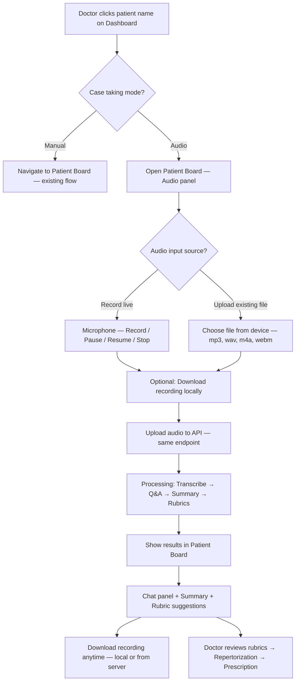

# Audio-Based Case Taking — Feature Specification

**Project:** NigaHomeopathy-UI (`D:\NIGA_API_OLD_NEW\NigaHomeopathy-UI`)  
**Related API:** New_API (`D:\NIGA_API_OLD_NEW\New_API`)  
**Status:** Proposed — ready for phased implementation  
**Last updated:** 23 Jun 2026

---

## Table of contents

1. [Executive summary](#1-executive-summary)
2. [Is this feature possible?](#2-is-this-feature-possible)
3. [User journey](#3-user-journey)
4. [Integration with existing code](#4-integration-with-existing-code)
5. [Recommended architecture](#5-recommended-architecture)
6. [UI/UX specification](#6-uiux-specification)
   - [6.2 Audio panel — Record live OR upload existing file](#62-audio-panel--record-live-or-upload-existing-file-patient-board)
7. [Frontend implementation plan](#7-frontend-implementation-plan)
8. [Backend & AI pipeline (New_API)](#8-backend--ai-pipeline-new_api)
   - [8.5 AI services — what to use (recommended stack)](#85-ai-services--what-to-use-recommended-stack)
   - [8.6 AI API configuration (appsettings)](#86-ai-api-configuration-appsettings)
   - [8.7 End-to-end AI call sequence](#87-end-to-end-ai-call-sequence)
   - [8.8 Cost estimate (indicative)](#88-cost-estimate-indicative)
   - [8.9 Provider comparison matrix](#89-provider-comparison-matrix)
9. [Rubric matching strategy](#9-rubric-matching-strategy)
10. [Data models & persistence](#10-data-models--persistence)
    - [10.3 Database audit & safety logging (required)](#103-database-audit--safety-logging-required)
    - [10.4 What to log vs what NOT to log](#104-what-to-log-vs-what-not-to-log)
    - [10.5 Logging implementation pattern (C#)](#105-logging-implementation-pattern-c)
11. [Security, privacy & compliance](#11-security-privacy--compliance)
12. [Phased rollout](#12-phased-rollout)
13. [Expert suggestions & enhancements](#13-expert-suggestions--enhancements)
14. [Risks & mitigations](#14-risks--mitigations)
15. [Acceptance criteria](#15-acceptance-criteria)
16. [Cursor implementation prompt](#16-cursor-implementation-prompt)

---

## 1. Executive summary

When a doctor clicks a **patient name** on the Doctor Dashboard, show a modal:

| Option | Behavior |
|--------|----------|
| **Manual case taking** | Existing flow — navigate to Patient Board (`/doctor/patientboard?...`) |
| **Audio-based case taking** | **Record live** or **upload an existing audio file** → same pipeline: transcribe → Q&A chat → summary → suggest up to **20 rubrics**. After stop/upload, doctor can **download** the recording. |

**Verdict:** This is **technically feasible** and aligns well with the existing Patient Board repertorization model (20-rubric limit already enforced). The main new work is an **AI processing pipeline on the backend**; the UI can reuse existing patterns (modals, chat layout, `handleIntensityChipClick`, session persistence).

---

## 2. Is this feature possible?

| Layer | Feasibility | Notes |
|-------|-------------|-------|
| **Browser audio capture** | ✅ High | `MediaRecorder` + `getUserMedia` — pause/resume/stop supported in Chrome, Edge, Firefox |
| **Multi-language transcription** | ✅ High | OpenAI Whisper, Azure Speech, Google Cloud Speech — auto language detect |
| **Q&A extraction from transcript** | ✅ Medium–High | LLM prompt (GPT-4o / Azure OpenAI) with medical case-taking schema |
| **Summary report** | ✅ High | Same LLM pipeline, structured JSON output |
| **Rubric matching from DB** | ✅ Medium–High | Combine existing keyword APIs + full-text subsection search + semantic ranking |
| **Push to Repertorization (≤20)** | ✅ High | Reuse `handleIntensityChipClick` / `setRepertorizationRubrics` in `PatientBoard.js` |
| **Upload pre-recorded audio file** | ✅ High | Same upload API + pipeline as live recording — mp3, wav, m4a, webm, ogg |
| **Download recording after stop** | ✅ High | Download from local blob immediately; from server via signed URL after upload |
| **Offline / poor network** | ⚠️ Partial | Record locally; upload when online (recommended) |

**Not feasible in browser alone:** Rubric matching against your full repertory DB and secure storage of PHI must run **server-side** (New_API), not only in React.

---

## 3. User journey



### Detailed steps

1. **Entry:** Doctor Dashboard → Today / All patients tab → click patient name link.
2. **Modal:** “How would you like to take this case?”
   - Manual case taking
   - Audio-based case taking
3. **Audio path:**
   - Navigate to Patient Board with audio panel (recommended so repertorization is immediate).
   - Doctor chooses **how to provide audio:**
     - **Record live** — microphone with Pause / Resume / Stop.
     - **Upload existing file** — pick a pre-recorded file from phone, PC, or voice recorder (same analysis workflow).
   - After stop (live) or file selected (upload), doctor can **download the recording** before or after analysis.
   - Confirm **“Analyze conversation?”** → upload to API (same endpoint for both sources).
4. **Processing:** Progress steps — Uploading → Transcribing → Extracting symptoms → Matching rubrics. **Identical pipeline** for live recording and uploaded file.
5. **Results:**
   - **Download recording** — available from toolbar (local blob right after stop; server download after upload completes).
   - **Conversation chat:** alternating Doctor / Patient bubbles from extracted Q&A.
   - **Summary:** chief complaint, modalities, mentals, generals, particulars, timeline.
   - **Suggested rubrics:** ranked list; doctor can remove/edit intensity before adding to Repertorization.
6. **Continue:** Doctor uses existing Repertory / Questions / Prescription tabs as today.

---

## 4. Integration with existing code

### 4.1 Entry point — Doctor Dashboard

**File:** `src/pages/Doctor/Dashboard/BestSellingProducts.js`

Current behavior — direct link to Patient Board:

```895:923:src/pages/Doctor/Dashboard/BestSellingProducts.js
    const handlePatientBoardLinkClick = (event, patient) => {
        const patientKey = buildPatientBoardKeyFromPatient(patient);
        const access = canOpenPatientSession(activePatientSessions, patientKey);
        if (!access.allowed) {
            event.preventDefault();
            showPatientSessionLimitAlert(access.activeSessions);
        }
    };

    const renderPatientBoardNameLink = (patient) => {
        // ...
        return (
            <Link
                to={buildPatientBoardPath(patient)}
                onClick={(event) => handlePatientBoardLinkClick(event, patient)}
            >
                {displayName}
            </Link>
        );
    };
```

**Change:** Replace immediate navigation with `preventDefault` → open `CaseTakingModeModal` → on Manual, call `navigate(buildPatientBoardPath(patient))`; on Audio, navigate with query flag e.g. `?caseTakingMode=audio`.

**Also update:** Any other dashboard entry points that link to Patient Board (search for `buildPatientBoardPath`).

### 4.2 Patient Board — Repertorization (20 limit)

**File:** `src/pages/Doctor/PatientBoard/PatientBoard.js`

Existing limit and add logic:

```2442:2467:src/pages/Doctor/PatientBoard/PatientBoard.js
      if (repertorizationRubrics.length >= 20) {
        Swal.fire({
          icon: 'warning',
          title: 'Maximum Limit Reached',
          text: 'You can only add up to 20 rubrics to the repertorization list.',
        });
        return;
      }
      setRepertorizationRubrics(prev => [...prev, { rubricId, rubricName, intensityNo, ... }]);
```

**Change:** After audio analysis, call the same shape via a helper e.g. `applySuggestedRubricsToRepertorization(suggestions)` — cap at 20, default intensity (e.g. 2) with doctor override in UI.

### 4.3 Session persistence

**File:** `src/helpers/patientBoardSessionHelper.js`

Extend `collectPatientBoardSnapshot` / `applyPatientBoardSnapshot` with:

- `audioCaseSessionId`
- `audioTranscript`
- `audioConversationMessages[]`
- `audioSummary`
- `audioSuggestedRubrics[]`

So doctor can switch patients (max 5 sessions) without losing audio results.

### 4.4 Existing rubric APIs to reuse

| API / function | Use in audio flow |
|----------------|-------------------|
| `getRubricByKeywordId` | Map extracted symptom keywords → subsections |
| `GET api/subsection/SearchByHotspot` (New_API) | Hotspot / symptom text → subsection names |
| `SearchGlobal` / full-text search (Old_API pattern) | Fuzzy match transcript phrases → SubSectionMaster |
| `handleIntensityChipClick` | Add matched rubrics to repertorization |
| `getRemedyCounts` | Remedy count after rubrics added |

---

## 5. Recommended architecture

```
┌─────────────────────────────────────────────────────────────────┐
│  NigaHomeopathy-UI (React)                                       │
│  ┌──────────────┐  ┌─────────────────┐  ┌────────────────────┐ │
│  │ CaseTaking   │  │ AudioRecorder   │  │ AudioCaseResults   │ │
│  │ ModeModal    │  │ (MediaRecorder) │  │ Chat + Summary +   │ │
│  └──────────────┘  └────────┬────────┘  │ RubricSuggestions  │ │
│                             │ multipart  └─────────┬──────────┘ │
└─────────────────────────────┼──────────────────────┼───────────┘
                              │                      │
                              ▼                      ▼
┌─────────────────────────────────────────────────────────────────┐
│  New_API — AudioCaseTakingController                             │
│  POST /api/AudioCaseTaking/upload                                │
│  GET  /api/AudioCaseTaking/{sessionId}/status                    │
│  GET  /api/AudioCaseTaking/{sessionId}/result                    │
│  ┌────────────┐  ┌──────────────┐  ┌─────────────────────────┐  │
│  │ Blob store │→ │ Transcription│→ │ LLM: Q&A + Summary      │  │
│  │ (Azure/S3) │  │ (Whisper)    │  │ + Symptom extraction    │  │
│  └────────────┘  └──────────────┘  └───────────┬─────────────┘  │
│                                                 ▼                 │
│                              RubricMatchingService                │
│                              (keyword + FTS + semantic rank)      │
└─────────────────────────────────────────────────────────────────┘
                              │
                              ▼
                    SubSectionMaster / Keyword tables (existing DB)
```

**Why server-side AI:** Protects API keys, handles large audio, enables audit logs, and keeps PHI out of the browser.

---

## 6. UI/UX specification

### 6.1 Case Taking Mode Modal (Dashboard)

- **Title:** “Start case taking”
- **Subtitle:** Patient name + age/sex (from row data)
- **Buttons:**
  - Primary outline: **Manual case taking** — keyboard icon
  - Primary filled: **Audio case taking** — microphone icon
- **Footer note:** “Record live, upload an existing file, or download after case taking. Microphone required only for live recording.”
- **Accessibility:** Focus trap, Esc to cancel, clear labels

### 6.2 Audio panel — Record live OR upload existing file (Patient Board)

Suggested placement: **collapsible right panel** or **top banner** above tabs when `caseTakingMode=audio`.

#### 6.2.1 Source selector (tabs or toggle)

| Tab | Label | Description |
|-----|-------|-------------|
| **Record** | Record live | Use device microphone — default tab |
| **Upload** | Upload file | Doctor already has a recording (phone, dictaphone, previous session) |

Both paths merge into the **same upload + analysis workflow** after audio is ready.

#### 6.2.2 Record live tab

| Control | Behavior |
|---------|----------|
| Record | Start `MediaRecorder` |
| Pause | `mediaRecorder.pause()` — show “Paused” badge |
| Resume | `mediaRecorder.resume()` |
| Stop | Stop tracks, finalize blob — **enable Download + Analyze buttons** |
| Cancel | Discard blob, confirm dialog |

**Visual feedback:** Elapsed time `MM:SS`, optional red pulse while recording, muted state when paused.

#### 6.2.3 Upload existing file tab

| Control | Behavior |
|---------|----------|
| Choose file | `<input type="file" accept="audio/*,.mp3,.wav,.m4a,.webm,.ogg,.aac">` |
| File preview | Show file name, size, estimated duration (if readable via `Audio` element) |
| Remove | Clear selection |
| Analyze | Upload selected file → same pipeline as live recording |

**Accepted formats:** `audio/mpeg` (mp3), `audio/wav`, `audio/x-m4a` / `audio/mp4` (m4a), `audio/webm`, `audio/ogg`, `audio/aac`.

**Validation (client + server):**
- Max file size: 50 MB (configurable)
- Max duration: 45 minutes (validated server-side after upload)
- Reject non-audio MIME types with clear error message

**Use cases:**
- Doctor recorded on phone before opening Patient Board
- Clinic uses external dictaphone / call recorder
- Doctor re-analyzes a previous case recording for the same patient (new session id; log in DB)

#### 6.2.4 Download recording (both sources)

Available **after** live recording is stopped **or** after an upload file is selected (upload tab: download is the same file doctor picked).

| When | Download source | UI |
|------|-----------------|------|
| Immediately after **Stop** (live) | Local `Blob` in browser | **Download recording** button — no server round-trip required |
| After **upload to server** completes | Server blob (Azure) | **Download recording** button — `GET .../download` with JWT |
| After analysis **Completed** | Server blob still available | Same download button in results toolbar |
| Upload tab (before analyze) | Selected local file | Browser re-download of chosen file (optional) |

**Download file naming:** `{PatientName}_{SessionId}_{YYYYMMDD-HHmm}.webm` (or original extension for uploads).

**UX placement:** Toolbar row next to Stop / Analyze:

```
[ ⏺ Record ] [ ⏸ Pause ] [ ⏹ Stop ]  |  [ ⬇ Download ]  [ ▶ Analyze conversation ]
```

- **Download** enabled when audio blob/file exists (disabled while recording).
- Log every server download in `AudioCaseDoctorActionLog` (`ActionType = AudioDownloaded`).

**Language:** No doctor selection required initially — backend auto-detects. Optional dropdown later (en, hi, mr, etc.).

### 6.3 Processing overlay

Stepper with states:

1. Uploading audio…
2. Transcribing…
3. Building conversation…
4. Generating summary…
5. Matching rubrics…

Allow **background processing** — doctor can read Repertory while waiting; toast when complete.

### 6.4 Conversation chat window

Reuse chat list styling from `src/pages/Chat/index.js` (left = Patient, right = Doctor):

```json
{
  "messages": [
    { "role": "doctor", "text": "Since when do you have this headache?", "timestamp": "00:01:12" },
    { "role": "patient", "text": "About three days, worse in the morning.", "timestamp": "00:01:28" }
  ]
}
```

- Editable messages (doctor may correct transcription errors)
- “Re-analyze from edited transcript” button (Phase 2)

### 6.5 Summary report

Sections (collapsible cards):

- Chief complaint
- History of present illness
- Mental / emotional state
- Generals (appetite, sleep, thirst, thermal)
- Particulars / modalities
- Red flags (if any — display prominently)

Actions: Copy to clipboard, append to **History Note** (`historyNotePlainText` in Patient Board snapshot).

### 6.6 Suggested rubrics panel

Table/card list:

| Rubric (Subsection) | Match score | Suggested grade | Add |
|---------------------|-------------|-----------------|-----|
| HEAD - PAIN, MORNING | 0.92 | 3 | ✓ |

- Show max **20** suggestions (align with repertorization cap)
- Bulk “Add all to Repertorization” with confirmation
- Individual remove before add
- Already uses existing intensity chips (`intensitiesForPatientList`)

---

## 7. Frontend implementation plan

### 7.1 New files (suggested)

```
src/
  components/
    CaseTaking/
      CaseTakingModeModal.js          # Manual vs Audio choice
      AudioCaseRecorder.js            # Record live tab + controls
      AudioCaseFileUpload.js          # Upload existing file tab
      AudioCaseDownloadButton.js      # Local blob + server download
      AudioCaseProcessingStatus.js    # Upload + polling UI
      AudioCaseConversationPanel.js   # Q&A chat display
      AudioCaseSummaryPanel.js        # Summary report
      AudioCaseRubricSuggestions.js   # Top 20 rubrics
  hooks/
    useAudioRecorder.js               # pause/resume/stop logic
    useAudioCaseAnalysis.js           # upload + poll API
  helpers/
    audioCaseTakingHelper.js          # map API result → repertorization shape
    audioCaseDownloadHelper.js        # local blob download + server download URL
  slices/
    doctor/
      audioCaseTaking/
        reducer.js
        thunk.js
```

### 7.2 Hook: `useAudioRecorder`

Responsibilities:

- Request `navigator.mediaDevices.getUserMedia({ audio: true })`
- Create `MediaRecorder` with `mimeType: 'audio/webm;codecs=opus'` (fallback `audio/webm`)
- Accumulate chunks on `dataavailable`
- Expose: `start`, `pause`, `resume`, `stop`, `isRecording`, `isPaused`, `durationMs`, `error`
- On `stop`: return `Blob` for upload
- Cleanup: `track.stop()` on unmount

### 7.3 Dashboard wiring

```javascript
// Pseudocode — BestSellingProducts.js
const onPatientNameClick = (e, patient) => {
  e.preventDefault();
  const access = canOpenPatientSession(...);
  if (!access.allowed) { showPatientSessionLimitAlert(...); return; }
  setSelectedPatientForCaseTaking(patient);
  setCaseTakingModalOpen(true);
};

const onManualCaseTaking = () => {
  navigate(buildPatientBoardPath(selectedPatient));
};

const onAudioCaseTaking = () => {
  navigate(buildPatientBoardPath(selectedPatient) + '&caseTakingMode=audio');
};
```

### 7.4 Patient Board wiring

```javascript
// On mount — read caseTakingMode=audio from URL
useEffect(() => {
  if (searchParams.get('caseTakingMode') === 'audio') {
    setAudioCasePanelOpen(true);
  }
}, []);

// When analysis completes
const applyAudioAnalysisResult = (result) => {
  setAudioConversation(result.messages);
  setAudioSummary(result.summary);
  applySuggestedRubrics(result.rubrics.slice(0, 20)); // uses handleIntensityChipClick pattern
};
```

### 7.6 Upload existing file (frontend)

```javascript
// AudioCaseFileUpload.js — same upload thunk as live recording
const onFileSelected = (file) => {
  if (!ACCEPTED_AUDIO_TYPES.includes(file.type) && !ACCEPTED_EXTENSIONS.test(file.name)) {
    Swal.fire({ icon: 'error', title: 'Invalid file', text: 'Please choose mp3, wav, m4a, webm, or ogg.' });
    return;
  }
  if (file.size > MAX_FILE_SIZE_BYTES) {
    Swal.fire({ icon: 'error', title: 'File too large', text: 'Maximum size is 50 MB.' });
    return;
  }
  setSelectedFile(file);
  setLocalAudioBlob(file); // enables Download + Analyze
};

const onAnalyzeUploadedFile = () => {
  dispatch(uploadAudioCaseTaking({
    audioFile: selectedFile,
    patientId,
    caseId,
    audioSource: 'FileUpload', // vs 'LiveRecording'
    originalFileName: selectedFile.name,
  }));
};
```

### 7.7 Download recording (frontend)

```javascript
// Immediate download after live Stop — no server needed
export const downloadLocalAudioBlob = (blob, fileName) => {
  const url = URL.createObjectURL(blob);
  const a = document.createElement('a');
  a.href = url;
  a.download = fileName;
  a.click();
  URL.revokeObjectURL(url);
};

// After server upload — JWT-authenticated download
export const downloadServerRecording = async (sessionId, fileName) => {
  const response = await APIClients.nigahomeo.get(
    `/AudioCaseTaking/${sessionId}/download`,
    { responseType: 'blob' }
  );
  downloadLocalAudioBlob(response, fileName);
  // Optional: dispatch logDoctorAction({ actionType: 'AudioDownloaded' })
};
```

**When to show Download:**
- Live tab: after `Stop` — download local webm blob.
- Upload tab: doctor can re-save the file they selected (optional); after analyze, download from server.
- Results panel: download from server until retention policy purges blob.

---

### 7.5 Redux slice (optional but recommended)

State:

```javascript
{
  sessionId: null,
  audioSource: null, // 'LiveRecording' | 'FileUpload'
  localAudioBlob: null,
  selectedFileName: null,
  status: 'idle' | 'recording' | 'ready' | 'uploading' | 'processing' | 'completed' | 'failed',
  progressStep: null,
  transcript: null,
  messages: [],
  summary: null,
  suggestedRubrics: [],
  canDownloadLocal: false,
  canDownloadFromServer: false,
  error: null,
}
```

---

## 8. Backend & AI pipeline (New_API)

### 8.1 New controller endpoints

| Method | Route | Description |
|--------|-------|-------------|
| POST | `/api/AudioCaseTaking/upload` | Multipart: `audioFile`, `patientId`, `caseId`, `doctorUserId`, `audioSource` (`LiveRecording` \| `FileUpload`), optional `language`, optional `originalFileName` |
| GET | `/api/AudioCaseTaking/{sessionId}/status` | `{ status, progressStep, percent }` |
| GET | `/api/AudioCaseTaking/{sessionId}/result` | Full result when `status === completed` |
| GET | `/api/AudioCaseTaking/{sessionId}/download` | **Download original recording** — JWT required; doctor must own session; streams file from blob storage |
| DELETE | `/api/AudioCaseTaking/{sessionId}` | Optional — purge audio + PHI |

**Upload endpoint — one pipeline for both sources:**

| Field | Live recording | Uploaded file |
|-------|----------------|---------------|
| `audioFile` | webm blob from MediaRecorder | mp3 / wav / m4a / webm / ogg from disk |
| `audioSource` | `LiveRecording` | `FileUpload` |
| `originalFileName` | `recording-{timestamp}.webm` | Original file name e.g. `patient-visit.mp3` |
| Processing after upload | **Identical** — Whisper → GPT → rubric match | **Identical** |

**Download endpoint rules:**
- Only `DoctorUserId` on session (or admin) may download.
- Return `Content-Disposition: attachment; filename="..."` with correct MIME type.
- Log `AudioDownloaded` in `AudioCaseDoctorActionLog` + `AudioCaseSessionEventLog`.
- Return `404` if blob purged by retention job (show message in UI: “Recording no longer available”).
- Optional: short-lived SAS URL instead of streaming through API (same audit log on URL generation).

Use existing `APIClients.nigahomeoMultipart` pattern from `api_usage_guide.md`.

### 8.2 Processing pipeline (background job)

1. **Store audio** — Azure Blob / local secure storage (encrypted at rest).
2. **Transcribe** — OpenAI Whisper API or Azure Speech (supports Hindi, Marathi, English, etc.).
3. **Diarize (optional Phase 2)** — Separate doctor vs patient voices (Azure Conversation Transcription or pyannote).
4. **LLM structured extraction** — Single prompt → JSON schema:

```json
{
  "conversation": [
    { "speaker": "doctor", "text": "..." },
    { "speaker": "patient", "text": "..." }
  ],
  "symptoms": [
    { "phrase": "headache worse morning", "category": "particular", "intensityHint": 3 }
  ],
  "summary": {
    "chiefComplaint": "...",
    "generals": [],
    "mentals": [],
    "modalities": [],
    "particulars": []
  }
}
```

5. **Rubric matching** — see Section 9.
6. **Persist** — `AudioCaseSession` table linked to `patientId`, `caseId`, `doctorUserId`.
7. **Return** — result to UI; optionally append summary to case notes API if one exists.

### 8.3 LLM prompt guidelines

- System prompt: homeopathic case-taking assistant; output **strict JSON** only.
- Include few-shot examples for Indian clinic context (mixed English/Hindi/Marathi).
- Never invent symptoms not in transcript — mark uncertain extractions with `"confidence": "low"`.
- Map lay terms to repertory language where possible (“gas” → “flatulence”, “weakness” → “prostration”).

### 8.4 Technology recommendations (summary)

| Concern | Recommended | Alternative |
|---------|-------------|-------------|
| Transcription | **OpenAI Whisper API** (`whisper-1`) | Azure AI Speech |
| LLM extraction | **Azure OpenAI GPT-4o** | OpenAI GPT-4o API |
| Embeddings (Phase 2) | **OpenAI `text-embedding-3-small`** | Azure OpenAI embeddings |
| Rubric search (Phase 1) | **Your existing SQL DB** (keyword + SearchByHotspot) | No extra AI needed |
| Job queue | **BackgroundService + DB status** | Hangfire |
| Audio file storage | **Azure Blob Storage** | Local encrypted folder (dev only) |
| Application logs | **ILogger** (metadata only) | — |
| Clinical audit trail | **SQL tables** (full session — see Section 10.3) | Required |

> **Important:** All AI calls must run **only in New_API**. Never put OpenAI/Azure keys in React (`NigaHomeopathy-UI`). The UI uploads audio and polls status; the server calls AI providers and writes every step to the database.

---

### 8.5 AI services — what to use (recommended stack)

This feature needs **three AI capabilities**. Below is what each does, which product to use, and why.

#### A. Speech-to-text (transcription) — any language

**Purpose:** Convert doctor–patient audio (English, Hindi, Marathi, mixed) into text.

| Option | API / product | When to use |
|--------|---------------|-------------|
| **Recommended (MVP)** | [OpenAI Audio API — Whisper](https://platform.openai.com/docs/guides/speech-to-text) — model `whisper-1` | Fastest to integrate; strong multilingual support including Indian languages; auto language detection |
| Enterprise / India hosting | [Azure AI Speech — batch transcription](https://learn.microsoft.com/en-us/azure/ai-services/speech-service/batch-transcription) | If you already use Azure, need enterprise contract, or want data in a specific Azure region |
| Alternative | Google Cloud Speech-to-Text v2 | Comparable quality; use if GCP is your cloud standard |

**Recommended choice for NigaHomeopathy MVP:** **OpenAI Whisper API (`whisper-1`)**

**Why Whisper first:**
- Single REST call: upload `audio/webm` or `audio/mp3` → receive transcript JSON
- Handles code-mixed speech (doctor asks in English, patient answers in Marathi/Hindi)
- No separate “language picker” required for MVP (`language` parameter optional)
- Lower integration effort than Azure Speech custom models

**Whisper API call (server-side C# via HttpClient or OpenAI SDK):**

```
POST https://api.openai.com/v1/audio/transcriptions
Headers: Authorization: Bearer {OPENAI_API_KEY}
Content-Type: multipart/form-data

Fields:
  file=@recording.webm
  model=whisper-1
  response_format=verbose_json    ← includes segments + detected language
  temperature=0
```

**Response fields to store in DB:** full transcript, `language`, segment timestamps (for future chat alignment), `duration`, provider request id.

---

#### B. Large language model (LLM) — Q&A, summary, symptom extraction

**Purpose:** From raw transcript, produce structured JSON:
- Doctor vs patient conversation turns
- Clinical summary (chief complaint, generals, mentals, modalities)
- Symptom phrases for rubric matching

| Option | API / product | When to use |
|--------|---------------|-------------|
| **Recommended (production)** | [Azure OpenAI — GPT-4o](https://learn.microsoft.com/en-us/azure/ai-services/openai/) | Enterprise controls, key management via Azure, easier compliance story for healthcare apps |
| **Recommended (MVP / dev)** | [OpenAI API — GPT-4o](https://platform.openai.com/docs/models/gpt-4o) | Same model quality; simpler setup for first prototype |
| Budget alternative | GPT-4o-mini | Lower cost; acceptable for MVP if quality is validated on real clinic recordings |
| Not recommended alone | Whisper + rules only | Cannot reliably build Q&A chat and homeopathic summary without LLM |

**Recommended choice:** **Azure OpenAI GPT-4o** for production; **OpenAI GPT-4o** for development.

**One LLM call does all extraction (efficient):**

```
POST https://{AZURE_OPENAI_ENDPOINT}/openai/deployments/gpt-4o/chat/completions?api-version=2024-08-01-preview
Headers: api-key: {AZURE_OPENAI_KEY}

Body:
{
  "model": "gpt-4o",
  "temperature": 0.1,
  "response_format": { "type": "json_object" },
  "messages": [
    { "role": "system", "content": "<homeopathic case-taking system prompt — see 8.3>" },
    { "role": "user", "content": "Transcript:\n\n{TRANSCRIPT_TEXT}" }
  ]
}
```

**Rules for safe LLM use:**
- `temperature` 0–0.2 (deterministic clinical extraction)
- `response_format: json_object` — enforce schema
- System prompt: **never invent symptoms**; mark low confidence
- Log prompt hash + model version + token usage in `AudioCaseAiRequestLog` (Section 10.3)
- Store full LLM input/output in DB session tables (encrypted at rest) — required for medico-legal audit

---

#### C. Semantic rubric matching (Phase 2 — optional AI)

**Purpose:** Rank SubSectionMaster rows when keyword + full-text search is not enough.

| Option | API | When to use |
|--------|-----|-------------|
| **Phase 1 (no AI cost)** | Existing DB: `getRubricByKeywordId` + `SearchByHotspot` | Start here — uses your repertory data directly |
| **Phase 2** | OpenAI Embeddings `text-embedding-3-small` | Embed symptom phrase + top subsection names; cosine similarity |
| **Phase 2 alt** | Azure OpenAI `text-embedding-3-small` | Same, via Azure |

**Phase 1 does not need embeddings.** Rubric matching runs in SQL against your existing tables — this is safer and cheaper.

---

#### D. Speaker diarization — who is doctor vs patient (Phase 2)

**Purpose:** Label speech turns when transcript is one block of text.

| Option | Product | Notes |
|--------|---------|-------|
| **Phase 2 recommended** | Azure Conversation Transcription | Speaker labels in multi-party audio |
| Alternative | LLM-only split | GPT-4o assigns roles from context — cheaper, good enough for MVP |
| Advanced | pyannote.audio (self-hosted) | No per-minute cloud cost; needs GPU server |

**MVP approach:** Skip dedicated diarization API — let **GPT-4o infer doctor/patient roles** from dialogue context in the same extraction call. Add Azure diarization in Phase 2 if accuracy is insufficient.

---

#### E. What we do NOT use AI for

| Task | Use instead |
|------|-------------|
| Storing audio | Azure Blob / secure file path in SQL |
| Session state / polling | SQL `AudioCaseSession.Status` + BackgroundService |
| Repertorization limit (20) | Existing Patient Board logic |
| Doctor confirms rubrics | UI only — no AI auto-add |
| JWT auth | Existing New_API `[Authorize]` |
| Audit trail | **SQL log tables** (Section 10.3) — not AI |

---

### 8.6 AI API configuration (appsettings)

Add to `New_API/Niga-Web/appsettings.json` (secrets in environment variables or Azure Key Vault — **never commit keys**):

```json
{
  "AudioCaseTaking": {
    "MaxAudioDurationMinutes": 45,
    "MaxFileSizeMb": 50,
    "AudioRetentionDays": 30,
    "EnableSemanticRubricMatch": false,
    "ProcessingProvider": "OpenAI"
  },
  "OpenAI": {
    "ApiKey": "", 
    "WhisperModel": "whisper-1",
    "ChatModel": "gpt-4o",
    "EmbeddingModel": "text-embedding-3-small",
    "BaseUrl": "https://api.openai.com/v1"
  },
  "AzureOpenAI": {
    "Endpoint": "https://{your-resource}.openai.azure.com/",
    "ApiKey": "",
    "DeploymentNameGpt4o": "gpt-4o",
    "DeploymentNameEmbedding": "text-embedding-3-small",
    "ApiVersion": "2024-08-01-preview"
  },
  "AzureSpeech": {
    "SubscriptionKey": "",
    "Region": "centralindia",
    "EnableDiarization": false
  },
  "AzureBlobStorage": {
    "ConnectionString": "",
    "ContainerName": "audio-case-taking"
  }
}
```

**Environment variable names (production):**

| Variable | Purpose |
|----------|---------|
| `OPENAI_API_KEY` | Whisper + GPT (if using OpenAI directly) |
| `AZURE_OPENAI_ENDPOINT` | Azure OpenAI base URL |
| `AZURE_OPENAI_API_KEY` | Azure OpenAI key |
| `AZURE_SPEECH_KEY` | Optional Phase 2 diarization |
| `AZURE_STORAGE_CONNECTION_STRING` | Audio blob storage |

**NuGet packages (New_API):**

| Package | Purpose |
|---------|---------|
| `Azure.AI.OpenAI` | Azure OpenAI chat + embeddings |
| `OpenAI` (official .NET SDK) | Whisper + OpenAI API |
| `Azure.Storage.Blobs` | Audio file storage |
| `Microsoft.CognitiveServices.Speech` | Optional Azure Speech (Phase 2) |

---

### 8.7 End-to-end AI call sequence

```
Doctor stops recording OR selects existing file
        │
        ▼
[Optional] Doctor clicks Download (local blob — live or selected file)
        │
        ▼
Doctor confirms Analyze → POST /api/AudioCaseTaking/upload
  (audioSource = LiveRecording | FileUpload)
        │
        ▼ DB: AudioCaseSession (Status=Uploaded, AudioSourceType=...)
        │ DB: EventLog (AudioUploaded | FileUploaded)
        │
        ▼
[2] Background job starts
        │
        ├─► [2a] Save audio → Azure Blob
        │         DB: EventLog (AudioStored), store BlobPath + SHA256 hash
        │
        ├─► [2b] Whisper API → transcript
        │         DB: AudioCaseAiRequestLog (Provider=OpenAI, Model=whisper-1, tokens/duration/cost)
        │         DB: AudioCaseSession.TranscriptRaw = full text
        │         DB: EventLog (TranscriptionCompleted)
        │
        ├─► [2c] GPT-4o API → JSON (conversation + summary + symptoms)
        │         DB: AudioCaseAiRequestLog (Provider=AzureOpenAI, Model=gpt-4o, promptTokens, completionTokens)
        │         DB: AudioCaseSession.ConversationJson, SummaryJson
        │         DB: EventLog (LlmExtractionCompleted)
        │
        ├─► [2d] RubricMatchingService (SQL — your DB, not external AI in Phase 1)
        │         DB: AudioCaseRubricMatchLog (one row per candidate + final score)
        │         DB: AudioCaseSession.SuggestedRubricsJson (top 20)
        │         DB: EventLog (RubricMatchingCompleted)
        │
        └─► [2e] Status = Completed
                  DB: EventLog (SessionCompleted), CompletedAt = UTC now
        │
        ▼
[3] UI GET /api/AudioCaseTaking/{sessionId}/result
```

Every step **[2a–2e] must write to SQL before moving to the next step.** If a step fails, set `Status=Failed`, log error in `AudioCaseSessionEventLog` and `AudioCaseAiRequestLog.ErrorMessage`, and keep partial data for support investigation.

---

### 8.8 Cost estimate (indicative)

Prices vary by region and contract — use as planning numbers only (verify on provider pricing pages).

| Step | Provider | Typical unit | ~Cost per 15-min case |
|------|----------|--------------|------------------------|
| Transcription | OpenAI Whisper | ~$0.006 / minute | ~$0.09 |
| LLM extraction | GPT-4o | ~2K–8K tokens | ~$0.05–$0.20 |
| Embeddings (Phase 2) | text-embedding-3-small | ~20 phrases | ~$0.001 |
| Blob storage | Azure | negligible per file | ~$0.01 |
| **Total MVP (Phase 1)** | | | **~$0.15–$0.35 per case** |

**Cost controls:**
- Max 45-minute recording (`MaxAudioDurationMinutes`)
- Reject duplicate upload by SHA256 hash (log in DB, skip re-processing)
- Use GPT-4o-mini for dev/staging
- Clinic-level monthly quota in config

---

### 8.9 Provider comparison matrix

| Criteria | OpenAI Whisper + GPT-4o | Azure OpenAI + Azure Speech | Google Speech + Vertex AI |
|----------|-------------------------|-----------------------------|---------------------------|
| Integration speed | ⭐⭐⭐ Fastest | ⭐⭐ Medium | ⭐⭐ Medium |
| Hindi / Marathi quality | ⭐⭐⭐ Good | ⭐⭐⭐ Good | ⭐⭐⭐ Good |
| Enterprise / compliance | ⭐⭐ | ⭐⭐⭐ | ⭐⭐⭐ |
| India region data residency | ⭐⭐ US/EU default | ⭐⭐⭐ Azure Central India | ⭐⭐⭐ Mumbai region |
| Cost (typical) | ⭐⭐⭐ Low | ⭐⭐ Medium | ⭐⭐ Medium |
| **Recommendation** | **MVP & dev** | **Production target** | If already on GCP |

**Final recommendation for NigaHomeopathy:**

| Phase | Transcription | LLM | Rubric match | Storage |
|-------|---------------|-----|--------------|---------|
| **Phase 1 MVP** | OpenAI Whisper | OpenAI GPT-4o | SQL (existing DB) | Azure Blob |
| **Phase 2 Production** | Azure Speech or keep Whisper | Azure OpenAI GPT-4o | SQL + embeddings | Azure Blob |
| **Phase 3** | + Azure diarization | Same | + feedback tuning | + retention jobs |

---

## 9. Rubric matching strategy

Goal: From extracted symptoms, return **top 20 SubSectionMaster** rows ranked by relevance.

### 9.1 Multi-stage matching (recommended)

```
Symptom phrases (from LLM)
        │
        ├─► Stage A: Keyword table lookup
        │         getRubricByKeywordId equivalent server-side
        │
        ├─► Stage B: Full-text / hotspot search
        │         SearchByHotspot, SearchGlobal on SubSectionName
        │
        ├─► Stage C: Semantic similarity (optional)
        │         Embed symptom phrase + subsection names;
        │         cosine similarity top-K
        │
        └─► Stage D: Merge & rank
                  score = 0.4*keyword + 0.35*FTS + 0.25*semantic
                  dedupe by SubSectionId
                  take top 20
```

### 9.2 Intensity (grade) suggestion

| Signal | Suggested grade |
|--------|-----------------|
| Repeated emphasis / severe language | 3–4 |
| Mentioned once, moderate | 2 |
| Brief or uncertain | 1 |

Doctor always confirms via existing intensity chips before prescription.

### 9.3 Response shape (API → UI)

```json
{
  "suggestedRubrics": [
    {
      "subSectionId": 12345,
      "subSectionName": "HEAD - PAIN, MORNING",
      "sectionId": 12,
      "matchScore": 0.91,
      "suggestedIntensityNo": 3,
      "matchedFrom": "headache worse in the morning",
      "remedyCountForSort": 42
    }
  ]
}
```

Map directly to `handleIntensityChipClick` input:

```javascript
{
  rubricId: subSectionId,
  rubricName: subSectionName,
  sectionId,
  remedyCountForSort: remedyCountForSort,
}
```

---

## 10. Data models & persistence

### 10.1 New table: `AudioCaseSession` (summary)

Full column list with audit fields is in [Section 10.3.2](#1032-audiocasesession-extended). Core fields:

| Column | Type | Notes |
|--------|------|-------|
| AudioCaseSessionId | GUID PK | |
| PatientId | int | FK |
| CaseId | int nullable | FK |
| DoctorUserId | int | FK |
| Status | varchar | Uploaded → Processing → Completed / Failed |
| AudioBlobPath | varchar | Secure path |
| TranscriptRaw | nvarchar(max) | |
| ConversationJson | nvarchar(max) | Q&A JSON |
| SummaryJson | nvarchar(max) | |
| SuggestedRubricsJson | nvarchar(max) | |
| DetectedLanguage | varchar(10) | |
| DurationSeconds | int | |
| CreatedAt / CompletedAt | datetime | |
| DeletedAt | datetime nullable | Soft delete for retention policy |

See **Section 10.3** for all audit, AI, consent, and retention tables.

### 10.2 Link to case notes

Optional: write `summary.chiefComplaint + particulars` into existing appointment history note field used by `historyNotePlainText` on Patient Board.

---

### 10.3 Database audit & safety logging (required)

**Policy:** Log **everything clinically and operationally relevant in SQL** for safety, medico-legal traceability, dispute resolution, and support debugging. Application logs (`ILogger`) are supplementary — they must **not** be the only audit trail.

**Principle:** If something happened in the audio case-taking flow, there must be a **database row** proving who did it, when, on which patient, and what changed.

#### 10.3.1 Table overview

| Table | Purpose |
|-------|---------|
| `AudioCaseSession` | Master record — one row per recording/analysis session |
| `AudioCaseSessionEventLog` | **Every lifecycle event** (upload, pause metadata, processing steps, failures) |
| `AudioCaseAiRequestLog` | **Every external AI API call** (Whisper, GPT, embeddings) |
| `AudioCaseRubricMatchLog` | **Every rubric candidate** scored + final top-20 selection |
| `AudioCaseDoctorActionLog` | **Every doctor action** on results (edit, accept, reject, add to repertorization) |
| `AudioCaseConsentLog` | Patient/doctor consent capture before recording |
| `AudioCaseRetentionLog` | Audio deletion / anonymization events |

All tables include: `CreatedAtUtc`, `CreatedByUserId`, `IpAddress`, `UserAgent` (where applicable from HTTP context).

---

#### 10.3.2 `AudioCaseSession` (extended)

| Column | Type | Notes |
|--------|------|-------|
| AudioCaseSessionId | GUID PK | Returned to UI as `sessionId` |
| PatientId | int | FK — required |
| CaseId | int nullable | FK |
| DoctorUserId | int | FK — who started session |
| PatientAppId | int nullable | Appointment link if available |
| AudioSourceType | varchar(20) | `LiveRecording` or `FileUpload` |
| CaseTakingMode | varchar(20) | `Manual`, `Audio` |
| Status | varchar(30) | See status enum below |
| CurrentStep | varchar(50) | e.g. `Transcribing`, `LlmExtracting`, `RubricMatching` |
| AudioBlobPath | varchar(500) | Azure Blob path or relative secure path |
| AudioFileName | varchar(255) | Original filename |
| AudioMimeType | varchar(100) | e.g. `audio/webm` |
| AudioFileSizeBytes | bigint | |
| AudioSha256Hash | char(64) | Dedup + integrity check |
| AudioDurationSeconds | int | From client + verified from Whisper |
| RecordingStartedAtUtc | datetime nullable | Client timestamp (optional) |
| RecordingStoppedAtUtc | datetime nullable | |
| PauseCount | int | Number of pause/resume cycles (from client metadata) |
| TranscriptRaw | nvarchar(max) | Full Whisper output |
| TranscriptSegmentsJson | nvarchar(max) | Whisper verbose_json segments |
| ConversationJson | nvarchar(max) | LLM Q&A output |
| SummaryJson | nvarchar(max) | LLM summary output |
| ExtractedSymptomsJson | nvarchar(max) | Symptom phrases for rubric match |
| SuggestedRubricsJson | nvarchar(max) | Final top 20 sent to UI |
| DetectedLanguage | varchar(10) | e.g. `hi`, `mr`, `en` |
| LlmModelVersion | varchar(50) | e.g. `gpt-4o-2024-08-06` |
| WhisperModelVersion | varchar(50) | e.g. `whisper-1` |
| TotalAiCostUsd | decimal(10,4) nullable | Sum of AI calls for this session |
| ErrorCode | varchar(50) nullable | e.g. `WHISPER_TIMEOUT` |
| ErrorMessage | nvarchar(2000) nullable | Safe error text for support |
| ClientSessionMetaJson | nvarchar(max) nullable | Browser, dashboard tab, UI version |
| CreatedAtUtc | datetime | |
| UpdatedAtUtc | datetime | |
| CompletedAtUtc | datetime nullable | |
| DeletedAtUtc | datetime nullable | Soft delete |
| AudioPurgedAtUtc | datetime nullable | When blob was deleted per retention |

**Status enum:** `Created` → `Uploaded` → `Processing` → `Transcribing` → `Extracting` → `MatchingRubrics` → `Completed` | `Failed` | `Cancelled`

---

#### 10.3.3 `AudioCaseSessionEventLog`

One row **per event** — append-only (never update/delete except retention purge job).

| Column | Type | Notes |
|--------|------|-------|
| EventLogId | bigint PK identity | |
| AudioCaseSessionId | GUID FK | |
| EventType | varchar(80) | See event list below |
| EventStatus | varchar(20) | `Success`, `Failure`, `InProgress` |
| Message | nvarchar(1000) | Human-readable description |
| DetailsJson | nvarchar(max) nullable | Structured payload (no duplicate of full transcript unless needed) |
| DurationMs | int nullable | Step duration |
| CreatedAtUtc | datetime | |
| CreatedByUserId | int nullable | Doctor or system (0 = background job) |
| IpAddress | varchar(45) nullable | |
| CorrelationId | varchar(50) | Same across one upload pipeline |

**EventType values (log all of these):**

| EventType | When |
|-----------|------|
| `SessionCreated` | Doctor chose Audio mode |
| `ConsentRecorded` | Consent checkbox confirmed |
| `RecordingStarted` | Client started mic (optional client beacon) |
| `RecordingPaused` | Client paused |
| `RecordingResumed` | Client resumed |
| `RecordingStopped` | Client stopped live recording |
| `FileSelected` | Client selected existing file (metadata only — name, size) |
| `FileUploaded` | Upload source was pre-recorded file (`AudioSourceType=FileUpload`) |
| `AudioUploaded` | Multipart upload received (live or file) |
| `AudioDownloaded` | Doctor downloaded recording (local or server) |
| `AudioStored` | Blob save success |
| `ProcessingStarted` | Background job picked up |
| `TranscriptionStarted` | Before Whisper call |
| `TranscriptionCompleted` | Whisper success |
| `TranscriptionFailed` | Whisper error |
| `LlmExtractionStarted` | Before GPT call |
| `LlmExtractionCompleted` | GPT success |
| `LlmExtractionFailed` | GPT error |
| `RubricMatchingStarted` | Before SQL match |
| `RubricMatchingCompleted` | Top 20 ready |
| `RubricMatchingFailed` | Match error |
| `SessionCompleted` | Full pipeline success |
| `SessionFailed` | Terminal failure |
| `SessionCancelled` | Doctor cancelled |
| `ResultViewed` | Doctor opened results in UI |
| `TranscriptEdited` | Doctor edited transcript text |
| `ReAnalysisRequested` | Doctor triggered re-analyze |
| `AudioPurged` | Retention job deleted blob |

---

#### 10.3.4 `AudioCaseAiRequestLog`

One row **per HTTP call** to an external AI provider.

| Column | Type | Notes |
|--------|------|-------|
| AiRequestLogId | bigint PK identity | |
| AudioCaseSessionId | GUID FK | |
| Provider | varchar(50) | `OpenAI`, `AzureOpenAI`, `AzureSpeech`, `Google` |
| ServiceType | varchar(50) | `Transcription`, `ChatCompletion`, `Embedding`, `Diarization` |
| ModelName | varchar(100) | e.g. `whisper-1`, `gpt-4o` |
| RequestId | varchar(100) nullable | Provider's request id (for support tickets) |
| HttpStatusCode | int nullable | |
| PromptTokens | int nullable | LLM only |
| CompletionTokens | int nullable | LLM only |
| AudioDurationSeconds | int nullable | Whisper only |
| EstimatedCostUsd | decimal(10,6) nullable | Calculated from pricing table |
| LatencyMs | int | Round-trip time |
| RequestPayloadHash | char(64) | SHA256 of request (not full PHI in separate logs) |
| ResponsePayloadHash | char(64) | SHA256 of response |
| RequestPayloadJson | nvarchar(max) nullable | **Store in DB** for audit (encrypt column or TDE) |
| ResponsePayloadJson | nvarchar(max) nullable | **Store in DB** — full transcript/LLM JSON for legal replay |
| IsSuccess | bit | |
| ErrorCode | varchar(50) nullable | |
| ErrorMessage | nvarchar(2000) nullable | |
| CreatedAtUtc | datetime | |
| CorrelationId | varchar(50) | Links to EventLog |

> **Safety note:** Storing `RequestPayloadJson` / `ResponsePayloadJson` in SQL is intentional for medico-legal audit. Protect with **SQL TDE**, restricted DB roles, and no export to flat application logs.

---

#### 10.3.5 `AudioCaseRubricMatchLog`

One row per **symptom phrase × subsection candidate** (can be many rows); flag final selections.

| Column | Type | Notes |
|--------|------|-------|
| RubricMatchLogId | bigint PK identity | |
| AudioCaseSessionId | GUID FK | |
| SymptomPhrase | nvarchar(500) | From LLM extraction |
| SubSectionId | int | FK to SubSectionMaster |
| SubSectionName | nvarchar(500) | Snapshot at match time |
| KeywordScore | decimal(5,4) nullable | Stage A |
| FullTextScore | decimal(5,4) nullable | Stage B |
| SemanticScore | decimal(5,4) nullable | Stage C (Phase 2) |
| FinalScore | decimal(5,4) | Weighted total |
| RankPosition | int nullable | 1–20 if selected |
| IsSelectedForUi | bit | Top 20 flag |
| SuggestedIntensityNo | int nullable | 1–4 |
| MatchSource | varchar(50) | `Keyword`, `Hotspot`, `Semantic`, `Combined` |
| CreatedAtUtc | datetime | |

Also log when doctor **accepts or rejects** each suggestion in `AudioCaseDoctorActionLog`.

---

#### 10.3.6 `AudioCaseDoctorActionLog`

| Column | Type | Notes |
|--------|------|-------|
| DoctorActionLogId | bigint PK identity | |
| AudioCaseSessionId | GUID FK | |
| DoctorUserId | int | |
| ActionType | varchar(80) | See below |
| TargetType | varchar(50) nullable | `Rubric`, `Message`, `Summary`, `Transcript` |
| TargetId | varchar(100) nullable | SubSectionId or message index |
| BeforeJson | nvarchar(max) nullable | State before change |
| AfterJson | nvarchar(max) nullable | State after change |
| Notes | nvarchar(500) nullable | |
| CreatedAtUtc | datetime | |
| IpAddress | varchar(45) nullable | |

**ActionType values:**

| ActionType | When |
|------------|------|
| `RubricAccepted` | Doctor added rubric to repertorization |
| `RubricRejected` | Doctor dismissed suggestion |
| `RubricIntensityChanged` | Doctor changed grade |
| `RubricBulkAccepted` | "Add all" clicked |
| `TranscriptEdited` | Manual correction |
| `MessageEdited` | Chat bubble edited |
| `SummaryCopiedToHistoryNote` | Summary appended to case notes |
| `AnalysisApproved` | Doctor confirmed results accurate |
| `AnalysisDisputed` | Doctor flagged incorrect AI output |
| `AudioDownloaded` | Doctor downloaded recording file from UI |

---

#### 10.3.7 `AudioCaseConsentLog`

| Column | Type | Notes |
|--------|------|-------|
| ConsentLogId | bigint PK identity | |
| AudioCaseSessionId | GUID FK | |
| PatientId | int | |
| DoctorUserId | int | |
| ConsentType | varchar(50) | `AudioRecordingClinical` |
| ConsentTextVersion | varchar(20) | e.g. `v1.0-2026-06-23` |
| ConsentGiven | bit | Must be `true` before upload |
| ConsentCapturedAtUtc | datetime | |
| IpAddress | varchar(45) | |
| UserAgent | nvarchar(500) | |

---

#### 10.3.8 `AudioCaseRetentionLog`

| Column | Type | Notes |
|--------|------|-------|
| RetentionLogId | bigint PK identity | |
| AudioCaseSessionId | GUID FK | |
| ActionType | varchar(50) | `AudioBlobDeleted`, `TranscriptAnonymized`, `FullSessionArchived` |
| Reason | varchar(200) | e.g. `RetentionPolicy30Days` |
| PerformedBy | varchar(50) | `SystemJob` or user id |
| CreatedAtUtc | datetime | |
| DetailsJson | nvarchar(max) nullable | |

---

#### 10.3.9 Admin / compliance queries (examples)

Support and compliance team should be able to answer:

```sql
-- Full timeline for one session
SELECT EventType, EventStatus, Message, CreatedAtUtc
FROM AudioCaseSessionEventLog
WHERE AudioCaseSessionId = @SessionId
ORDER BY CreatedAtUtc;

-- All AI calls + cost for a session
SELECT Provider, ServiceType, ModelName, LatencyMs, EstimatedCostUsd, IsSuccess
FROM AudioCaseAiRequestLog
WHERE AudioCaseSessionId = @SessionId;

-- Which rubrics were suggested vs accepted by doctor
SELECT r.SubSectionName, r.FinalScore, r.IsSelectedForUi,
       d.ActionType, d.CreatedAtUtc
FROM AudioCaseRubricMatchLog r
LEFT JOIN AudioCaseDoctorActionLog d
  ON d.AudioCaseSessionId = r.AudioCaseSessionId
 AND d.TargetId = CAST(r.SubSectionId AS varchar)
WHERE r.AudioCaseSessionId = @SessionId;
```

---

### 10.4 What to log vs what NOT to log

| Data | SQL DB (required) | ILogger / file logs |
|------|-------------------|---------------------|
| Session id, patient id, doctor id | ✅ | ✅ (ids only) |
| Full transcript | ✅ `AudioCaseSession` + `AiRequestLog` | ❌ Never |
| LLM request/response JSON | ✅ `AiRequestLog` | ❌ Never |
| Audio blob | ✅ Azure Blob + path in SQL | ❌ Never |
| AI provider request id | ✅ | ✅ |
| Token counts, latency, cost | ✅ | ✅ |
| Rubric match scores | ✅ | ✅ (summary) |
| Doctor accept/reject actions | ✅ | ✅ (action type only) |
| Stack traces on failure | ✅ ErrorMessage in EventLog | ✅ |
| OpenAI / Azure API keys | ❌ Never | ❌ Never |

---

### 10.5 Logging implementation pattern (C#)

Use a dedicated `IAudioCaseAuditService` in New_API — **every controller and background step calls it**:

```csharp
public interface IAudioCaseAuditService
{
    Task LogEventAsync(Guid sessionId, string eventType, string status,
        string message, object? details = null, int? userId = null);

    Task LogAiRequestAsync(Guid sessionId, AudioCaseAiRequestLog entry);

    Task LogRubricMatchesAsync(Guid sessionId, IEnumerable<AudioCaseRubricMatchLog> rows);

    Task LogDoctorActionAsync(Guid sessionId, int doctorUserId,
        string actionType, string? targetType, string? targetId,
        object? before, object? after);
}
```

**Rules:**
1. Call `LogEventAsync` **before and after** each pipeline step.
2. Wrap AI HTTP calls: start timer → call provider → `LogAiRequestAsync` with full payload in DB.
3. Use one `CorrelationId` per upload (GUID string) across all tables for that run.
4. Background job updates `AudioCaseSession.Status` + `CurrentStep` on every transition.
5. Never commit API keys; read from `IConfiguration` / environment.
6. DB writes use the **same SQL transaction** as session status update where possible — avoid “completed” status without event log row.

**Retention job (daily):**
- Find sessions where `CompletedAtUtc + AudioRetentionDays < NOW()`
- Delete blob → insert `AudioCaseRetentionLog`
- Optionally clear `AudioBlobPath` but **keep transcript + audit logs** per clinic policy (recommend keep 7 years for clinical audit — configure per legal advice)

---

## 11. Security, privacy & compliance

- **Consent:** Show one-line consent before first recording per session (“Patient agrees to audio recording for clinical documentation”). Persist to `AudioCaseConsentLog` **before** upload is accepted.
- **HTTPS only** for upload.
- **Encrypt** audio at rest (Azure Blob encryption + SQL TDE for transcript columns).
- **Retention:** Delete audio blob after N days (default 30); keep audit tables per clinic legal policy (see Section 10.5).
- **JWT auth** on all AudioCaseTaking endpoints (same as other doctor APIs).
- **Full DB audit trail:** All events, AI calls, rubric matches, and doctor actions logged in SQL (Section 10.3) — **not optional**.
- **Application logs:** ILogger may log session id + step names only — never transcript or API keys.
- **Role check:** Doctor role only; reception users already blocked from Patient Board links.
- **Microphone:** Browser permission; handle denial gracefully with link to Manual mode.
- **DB access:** Restrict `AudioCaseAiRequestLog` / transcript columns to admin DBA + compliance role — not general app DB user.
- **Right to audit:** Admin API (future) to export session timeline for a patient case (doctor + compliance officer only).

---

## 12. Phased rollout

### Phase 1 — MVP (4–6 weeks)

- [ ] CaseTakingModeModal on dashboard
- [ ] Audio panel with **Record live** and **Upload existing file** tabs
- [ ] Live recorder (record / pause / resume / stop)
- [ ] **Download recording** after stop (local blob) and after upload (server endpoint)
- [ ] Upload + backend transcription (OpenAI Whisper) — **same pipeline for live and file upload**
- [ ] LLM: transcript → Q&A + summary (GPT-4o)
- [ ] Basic rubric match via keyword + SearchByHotspot
- [ ] Display chat + summary + add up to 20 rubrics manually confirmed
- [ ] **DB:** All tables from Section 10.3 (minimum: Session, EventLog, AiRequestLog, ConsentLog)
- [ ] **DB:** `IAudioCaseAuditService` wired to every pipeline step

### Phase 2 — Quality (2–3 weeks)

- [ ] Speaker diarization (Azure Conversation Transcription or improved LLM roles)
- [ ] Editable transcript → re-analyze (log `TranscriptEdited` + new AiRequestLog rows)
- [ ] Semantic rubric ranking (embeddings) + `AudioCaseRubricMatchLog` semantic scores
- [ ] Persist session in DB + restore on Patient Board reload
- [ ] Append summary to history note (`SummaryCopiedToHistoryNote` action log)
- [ ] Migrate production AI from OpenAI to Azure OpenAI (if required)

### Phase 3 — Polish (2 weeks)

- [ ] Waveform visualization
- [ ] Language override dropdown
- [ ] Offline queue (IndexedDB) for upload retry
- [ ] Analytics: average processing time, match acceptance rate

---

## 13. Expert suggestions & enhancements

1. **Start on Patient Board, not Dashboard** — After mode selection, always land on Patient Board so repertorization, prescription, and session stack behave exactly as today.

2. **Hybrid workflow** — Allow doctor to switch mid-case: “Stop audio & continue manually” without losing transcript.

3. **Confidence indicators** — Low-confidence rubric matches shown greyed out; doctor must explicitly accept.

4. **Keyword preview** — Before rubric search, show extracted symptom keywords so doctor can tick/untick what to use for matching (reduces false positives).

5. **Rate limiting** — Cap audio length (e.g. 45 min) and file size (e.g. 50 MB) to control AI cost.

6. **Cost control** — Process long recordings in chunks; cache transcript hash to avoid re-billing on retry.

7. **Telemedicine** — Same pipeline works for phone speaker mode; document that quality depends on mic placement.

8. **Marathi / Hindi clinical terms** — Maintain a small **synonym dictionary** (patient term → repertory term) in DB for better matching without extra LLM calls.

9. **Feedback loop** — “Was this rubric correct?” thumbs up/down per suggestion → improve ranking over time.

10. **Do not auto-add rubrics silently** — Always require doctor confirmation (medico-legal safety).

11. **Integrate with Questions tab** — Mapped symptoms could highlight relevant question sections already in `PatientBoard` Questions flyout.

12. **Feature flag** — `REACT_APP_ENABLE_AUDIO_CASE_TAKING=true` for staged rollout per clinic.

13. **Upload existing recordings** — Support doctors who record on phone or dictaphone first; same AI pipeline, log `AudioSourceType=FileUpload`.

14. **Download for records** — Let doctor save recording to PC/phone for clinic records; log every server download; local download immediately after stop needs no API.

---

## 14. Risks & mitigations

| Risk | Mitigation |
|------|------------|
| Poor transcription (noise, accent) | Editable transcript; re-analyze; manual fallback |
| Wrong rubrics suggested | Multi-stage ranking + doctor confirmation; never auto-prescription |
| PHI leakage | Server-side processing, encrypted storage, retention policy |
| High OpenAI/Azure cost | Max duration, async queue, clinic-level quotas |
| Browser incompatibility | Feature detect MediaRecorder; show Manual-only message on Safari older versions |
| Patient session limit (5) | Audio results saved in session snapshot per patient |
| Long processing time | Async job + polling; notify via toast |
| Invalid uploaded file (video disguised as audio) | Server MIME + magic-byte validation; reject with clear error |
| Download after retention purge | UI message “Recording expired”; transcript/audit logs remain in DB |

---

## 15. Acceptance criteria

- [ ] Clicking patient name opens Manual vs Audio modal (doctors only).
- [ ] Manual path is unchanged from current Patient Board behavior.
- [ ] Audio path supports pause, resume, stop without losing prior segments.
- [ ] **Upload tab:** doctor can select an existing audio file (mp3, wav, m4a, webm, ogg) and run the **same** analyze workflow as live recording.
- [ ] **Download:** after live stop, doctor can download recording locally; after server upload, doctor can download via authenticated API until retention purge.
- [ ] Invalid file type or oversize file shows clear error; nothing uploaded.
- [ ] After stop, conversation appears as doctor/patient chat within 3 minutes for a 10-minute recording (target).
- [ ] Summary report displays structured sections.
- [ ] Up to 20 rubric suggestions shown with match scores.
- [ ] Adding suggestions respects existing 20-rubric repertorization limit.
- [ ] Microphone denial shows clear message and Manual option.
- [ ] All API calls authenticated; audio not exposed in client console logs.
- [ ] **Every session has rows in `AudioCaseSessionEventLog` for upload → complete/fail.**
- [ ] **Every Whisper and GPT call has a row in `AudioCaseAiRequestLog` with latency and success flag.**
- [ ] **Consent stored in `AudioCaseConsentLog` before audio upload.**
- [ ] **Doctor rubric accept/reject actions stored in `AudioCaseDoctorActionLog`.**
- [ ] **Server downloads logged** (`AudioDownloaded` in EventLog + DoctorActionLog).
- [ ] **`AudioSourceType` stored** (`LiveRecording` vs `FileUpload`) on every session.
- [ ] No transcript or API keys written to ILogger/file logs.

---

## 16. Cursor implementation prompt

Copy the block below into a new Cursor chat to start **Phase 1** implementation:

---

**Prompt:**

Implement Phase 1 of Audio-Based Case Taking for NigaHomeopathy-UI per `docs/AUDIO_CASE_TAKING_FEATURE_SPEC.md`.

**Scope:**

1. Add `CaseTakingModeModal` — shown when doctor clicks patient name in `BestSellingProducts.js` (Manual vs Audio).
2. Manual → existing `buildPatientBoardPath` navigation with session limit check unchanged.
3. Audio → navigate to Patient Board with `caseTakingMode=audio` query param.
4. Add `AudioCaseRecorder` (live tab) and `AudioCaseFileUpload` (upload tab) on Patient Board.
5. Add **Download recording** button — local blob after stop; server download via `GET .../download` after upload.
6. Add Redux slice `audioCaseTaking` with upload thunk (`audioSource`: `LiveRecording` | `FileUpload`) using `APIClients.nigahomeoMultipart`.
7. Add `AudioCaseConversationPanel`, `AudioCaseSummaryPanel`, `AudioCaseRubricSuggestions` — render mock JSON matching spec Section 9.3.
8. Wire rubric suggestions to existing `handleIntensityChipClick` (max 20).
9. Extend `patientBoardSessionHelper` snapshot with audio case fields.

**Constraints:**

- Match existing Velzon/Reactstrap UI patterns and SweetAlert2 usage.
- Do not break reception user read-only patient names.
- Minimize changes to unrelated Patient Board code — use composition/new components.
- Follow existing file structure under `src/components/CaseTaking/` and `src/hooks/`.

**Backend (New_API) — separate task:**

Create `AudioCaseTakingController` with upload + status + result + **download** endpoints.

Upload must accept both live recordings and pre-recorded files (`audioSource` field).

Integrate AI providers per Section 8.5:
- **MVP:** OpenAI Whisper (`whisper-1`) + OpenAI GPT-4o
- **Production target:** Azure OpenAI GPT-4o (+ optional Azure Speech)

Implement full DB audit logging per Section 10.3:
- Tables: `AudioCaseSession`, `AudioCaseSessionEventLog`, `AudioCaseAiRequestLog`, `AudioCaseRubricMatchLog`, `AudioCaseDoctorActionLog`, `AudioCaseConsentLog`, `AudioCaseRetentionLog`
- `IAudioCaseAuditService` called on every step
- Store full AI request/response JSON in SQL (encrypted), not in file logs

---

## Related files (reference)

| Path | Purpose |
|------|---------|
| `src/pages/Doctor/Dashboard/BestSellingProducts.js` | Patient name click entry |
| `src/helpers/patientBoardSessionHelper.js` | Navigation + session snapshot |
| `src/pages/Doctor/PatientBoard/PatientBoard.js` | Repertorization, Questions, intensity chips |
| `src/helpers/realbackend_helper.js` | API helpers |
| `src/helpers/api_usage_guide.md` | Multipart upload pattern |
| `New_API/.../SubSectionController.cs` | SearchByHotspot |
| `New_API/docs/WhatsApp-Templates-Frontend-Guide.md` | Doc style reference |

---

*End of specification.*
