# NIGA HOMEOCENTRUM
## Software Requirements & Solution Analysis Document
### AS-IS System · Gap Analysis · TO-BE Ecosystem · Development Scope

---

**Prepared for:** Homeocentrum / NIGA Product Ownership
**Prepared by:** Solution Architecture & Business Analysis Team
**Document type:** Client-Ready Requirement & Solution Analysis
**Programme:** Homeocentrum Single-Ecosystem Expansion (Clinic SaaS → Patient-Facing Care Marketplace)

---

## 1. DOCUMENT CONTROL

| Attribute | Detail |
|---|---|
| Document title | NIGA Homeocentrum — Requirements & Solution Analysis (AS-IS → TO-BE) |
| Version | 1.0 (Client Review Draft) |
| Status | For client meeting / scope confirmation |
| Date | 28 August 2026 |
| Audience | Client executives, product owners, solution architects, development team, QA, project management |

### 1.1 Source documents analysed

| # | Document | Category | Role in this analysis |
|---|---|---|---|
| 1 | `CODEBASE_DEEP_ANALYSIS.md` (27 Aug 2026) | Existing system documentation | **Primary source of truth** for AS-IS: repositories, stack, controllers, services, entities, routes, feature catalogue |
| 2 | `COMPLETE_ECOSYSTEM_DEVELOPMENT_PLAN.md` (28 Aug 2026) | Existing system + solution planning | Code-validated completion audit, payment operating model, ecosystem role map, proposed APIs, data model additions, delivery phases |
| 3 | `NEW_FEATURES_DEVELOPMENT_PLAN.md` (28 Aug 2026) | Solution planning (new-only subset) | Detailed backlog for the 18 `[New]` web/admin capabilities; **explicitly superseded for planning purposes** by document 2 |
| 4 | `NIGA_DEV_2.docx` | **New development requirement** | **Primary source of truth** for scope: the client's platform-by-platform feature list with Existing/New markers and completion percentages, Hello Homeo Doc patient modules, HomeoMeds go-live list, and Special Considerations |

### 1.2 Evidence labelling convention used throughout

To keep this document defensible in a client meeting, every statement carries an implicit or explicit label:

| Label | Meaning |
|---|---|
| **Existing Functionality** | Confirmed present in the codebase per `CODEBASE_DEEP_ANALYSIS.md` |
| **Client Requirement** | Explicitly stated in `NIGA_DEV_2.docx` |
| **Recommended / Proposed** | Our architectural or process recommendation — *not* a client instruction |
| **Not specified in the provided documentation** | Information genuinely absent from all four inputs |

> **Accuracy commitment:** No API endpoint, table name, column, or third-party contract has been invented and presented as existing. Every endpoint path prefixed **PROPOSED** is a target contract for design sign-off, not a discovered fact.

---

## 2. EXECUTIVE SUMMARY

### 2.1 What exists today

Homeocentrum is a **live, substantial homeopathy clinic SaaS** — not a greenfield project. It runs a React 18 single-page application against **two .NET backends** sharing one SQL Server database family, and it already delivers an unusually deep clinical knowledge product:

- A complete **repertory, materia medica, clinical-pattern, adverse-effect and questionnaire master-data platform** (all reported at 100% and confirmed in code).
- A working **Patient Board** — the clinical heart of the product — supporting body-part navigation, clinical questions, diagnosis patterns, repertory search, repertorization with elimination, differential materia medica, lab orders, history notes and prescription capture.
- **AI audio case-taking**: recording → Whisper transcription → GPT symptom extraction → multi-engine rubric suggestion → doctor approve/reject, with an admin-curated metaphor/alias intelligence layer, embeddings infrastructure, a knowledge graph, and an AI monitoring dashboard.
- **Practice management**: patients, appointments with status buckets, daily schedules and slot grids, reception staff, WhatsApp outreach, 3D anatomy, doctor self-registration, and multi-session patient-board backup/restore.
- **One** monetisation stream: doctor SaaS subscription packages via Razorpay.

### 2.2 What the new requirement asks for

`NIGA_DEV_2.docx` asks for something categorically larger than a feature list. It asks to convert a **clinic-facing tool** into a **consumer healthcare ecosystem** in which the patient becomes a first-class user, and in which **Homeocentrum owns every rupee that moves**.

Four transformations sit underneath the request:

| # | Transformation | Consequence |
|---|---|---|
| **T1** | **Clinic tool → patient marketplace** | New actors (Patient, Pharmacy Partner, Account/Finance), patient mobile apps, doctor mobile app, public self-service booking, doctor discovery and credentialing |
| **T2** | **Single revenue stream → multi-stream marketplace money** | Consult fees (online + at reception), teleconsult premium, medicine orders, refunds, commissions, GST, settlements and payouts — all collected by Homeocentrum as merchant of record ("Zomato/Blinkit pattern", stated explicitly in the client's Special Considerations) |
| **T3** | **In-clinic care → telemedicine** | Real availability, waiting queue, video sessions, rejoin, and recording consent — replacing today's `E-CONSULT` status plus a WhatsApp alert stub |
| **T4** | **Prescription as text → signed eRx as a commercial instrument** | Potency master, visit-notes/eRx separation, immutable eRx snapshot, patient-visible **remedy codes until a licensed pharmacy OTP-accepts**, then names + payment QR/link |

### 2.3 The scale of the change, in one table

| Dimension | AS-IS | TO-BE |
|---|---|---|
| Platforms | 1 web SPA | Web SPA + Patient mobile + Doctor mobile + Pharmacy console |
| Active roles | Admin, Doctor, Reception | + Patient, Account/Finance, Pharmacy Partner (and enforced Management/Supervisor/Inspector if retained) |
| Money streams | 1 (S1 SaaS subscription) | 7 (S1 SaaS, S2 online consult, S3 reception consult, S4 tele/instant premium, S5 medicines, S6 refunds/chargebacks, S7 payouts) |
| Payment integrity | Client-side Razorpay callback only | Server webhook with signature verification as source of truth + immutable ledger + exception queue |
| Financial governance | None | Dedicated Account department role with ledger, settlements, OTP-controlled payouts, GST/tax export |
| Prescription | Free-text `Dose`, notes mixed into the Rx modal | Structured potency, split visit notes vs eRx, signed immutable snapshot, code-then-name disclosure |
| Access control | Layout + home-redirect only; **no per-route ACL** | Role claims, menu-by-role restored, `[Authorize(Roles=)]` on all money and clinical APIs |
| Credential trust | Doctor self-registration activates immediately | Admin credentialing gate; unverified doctors invisible to patients and barred from paid consults |

### 2.4 Major technical impact

1. **A payments and ledger spine must be built before most other new modules can go live.** Booking, telemedicine and HomeoMeds are all commercially meaningless without it. This is the single largest sequencing constraint in the programme.
2. **All new domain modules should be built on NigaHomeopathy-API (.NET 8).** The classic API is ASP.NET Core 2.2 — end-of-life — and must not receive new domain surface. Razorpay order generation should be ported off it. **No third backend should be created.**
3. **Platform hygiene is a prerequisite, not a nice-to-have.** Plaintext passwords, absent per-route ACL, `[Authorize]` commented out on many controllers, a fake auth backend still mounted, and no server-side logout are acceptable risks for a closed clinic tool and unacceptable the moment patients, money and pharmacies enter the system.
4. **The Patient Board mega-component (~13,500 lines) is a delivery risk.** Four new clinical capabilities (Center of Gravity, potency, visit-notes/eRx split, case export) all land inside it. Extraction of sub-components is recommended before, not after, that work.

### 2.5 Major dependencies

| Dependency | Blocks |
|---|---|
| Payment gateway commercial account, KYC and marketplace/settlement decision (Route vs platform-held + NEFT) | S2–S7, booking, HomeoMeds, Account role |
| Telemedicine video vendor selection (Twilio / Daily / Agora / self-hosted WebRTC) | Entire telemedicine phase and both mobile apps' consult flow |
| SMS provider (MSG91 / Twilio or equivalent) and DLT template registration (India) | SMS outreach, booking confirmations, OTP delivery |
| Legal/compliance sign-off: DPDP consent, telemedicine practice guidelines, e-pharmacy rules, recording policy | Patient onboarding, telemedicine, HomeoMeds go-live |
| Mobile application delivery capability (native or React Native) — **not present in any current repository** | All patient and doctor mobile scope |
| Pharmacy partner supply (licensed premises willing to onboard) | HomeoMeds phase |

### 2.6 Major risks (headline)

| Risk | Why it matters |
|---|---|
| Money handled without webhook-verified, ledgered, reconciled flows | Silent revenue loss, unresolvable disputes, regulatory exposure |
| Classic API (.NET Core 2.2, EOL) still on the critical path for login and prescription save | Security patching gap under a public, patient-facing perimeter |
| Plaintext passwords + no per-route ACL under a public perimeter | Breach severity multiplies once patient health records and payments are present |
| Dual-API drift | Features silently diverge between `api` and `api1` hosts |
| Patient Board concentration risk | Four new clinical features in one 13.5k-line file |
| Scope breadth vs sequencing | Attempting mobile or HomeoMeds before the money spine produces demo-ware that cannot be operated |

### 2.7 Expected outcome

On completion, Homeocentrum becomes a **single interlinked ecosystem** — the client's explicit Special Consideration — in which one identity, one appointment, one signed prescription and one financial ledger flow across Admin, Account, Doctor (web + mobile), Reception, Patient (web + mobile) and Pharmacy, with Homeocentrum as merchant of record for every transaction and an OTP audit trail over every sensitive step.

---

## 3. PROJECT BACKGROUND

### 3.1 Business domain

Homeopathic clinical practice. The product's differentiator is not scheduling — it is the **depth of the homeopathic knowledge base** (repertory hierarchy, remedy grading by author, materia medica, clinical patterns) combined with **AI-assisted case taking** that converts a spoken consultation into candidate rubrics.

### 3.2 Why the change now

The current commercial model monetises **doctors only** (SaaS packages). Every clinical asset already built — verified doctors, structured prescriptions, appointment slots, teleconsult-capable status buckets — is invisible to the people who ultimately pay for care. The requirement document closes that gap by adding the patient side of the market and, critically, by insisting that Homeocentrum sit in the middle of the money rather than beside it.

### 3.3 The client's own framing (from `NIGA_DEV_2.docx`, Special Considerations)

> All features must live in **one ecosystem**, interlinked across web, admin, doctor, patient, reception and other roles.
> The **payment system is the most important element**; all payments are received and maintained by Homeocentrum, modelled on platforms such as Zomato and Blinkit.
> **Every transaction** must pass through Homeocentrum.
> **One Account department/role** is required to handle all transactions.

This document treats those four statements as the programme's governing constraints, not as footnotes.

---

## 4. EXISTING SYSTEM — AS-IS

*Source: `CODEBASE_DEEP_ANALYSIS.md`, corroborated by the code-validation audit in `COMPLETE_ECOSYSTEM_DEVELOPMENT_PLAN.md`.*

### 4.1 Application purpose and boundary

**Niga Homeocentrum** is a homeopathy clinic SaaS combining practice management, repertorization, materia medica and AI audio case-taking. It is explicitly **not** a hospital information system: there is **no pharmacy inventory, no ward management, and no invoice ledger entity**. Monetisation today is doctor subscription packages via Razorpay.

### 4.2 Repository topology

| Repository | Deployment | Platform | Role |
|---|---|---|---|
| `NigaHomeopathy-UI` | Browser | React 18.3.1 SPA (CRA), Velzon template shell | Admin, Doctor, Reception, marketing landing |
| `NIGA_Latest_Code_API` | `api.homeocentrum.com` | ASP.NET Core **2.2** (EOL) — the **classic/older** stack despite its folder name | Login, master-data CRUD, pagination surface, diagnosis, materia medica, Razorpay orders, news/blog/enquiry, prescription save, history notes |
| `NigaHomeopathy-API` | `api1.homeocentrum.com` | .NET **8** — the active rewrite | Doctor ops, schedule/slots, audio AI, WhatsApp, 3D anatomy, registration, reception staff, board backup, embeddings, knowledge graph |

Both APIs address the same SQL Server database family (`HomeoCentrum_Production`) with overlapping entity names. The SPA chooses its host per call via three axios clients configured in `src/config.js`.

> **Critical architectural fact for the client meeting:** this is **one UI against two backends**. It is the root cause of several risks later in this document, and it constrains where new work can be placed.

### 4.3 Technology stack (existing)

**Frontend**

| Layer | Technology |
|---|---|
| Runtime | React 18.3.1 on Create React App (`react-scripts` 5.0.1) |
| UI | Bootstrap 5.3.3, Reactstrap 9.2.3, Velzon SCSS theme |
| State | Redux Toolkit 2.3.0 with classic thunks (not RTK Query) |
| Routing | react-router-dom 6.27.0 |
| HTTP | Axios 1.7.7 — three clients: `default` (classic), `nigahomeo`, `nigahomeoMultipart` |
| Forms | Formik 2.4.6 + Yup 1.4.0 |
| Tables | @tanstack/react-table 8.20.5 via `TableContainer` |
| Charts | ApexCharts 3.54.1 (doctor dashboard) |
| 3D | three.js 0.184.0 + @react-three/fiber + drei |
| Payments | Razorpay Checkout 2.9.6 |
| i18n | i18next 23.16.0 (Velzon chrome; domain UI mostly English) |

**Backend — NigaHomeopathy-API (.NET 8)**

| Aspect | Detail |
|---|---|
| Framework | .NET 8.0, host project `Niga-Web` (~45 controllers) |
| ORM | EF Core + SQL Server, `NIGACentrumContext` with **187 DbSets** |
| Domain | `Niga-Domain`: ~156 entity files, ~176 DTOs |
| Auth | JWT Bearer, HMAC-SHA512; ASP.NET Identity registered but **not used** for the primary login path |
| Mapping | AutoMapper 13 |
| Documents | iText7, ClosedXML, RazorLight |
| Background work | Hosted services: audio queue, embedding builders, WhatsApp bulk, rubric Excel import, retention sweepers |

**Backend — NIGA_Latest_Code_API (classic)**

| Aspect | Detail |
|---|---|
| Framework | ASP.NET Core **2.2** (end of life), EF Core 2.2.6 |
| Projects | API / Business (~64 interfaces, ~66 implementations) / Entity (~120+ DbSets) / Model / Common |
| Surface | ~**348** HTTP actions |
| Notables | Central `PaginationController` (~30 search/list helpers), `OrderController` (Razorpay), legacy second auth path |

### 4.4 Existing user types, roles and access control

| Role | Home route | Sidebar | Auth path |
|---|---|---|---|
| Admin | `/dashboard` (Velzon ecommerce demo — **wrong landing**) | Shown | Classic `POST /Account/Login` |
| Doctor | `/doctordashboard` | Hidden | Same login; RoleId 3 + subscription flags |
| Reception | `/doctordashboard` | Hidden | Same login via `DoctorReceptionStaff`; JWT carries `DoctorID` |
| Guest | `/*` marketing splat | No shell | Unauthenticated |
| Management / Supervisor / Inspector | — | — | Present in the role enum only; **not specially routed** |
| Patient / Account / Pharmacy | **Do not exist** | — | — |

**Authorisation reality (must be stated plainly to the client):**

- There is **no per-route frontend ACL**. Any authenticated user who knows a URL can open any protected page. Authorisation today is layout selection plus home redirect.
- Menu permissions exist in the database (`RoleMaster` + `RoleDetail` + `MenuMaster`) but `GetMenuByRole` is **commented out** on the newer API.
- Many repertory and admin controllers have `[Authorize]` **commented out** on both APIs.
- Passwords on `UserMaster` are compared in **plaintext** on both APIs; reception uses a hash helper on the classic API only.
- Plan gating is **flag-based in the login payload and UI**, not enforced by an API gateway on every clinical call.

### 4.5 Existing architecture — AS-IS diagram

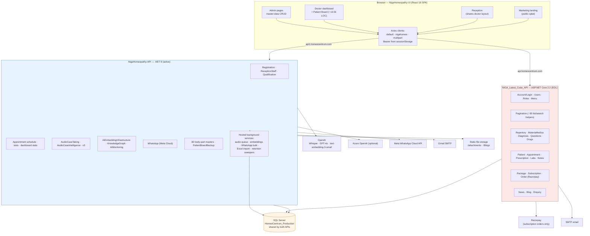

### 4.6 Existing modules and features (complete inventory)

#### 4.6.1 Admin portal — master data (client-reported 100%, confirmed in code)

| Module | Screens / capability |
|---|---|
| **Repertory** | Section, sub-section/rubric tree, rubric↔remedy mapping with author + grade, remedy-linked rubric viewer, language master, body-part master, intensity master, remedy master, remedy-grade master. Excel import/export/update with **asynchronous job status polling** |
| **Materia Medica** | Author, MM master, MM head (chapter headings), remedy-wise MM viewer, default differential-head flag |
| **Clinical Patterns** | Diagnosis system, diagnosis therapeutics, diagnosis & conditions with keyword→rubric linkage |
| **Adverse Effect** | Drug system, drug group, allopathic drug with serious / other side effects and adverse reactions |
| **Existance Questions** | Question section, question group, sub-question group, clinical question mapping to body parts and rubrics |
| **3D Body Part** | Mesh-key master (GLB mesh names), section master, hotspots linked to sub-section search |
| **Business Management** | Packages, qualifications, roles & menu permissions, platform users, labs/imaging catalogue, blogs, news |
| **Rubric Intelligence** | AI metaphors and aliases CRUD with approve/reject; benchmark dashboard (summary, trends, config, rollout, repertory status) |

Every admin master follows one consistent pattern: `ListX.js` (table + search + pagination) plus `AddX.js` / `EditX.js` (Formik + Yup), backed by a Redux `reducer.js` + `thunk.js` pair, with soft delete via dedicated `Delete*` endpoints.

#### 4.6.2 Doctor portal

| Area | Existing capability |
|---|---|
| Dashboard | Appointment counts by bucket (Waiting, Walk-In, Not Arrived, E-Consult, Remaining, Completed), patient list, patient stats charts (ApexCharts), recent activity, subscription days remaining and last-five-days warning |
| Patients | Create, search, list, open case, Excel/CSV/PDF export, import via template |
| Appointments | Create, status update, time update, appointment slot grid, daily schedule get/save (via a modal) |
| Patient Board | Body Parts · Questions · Clinical Pattern · Repertory · Repertorize · Materia Medica · Adverse Effect · Deep Analysis tabs; rubric clipboard; intensity selection; common/uncommon remedies; elimination; differential MM accordion; prescription modal (Prescription / Labs & Imaging / History Notes); multi-patient sessions (max 5) with cloud backup and restore |
| Audio AI case taking | Record or upload → consent → multipart upload → status polling every 2.5s (max 192 attempts ≈ 8 minutes) → transcript, conversation, AI summary, suggested rubrics → doctor edit/reanalyze/approve/reject → explainability, concept timeline, session history, offline upload queue |
| 3D anatomy | Interactive GLB viewer (male/female), hotspot click → sub-section rubric search |
| Outreach | WhatsApp templates, hospital service / offer / health tip / bulk sends, campaign and message history, background bulk queue |
| Commerce | Razorpay package purchase/renewal |
| Staff | Reception staff CRUD exists **as an API on .NET 8** with no UI page in the SPA |

#### 4.6.3 Reception portal

Reception shares the doctor dashboard layout with some clinical actions disabled. It can create patients, search, create and manage appointments, and update appointment status and time.

#### 4.6.4 Public / guest

Marketing landing with home, about, features, pricing, blog, news, contact, privacy, terms and account routes; doctor self-registration; activation from an emailed link; forgot-password screen.

### 4.7 Existing database — domains present

*Source: `NIGACentrumContext` description in `CODEBASE_DEEP_ANALYSIS.md`. Exact column definitions beyond those named below are **not specified in the provided documentation**.*

| Domain | Entities named in the documentation |
|---|---|
| Identity & org | `UserMaster`, `RoleMaster`, `RoleDetail`, `MenuMaster`, `ModuleMaster`, `FirmDetail`, `Doctor`, `DoctorReceptionStaff` |
| Scheduling | `DoctorDailySchedule`, `PatientAppointment`, `AppointmentHistoryNote` |
| Patients & cases | `Patient`, `CaseEntryDetail` (+ complaints, diagnoses), `CaseDetail`, `CaseDetailRemedy` |
| Prescription & labs | `PrescriptionRubricDetail`, `PrescriptionRemedyDetail`, `PatientLabOrder`, `PatientLabEntry`, `LabTestMaster` |
| Repertorization | `ClipboardRubric` |
| Commercial | `PackageMaster`, `PackageEntryDetail`, `PackageTopupMaster` |
| Clinical knowledge | `SectionMaster` → `SubSectionMaster` → `RubricRemedyDetail` (+ authors, grades), `RemedyMaster`, languages, body parts, sensations/modalities/patterns, diagnosis trees, materia medica, clinical questions, allopathic drugs and side effects |
| 3D | 3D mesh / section / hotspot masters |
| Board continuity | `DoctorPatientBoardBackup` |
| AI | `AudioCaseSession` (+ consent, events, match logs, feedback, benchmark), V3 concept-graph tables, embedding jobs/versions/queues, knowledge-graph nodes/edges, monitoring snapshots |
| Outreach | WhatsApp campaign / message / template tables |

Schema evolution is driven **largely by SQL scripts** under `Database/Scripts/`, not exclusively by EF migrations — including `SubSection_SearchNormalized_Setup.sql` and `RubricDetails_Performance_Indexes.sql`.

**Explicitly absent today:** any pharmacy entity, any invoice entity, and any financial ledger entity.

### 4.8 Existing business workflows

#### 4.8.1 End-to-end clinical workflow (AS-IS)

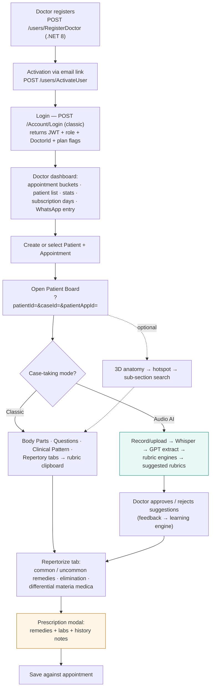

#### 4.8.2 Existing money workflow (AS-IS) — the only one that exists

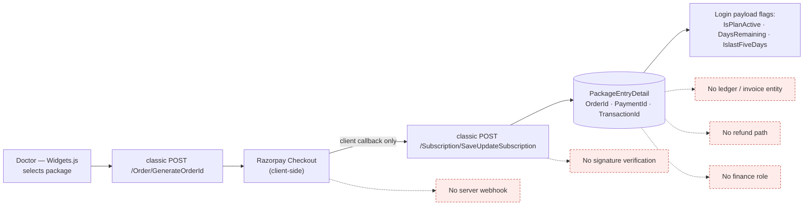

> **Client meeting point:** the current payment design trusts the browser. If the patient's browser closes between payment and callback, the platform has no independent record. That is tolerable for a doctor buying an annual subscription and **not** tolerable for thousands of patient consult and medicine transactions.

### 4.9 Existing integrations

| Integration | Purpose | Where |
|---|---|---|
| **OpenAI** — Whisper, GPT-4o, text-embedding-3-small | Transcription, symptom extraction, embeddings | .NET 8 |
| **Azure OpenAI** (optional) | Alternate model host | .NET 8 |
| **Meta WhatsApp Cloud API** | Templates, individual/bulk outreach, campaigns | .NET 8 |
| **Razorpay** | Doctor subscription orders | Classic API + UI checkout |
| **SMTP (Gmail)** | Registration, activation, password email | Both APIs |
| Static file hosting | `/attachments`, `/Blogs`, `/NewsImages` | Both APIs (directory browsing currently enabled on `/attachments` and `/Blogs`) |

### 4.10 Known gaps and technical debt in the existing system

*Stated by `CODEBASE_DEEP_ANALYSIS.md` as observational findings.*

| # | Finding | Programme relevance |
|---|---|---|
| 1 | No per-route frontend ACL | Blocks safe multi-role expansion |
| 2 | `[Authorize]` commented out on many repertory/admin APIs | Public perimeter cannot be opened until closed |
| 3 | Plaintext passwords on `UserMaster` | Must be fixed before patient data and payments |
| 4 | Fake backend still activated in `App.js`; `.env` still `REACT_APP_DEFAULTAUTH=fake` | Confusing auth surface; demo code in production bundle |
| 5 | Large unused Velzon demo surface still routed (ecommerce, NFT, crypto, CRM, tickets, kanban, mailbox…) | Must not be mistaken for product; admin currently lands on the ecommerce demo |
| 6 | `start` / `build` scripts use Windows `set` syntax | Heap bump may not apply on macOS/Linux build agents |
| 7 | Identity registered on .NET 8 but unused for login | Two competing auth concepts |
| 8 | Two APIs can drift; UI must call the correct host | Feature divergence risk |
| 9 | Secrets present in `appsettings.json` | Rotate; move to secret store before public exposure |
| 10 | Directory browsing enabled for `/attachments` and `/Blogs` | Information disclosure risk once patient documents are stored |
| 11 | `PatientBoard.js` ~13.5k lines; `Widgets.js` ~3.5k lines | Change risk concentration |
| 12 | Deep Analytics is a "coming soon" placeholder | Client expectation management |

---

## 5. NEW DEVELOPMENT OVERVIEW

*Source: `NIGA_DEV_2.docx` (Client Requirement), structured and analysed against the codebase.*

### 5.1 How the requirement document is organised

The client document is a platform-by-platform feature tree with three annotation types:

| Annotation | Meaning | Our treatment |
|---|---|---|
| `[Existing] [completed 100%]` | Built and complete | Verify by regression; no rebuild. Remaining work is ACL, hygiene, and dual-API discipline |
| `[Existing] [completed N%]` where N < 100 | Built but incomplete | **Enhancement Required** — we validate the stated percentage against the code and state where the two disagree |
| `[New]` | Not built | **New Development** — full specification required |

Three additional blocks carry requirements in prose rather than the tree: **Mobile application** (Patient and Doctor), **Patient features as per Hello Homeo Doc** (10 numbered modules), and **HomeoMeds — Go-Live Module List** (11 bullets), followed by **Special Considerations**.

### 5.2 Requirement volume

| Requirement source | Count |
|---|---|
| Admin portal items | 40 (36 existing, 4 new) |
| Web portal — Guest | 9 (7 existing, 2 new) |
| Web portal — Doctor | 52 (44 existing, 8 new) |
| Web portal — Reception | 15 (13 existing, 2 new) |
| Mobile — Patient | 9 capability areas (all new) |
| Mobile — Doctor | 12 capability areas (all new) |
| Hello Homeo Doc patient modules | 9 numbered modules (~60 discrete screens) |
| HomeoMeds go-live | 11 modules |
| Special Considerations | 4 governing constraints |

### 5.3 Where the client's stated percentages and the code disagree

This is material for the meeting: several items marked as low-completion actually have working backend assets, and one item marked 0% has partial code. Correcting these **reduces** estimated effort in some places and **increases** honesty in others.

| Requirement item | Client % | Code finding | Effect on scope |
|---|---|---|---|
| Daily schedule setup (Doctor) | 0% | `DailyScheduleSetupModal` + `GetDailySchedule` / `SaveDailySchedule` **exist**; it is simply not a first-class screen | **Reduces** — promote a modal to a screen, add reception read-only view |
| Manage reception staff (Doctor) | 50% | .NET 8 `api/ReceptionStaff` full CRUD **exists**; **no UI page at all** in the SPA | Re-labelled: backend done, frontend absent |
| Save complaints & case details | 20% | Classic `SaveComplaints` / `SaveCaseDetails` **exist**; Patient Board **does not call them** | **Reduces** — wiring, not new backend |
| Export case data | 0% | `ExportCasesToExcel` **exists** on .NET 8; no Patient Board button | **Reduces** — UI + PDF variant |
| Password reset request | 50% | `/forgot-password` UI exists but its thunk uses the **fake/Firebase** path; the real `ForgetPassword` API **emails the plaintext password** | **Increases** — this is a security defect, not a 50% feature |
| Admin home / overview widgets | 0% | Correct — the admin dashboard is the Velzon **ecommerce demo**, and login lands on `/dashboard` rather than `/admin/dashboard` | Confirmed |
| Platform users | 80% | List/Add/Edit live; **Import/Export buttons are dead**; no verification column | Confirmed |
| Reschedule appointment | New | `UpdateAppointmentTime` exists but has no audit, no notification, no old→new confirmation | Confirmed New (formalisation) |
| Cancel appointment | New | Status set is WAITING, WALK-IN, NOT ARRIVED, E-CONSULT, REMAINING, COMPLETED — there is **no CANCELLED** | Confirmed New |
| Save prescription → Potency | New | `Dose` is currently saved as an empty free-text string | Confirmed New |
| Telemedicine (all 5) | New | Only an `E-CONSULT` status plus a SweetAlert "WhatsApp video" stub | Confirmed New |
| Subscription Razorpay | 70% | Checkout works; **no webhook, no server signature verification, no refund, no invoice, no GST, no ledger** | Confirmed — and this is the seed of the whole payment programme |

---

## 6. BUSINESS OBJECTIVES

| # | Objective | Derived from |
|---|---|---|
| BO-1 | Open a **second and third revenue line** — patient consult fees and medicine orders — on top of doctor SaaS subscriptions | Consult Booking & Payments, HomeoMeds (Client Requirement) |
| BO-2 | Make Homeocentrum the **merchant of record for every transaction**, with full traceability | Special Considerations (Client Requirement) |
| BO-3 | Establish an **Account/Finance department role** owning ledger, settlement, refunds and payouts | Special Considerations (Client Requirement) |
| BO-4 | Give patients **direct access** to care — discovery, booking, payment, consultation, records, medicines — via web and mobile | Patient Self-Service Booking, Mobile application, Hello Homeo Doc (Client Requirement) |
| BO-5 | Deliver **first-party telemedicine**, ending dependence on WhatsApp video stubs | Telemedicine block (Client Requirement) |
| BO-6 | Build **trust infrastructure**: doctor credentialing, verification badges, ranking explanation, reviews, support tickets | Credentialing, Support Ticket, Hello Homeo Doc modules 2 & 9 (Client Requirement) |
| BO-7 | Make the **prescription a safe commercial instrument** — potency-structured, signed, immutable, and disclosed as codes before names | Potency, Visit notes vs eRx, HomeoMeds bullet on codes (Client Requirement) |
| BO-8 | Bridge prescriptions to **licensed pharmacy fulfilment** with licence gating and no re-entry of clinical data | HomeoMeds go-live list (Client Requirement) |
| BO-9 | Improve **clinic operations** — reschedule/cancel, waiting queue, schedule visibility, SMS, follow-up and performance analytics | Doctor/Reception items (Client Requirement) |
| BO-10 | Deepen **clinical differentiation** — Center of Gravity repertorization and higher audio-rubric accuracy | Patient Board items (Client Requirement) |
| BO-11 | Operate everything as **one interlinked ecosystem**, not federated apps | Special Considerations (Client Requirement) |

---

## 7. NEW FUNCTIONAL REQUIREMENTS — CATALOGUE

Requirement IDs used throughout the rest of this document.

### 7.1 Platform foundation (Recommended — prerequisite to client-requested scope)

| ID | Requirement | Classification |
|---|---|---|
| PLT-01 | Password hashing on `UserMaster`; migrate existing credentials | EXISTING — Modification Required |
| PLT-02 | Tokenised password reset (hash + TTL); stop emailing plaintext passwords; real thunk replacing the fake path | PARTIALLY EXISTING — Enhancement Required |
| PLT-03 | Server-side logout and session invalidation; activate `UserLoginStatus` | PARTIALLY EXISTING — Enhancement Required |
| PLT-04 | Real profile management for Admin, Doctor and Reception (replacing the Velzon `first_name` screen) | PARTIALLY EXISTING — Enhancement Required |
| PLT-05 | Restore `GetMenuByRole`; implement per-route frontend ACL; apply `[Authorize(Roles=)]` to all new modules | EXISTING — Modification Required |
| PLT-06 | Admin lands on `/admin/dashboard` with real KPI widgets, not the Velzon ecommerce demo | NEW DEVELOPMENT (replacing demo) |
| PLT-07 | Remove the fake auth backend from the production path; quarantine Velzon demo routes | CONFIGURATION CHANGE |
| PLT-08 | Move secrets out of `appsettings.json`; disable directory browsing on `/attachments` and `/Blogs` | CONFIGURATION CHANGE |
| PLT-09 | Add roles `Account`, `Patient`, `Pharmacy` to `RoleMaster` and the frontend role constants | DATABASE CHANGE REQUIRED |

### 7.2 Admin portal

| ID | Requirement | Client marker | Classification |
|---|---|---|---|
| ADM-01 | Doctor credentialing / verification review queue and detail | `[New] 0%` | NEW DEVELOPMENT |
| ADM-02 | Consult booking & payment reconciliation dashboard | `[New]` | NEW DEVELOPMENT |
| ADM-03 | Payment exception / failed payment queue | `[New]` | NEW DEVELOPMENT |
| ADM-04 | Patient & doctor reported issue (support ticket) queue | `[New]` | NEW DEVELOPMENT |
| ADM-05 | Admin home / overview widgets | `[Existing] 0%` | NEW DEVELOPMENT |
| ADM-06 | Platform users — working import/export, verification column, activate/lock | `[Existing] 80%` | PARTIALLY EXISTING — Enhancement Required |
| ADM-07 | Enquiry inbox screen for the existing `EnquiryDetail` API | Implied by Contact 50% | NEW DEVELOPMENT (frontend only) |
| ADM-08 | Pharmacy partner activation console | HomeoMeds list | NEW DEVELOPMENT |
| ADM-09 | HomeoMeds order exception queue | HomeoMeds list | NEW DEVELOPMENT |
| ADM-10 | Repertory / MM / Clinical Patterns / Adverse Effect / Existance / 3D / Roles / Packages / Qualifications / Lab catalogue | `[Existing] 100%` (25 items) | EXISTING — No Change Required (regression only) |

### 7.3 Account / Finance (new role)

| ID | Requirement | Classification |
|---|---|---|
| FIN-01 | Unified ledger across all money streams | NEW DEVELOPMENT |
| FIN-02 | Settlement runs for doctors and pharmacies | NEW DEVELOPMENT |
| FIN-03 | Payout approval under OTP dual control | NEW DEVELOPMENT |
| FIN-04 | Consult reconciliation view | NEW DEVELOPMENT |
| FIN-05 | Medicine ledger, **kept separate** from consult money | NEW DEVELOPMENT |
| FIN-06 | Payment exception queue (shared with Admin) | NEW DEVELOPMENT |
| FIN-07 | Refund processing | NEW DEVELOPMENT |
| FIN-08 | GST / invoice export | NEW DEVELOPMENT |
| FIN-09 | Doctor and pharmacy payee KYC | NEW DEVELOPMENT |
| FIN-10 | Clinic cash/UPI collection view (reception mix) | NEW DEVELOPMENT |

### 7.4 Web portal — Guest / Public

| ID | Requirement | Client marker | Classification |
|---|---|---|---|
| GST-01 | Patient-facing self-service booking funnel | `[New]` | NEW DEVELOPMENT |
| GST-02 | Patient-facing consult payment | `[New]` | NEW DEVELOPMENT |
| GST-03 | Product home — booking CTAs, verified-doctor trust, app links | `[Existing] 50%` | PARTIALLY EXISTING — Enhancement Required |
| GST-04 | Contact / enquiry — confirmation, SLA, admin inbox | `[Existing] 50%` | PARTIALLY EXISTING — Enhancement Required |
| GST-05 | Privacy policy — DPDP, recording, pharmacy consent, data rights | `[Existing] 50%` | PARTIALLY EXISTING — Enhancement Required |
| GST-06 | Terms of service — payments, telemedicine, HomeoMeds, refunds | `[Existing] 50%` | PARTIALLY EXISTING — Enhancement Required |
| GST-07 | Doctor self-registration — document upload, no auto-activation of practice | `[Existing] 90%` | EXISTING — Modification Required |
| GST-08 | Activation link — expiry, resend, aligned with credentialing | `[Existing] 90%` | EXISTING — Modification Required |
| GST-09 | Consult pricing display per doctor (in addition to SaaS pricing) | `[Existing] 100%` for SaaS | PARTIALLY EXISTING — Enhancement Required |

### 7.5 Web portal — Doctor

| ID | Requirement | Client marker | Classification |
|---|---|---|---|
| DOC-01 | Reschedule appointment (formal, audited, notified) | `[New]` | NEW DEVELOPMENT |
| DOC-02 | Cancel appointment (`CANCELLED` status + reason + slot release) | `[New]` | NEW DEVELOPMENT |
| DOC-03 | Follow-up analysis | `[New]` | NEW DEVELOPMENT |
| DOC-04 | Clinic performance analysis | `[New]` | NEW DEVELOPMENT |
| DOC-05 | SMS outreach — appointment confirmation, registration, doctor unavailable | `[New]` | NEW INTEGRATION |
| DOC-06 | Repertorization → Center of Gravity module | `[New]` | NEW DEVELOPMENT |
| DOC-07 | Prescription → Potency module | `[New]` | NEW DEVELOPMENT |
| DOC-08 | Visit notes distinct from prescription (eRx) | `[New]` | NEW DEVELOPMENT |
| DOC-09 | Telemedicine — doctor online/offline availability | `[New]` | NEW DEVELOPMENT |
| DOC-10 | Telemedicine — waiting queue | `[New]` | NEW DEVELOPMENT |
| DOC-11 | Telemedicine — join video consultation in browser | `[New]` | NEW INTEGRATION |
| DOC-12 | Telemedicine — rejoin after dropped call | `[New]` | NEW DEVELOPMENT |
| DOC-13 | Telemedicine — capture recording consent before consult | `[New]` | NEW DEVELOPMENT |
| DOC-14 | View consult payment status on appointment | `[New]` | NEW DEVELOPMENT |
| DOC-15 | Doctor profile — clinic, fees, KYC, photo, qualifications, hours, verification status | `[Existing] 20%` | PARTIALLY EXISTING — Enhancement Required |
| DOC-16 | Doctor home dashboard — online toggle, tele queue, payment badges, follow-up due | `[Existing] 70%` | PARTIALLY EXISTING — Enhancement Required |
| DOC-17 | Daily schedule setup as a first-class screen | `[Existing] 0%` (code: partial) | PARTIALLY EXISTING — Enhancement Required |
| DOC-18 | Manage reception staff UI over the existing API | `[Existing] 50%` | PARTIALLY EXISTING — Enhancement Required (frontend only) |
| DOC-19 | Buy / renew package — failure handling, invoice, ledger | `[Existing] 70%` | PARTIALLY EXISTING — Enhancement Required |
| DOC-20 | WhatsApp outreach — bulk completion, template governance, failure logs, opt-out | `[Existing] 50%` | PARTIALLY EXISTING — Enhancement Required |
| DOC-21 | Audio case taking — rubric-finding accuracy rules | `[Existing] 50%` | PARTIALLY EXISTING — Enhancement Required |
| DOC-22 | Save prescription remedies — no empty dose, signed snapshot | `[Existing] 80%` | PARTIALLY EXISTING — Enhancement Required |
| DOC-23 | Save complaints & case details — wire the board to existing APIs | `[Existing] 20%` | PARTIALLY EXISTING — Enhancement Required (frontend only) |
| DOC-24 | View patient back history — full timeline including eRx and payments | `[Existing] 70%` | PARTIALLY EXISTING — Enhancement Required |
| DOC-25 | Export case data from the Patient Board | `[Existing] 0%` (code: API exists) | PARTIALLY EXISTING — Enhancement Required (frontend + PDF) |
| DOC-26 | 3D anatomy viewer completeness | `[Existing] 50%` | PARTIALLY EXISTING — Enhancement Required |
| DOC-27 | Repertorization & elimination stability | `[Existing] 90%` | PARTIALLY EXISTING — Enhancement Required |
| DOC-28 | Materia medica browsing during case | `[Existing] 90%` | PARTIALLY EXISTING — Enhancement Required |
| DOC-29 | Patient search / list / open case — filters, last visit, unpaid, family | `[Existing] 90%` | PARTIALLY EXISTING — Enhancement Required |
| DOC-30 | New appointment — visit type, consult mode, fee | `[Existing] 90%` | PARTIALLY EXISTING — Enhancement Required |
| DOC-31 | Manage selected rubrics — confirm delete, intensity edit | `[Existing] 90%` | PARTIALLY EXISTING — Enhancement Required |
| DOC-32 | Open clinical workspace — payment/tele/eRx status in header | `[Existing] 90%` | PARTIALLY EXISTING — Enhancement Required |
| DOC-33 | Manual case, body parts, questions, diagnosis, repertory search, allopathic lookup, labs, history notes, board restore, slot grid, stats, activity, new/import/export patients, status & time updates, counts | `[Existing] 100%` | EXISTING — No Change Required |

### 7.6 Web portal — Reception

| ID | Requirement | Client marker | Classification |
|---|---|---|---|
| REC-01 | Reschedule appointment | `[New]` | NEW DEVELOPMENT (shared API with DOC-01) |
| REC-02 | Cancel appointment | `[New]` | NEW DEVELOPMENT (shared API with DOC-02) |
| REC-03 | Collect per-consult payment at reception | `[New]` | NEW DEVELOPMENT |
| REC-04 | Reception profile | `[Existing] 0%` | NEW DEVELOPMENT |
| REC-05 | View / support doctor schedule (read-only) | `[Existing] 0%` | NEW DEVELOPMENT (frontend over existing API) |
| REC-06 | Log case paper / chief complaint | `[Existing] 0%` | NEW DEVELOPMENT (frontend over existing API) |
| REC-07 | Waiting queue management — dedicated UX, payment gate, tele vs walk-in | `[Existing] 60%` | PARTIALLY EXISTING — Enhancement Required |
| REC-08 | Reception home dashboard — reception-first chrome | `[Existing] 90%` | PARTIALLY EXISTING — Enhancement Required |
| REC-09 | Clear session | `[Existing] 50%` | Covered by PLT-03 |
| REC-10 | Login, create patient, search/list, create/manage appointments, new appointment, status & time update | `[Existing] 100%` | EXISTING — No Change Required |

### 7.7 Mobile — Patient (Hello Homeo Doc)

*All NEW DEVELOPMENT. **Mobile applications do not exist in any current repository.***

| ID | Module (client numbering) | Screens |
|---|---|---|
| PAT-M1 | Onboarding & Identity | Language select · Welcome · Mobile + OTP · Profile setup · Privacy consent · Family members · Caregiver authorization |
| PAT-M2 | Discovery & Doctor Directory | Home dashboard · Search & care categories · Results · Filters · Doctor profile · Credentials & verification · Ranking explanation · Health articles |
| PAT-M3 | Booking, Queue & Payment | Slot picker · Booking review & consent · Checkout · Payment status · Appointment detail · Reschedule/cancel · Waitlist offer · Instant consult request · Queue & doctor offer |
| PAT-M4 | Consultation (first-party telemedicine) | Device check · Waiting room · Live video · Recording consent · Fallback & join failure · Case-linked chat · Consultation summary |
| PAT-M5 | Clinical Records & Prescription | Records timeline · Consultation note · Signed eRx · Document upload |
| PAT-M6 | Follow-up & Continuity | Follow-up plan & tasks · Symptom diary · CliniSight progress |
| PAT-M8 | HomeoMeds Bridge | Medicines tab · Order start · Pharmacy & quote · Order review & consent · Tracking · Order detail & refill |
| PAT-M9 | Trust, Money & Account | Write a review · My reviews & appeal · Payments & refunds · Profile & settings · Consent centre & data rights · Notifications |
| PAT-M10 | Support & Access | Help centre & tickets · Physical clinic appointment · Assisted booking · Low-data mode |
| PAT-M11 | Push notifications | OS permission handling + in-app notification list |

> **Note for clarification:** the client's Hello Homeo Doc list runs 1, 2, 3, 4, 5, 6, **8**, 9, 10 — **module 7 is absent** from the document. See Open Question OQ-C3.

### 7.8 Mobile — Doctor

*All NEW DEVELOPMENT. Explicit client constraint: **no case-taking on mobile** — refill approve/reject only.*

| ID | Requirement |
|---|---|
| DOCM-01 | Login & identity — shared `DoctorId`, same auth as web |
| DOCM-02 | First-run onboarding — confirm number, grant permissions |
| DOCM-03 | Notification permission handling — push, mic, camera |
| DOCM-04 | Today's queue / schedule view |
| DOCM-05 | Availability toggle — online/offline, working hours |
| DOCM-06 | Push notifications — patient waiting, new booking, reschedule/cancel, refill request, payment confirmed |
| DOCM-07 | Read-only patient context card — name, age, chief complaint, last visit |
| DOCM-08 | Join consultation (video/audio) |
| DOCM-09 | Refill / repeat-prescription approval (approve/reject only) |
| DOCM-10 | Earnings summary — today/week/month, payout status |
| DOCM-11 | Error and offline states — dead connection, failed action, expired session |
| DOCM-12 | Crash / error monitoring |

### 7.9 HomeoMeds (pharmacy marketplace)

*All NEW DEVELOPMENT.*

| ID | Module |
|---|---|
| PHR-01 | Pharmacy partner onboarding — licensed premises, licence records, activation checklist |
| PHR-02 | Licence gating — expired/suspended pharmacies auto-blocked from routing |
| PHR-03 | Fulfilment consent & pharmacy selection — patient picks a seller and consents before transmission |
| PHR-04 | Prescription handoff — signed eRx → immutable order draft, **no re-entry** |
| PHR-05 | Rule-based seller routing — licence, service area, hours, capacity; **manual stock confirmation, no live inventory** |
| PHR-06 | Pharmacy console — accept/reject, manual price quote, mark ready/dispatched |
| PHR-07 | Order confirmation & payment — quote shown before payment, pay or COD, status tracking |
| PHR-08 | Medicine ledger — seller/platform/delivery split, **separate from consult money** |
| PHR-09 | Order exception queue — stuck, rejected or failed orders surfaced to ops, **never silent** |
| PHR-10 | Code-then-name disclosure — patient sees remedy **codes**; on acceptance the prescription reveals names and generates a payment QR/link |
| PHR-11 | OTP-based control across the system so Homeocentrum can monitor and trace every transaction |

### 7.10 Special Considerations (governing constraints)

| ID | Constraint | Architectural consequence |
|---|---|---|
| SC-01 | All features in **one ecosystem**, interlinked across every role | Shared identity, appointment, eRx and ledger keys; no siloed data stores; one API family |
| SC-02 | **Payment is the most important element**; all payments received and maintained by Homeocentrum | Merchant-of-record model; webhook-verified capture; immutable ledger; no direct doctor↔patient or patient↔pharmacy settlement |
| SC-03 | **Every transaction** must pass through Homeocentrum | Even reception cash must produce a ledger row; COD must be logged and reconciled |
| SC-04 | **One Account department/role** handles all transactions | Dedicated role, dedicated screens, separation of duties from Admin |

---

## 8. AS-IS vs TO-BE

### 8.1 Transformation summary

| Dimension | AS-IS | Change | TO-BE |
|---|---|---|---|
| **Actors** | Admin, Doctor, Reception, Guest | + Patient, Account, Pharmacy | Six operating roles across four client applications |
| **Clients** | 1 web SPA | + Patient app, Doctor app, Pharmacy console | Four surfaces on one API family |
| **Identity** | Username/password, plaintext, session-only logout | + Hashed passwords, tokenised reset, server logout, patient OTP identity, generic high-risk OTP | Unified identity with an OTP control plane |
| **Authorisation** | Layout + redirect only | + Role claims, menu-by-role, route ACL, `[Authorize(Roles=)]` | Enforced RBAC end to end |
| **Booking** | Staff-created appointments only | + Public funnel, waitlist, instant consult, queue offers | Patient-initiated and staff-initiated converge on one appointment record |
| **Appointment lifecycle** | Create · status · time edit | + Formal reschedule, cancel with reason, change log, visit type, consult mode, payment status | Auditable lifecycle |
| **Consultation** | In-clinic; `E-CONSULT` status + WhatsApp stub | + Availability, tele queue, real sessions, rejoin, recording consent | First-party telemedicine |
| **Prescription** | Remedies + labs + notes in one modal; free-text empty `Dose` | + Potency master, notes/eRx split, immutable signed snapshot, code-then-name | eRx as a signed clinical and commercial instrument |
| **Repertorization** | Common/uncommon + elimination + differential MM | + Center of Gravity with explainability | Extended decision support |
| **Money** | S1 subscription only, client-trusted | + S2–S7, webhook-verified, ledgered, reconciled, settled | Marketplace treasury |
| **Finance ops** | None | + Account role: ledger, settlements, payouts, refunds, tax, payee KYC | Governed money movement |
| **Fulfilment** | None | + Licensed pharmacy network, routing, quotes, orders, medicine ledger | HomeoMeds marketplace |
| **Messaging** | WhatsApp only (50%) | + SMS provider and event hooks; push notifications | Multi-channel notification layer |
| **Support** | Marketing enquiry form only | + Support ticket workflow with SLA and assignment | Real support operations |
| **Trust** | Self-registration activates immediately | + Credentialing gate, verification badge, ranking explanation, reviews | Verified marketplace |
| **Analytics** | Patient stats charts; "Deep Analytics" placeholder | + Admin KPIs, follow-up analysis, clinic performance, AI monitoring (exists) | Operational intelligence |

### 8.2 AS-IS vs TO-BE — visual

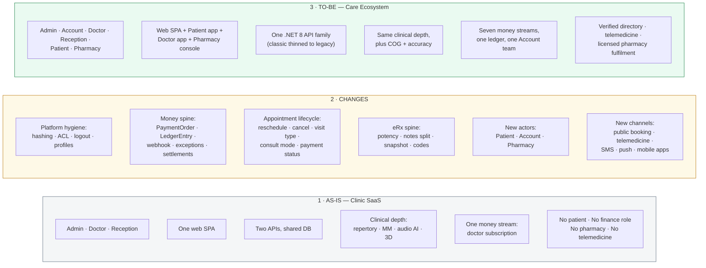

### 8.3 What deliberately does **not** change

Stating this protects the estimate and reassures the client that proven assets are not being rebuilt.

| Preserved asset | Rationale |
|---|---|
| All repertory, materia medica, clinical-pattern, adverse-effect, questionnaire and 3D masters (25 admin items at 100%) | Regression only |
| Patient Board core case-taking tabs and clipboard mechanics | Extended, never replaced |
| Repertorization, elimination and differential materia medica engines | COG is added alongside them |
| Audio AI pipeline, engines, intelligence admin, embeddings, knowledge graph, monitoring | Accuracy work continues per the existing `AUDIO_CASE_TAKING_*` documents |
| WhatsApp integration | Completed, not replaced; SMS is a parallel channel |
| Appointment status and time updates, slot grid, daily schedule APIs | Reused by reschedule, booking and telemedicine |
| Patient import/export, board backup/restore, lab orders, history notes | Reused |
| Razorpay commercial relationship | Reused; the integration is hardened and ported |

---

## 9. GAP ANALYSIS

### 9.1 Classification key

`E-NC` Existing — No Change · `E-MOD` Existing — Modification Required · `P-ENH` Partially Existing — Enhancement Required · `NEW` New Development · `NEW-INT` New Integration · `DB` Database Change Required · `CFG` Configuration Change · `MIG` Data Migration Required · `DEP` Requirement Dependency · `CLR` Clarification Needed

Priority: **P0** Critical · **P1** High · **P2** Medium · **P3** Low. All priorities are **Recommended Priority** unless the client document states otherwise — it does not state priorities, so every value below is our recommendation.

### 9.2 Master gap analysis table

| ID | Requirement | Existing capability | Gap | Required change | Impacted module | FE | BE | DB | API | Priority | Status |
|---|---|---|---|---|---|:--:|:--:|:--:|:--:|:--:|---|
| PLT-01 | Password hashing | Plaintext compare on both APIs | Credentials stored/compared in clear | Hash + salt; migrate on next login | Auth | ○ | ● | ● | ● | P0 | E-MOD, MIG |
| PLT-02 | Password reset | UI exists; thunk uses fake path; API emails plaintext password | No secure reset | Reset token table, TTL, email link, real thunk | Auth | ● | ● | ● | ● | P0 | P-ENH |
| PLT-03 | Logout / session | Client clears sessionStorage only | No server invalidation | `Logout` API, `UserLoginStatus`, optional denylist | Auth | ● | ● | ● | ● | P1 | P-ENH |
| PLT-04 | Real profiles | Velzon `first_name` screen only | No role-appropriate profile | Profile DTO/API per role + photo upload | Auth | ● | ● | ● | ● | P1 | P-ENH |
| PLT-05 | RBAC enforcement | Layout/redirect only; `GetMenuByRole` commented; `[Authorize]` commented on many APIs | No real authorisation | Restore menu-by-role, route ACL, role attributes | Platform | ● | ● | ○ | ● | P0 | E-MOD |
| PLT-06 | Admin home | Velzon ecommerce demo | No admin KPIs | New widgets + redirect fix + aggregate API | Admin dashboard | ● | ● | ○ | ● | P1 | NEW |
| PLT-07 | Demo surface | Fake backend mounted; demo routes registered | Demo code in production | Remove fake backend; quarantine routes | Platform | ● | ○ | ○ | ○ | P1 | CFG |
| PLT-08 | Secrets & static files | Secrets in `appsettings.json`; directory browsing on | Disclosure risk | Secret store; disable browsing; signed URLs | Platform | ○ | ● | ○ | ○ | P0 | CFG |
| PLT-09 | New roles | 6-value role enum, 3 used | No Account/Patient/Pharmacy | Seed roles + menu rows + FE constants | Platform | ● | ● | ● | ○ | P0 | DB |
| ADM-01 | Doctor credentialing | Registration captures university, cert no, qualification | No review workflow; registration auto-activates | Verification + document entities, queue/detail UI, approve/reject/request-info, practice gate | Business Mgmt | ● | ● | ● | ● | P1 | NEW |
| ADM-02 | Consult reconciliation | None (no consult payments exist) | No reconciliation surface | Dashboard + aggregate join queries | Payments | ● | ● | ● | ● | P0 | NEW, DEP(FIN-01) |
| ADM-03 | Payment exception queue | None | Failures invisible | Exception state machine + queue UI + resolve/retry | Payments | ● | ● | ● | ● | P0 | NEW |
| ADM-04 | Support tickets | Marketing `EnquiryDetail` only; Velzon demo tickets | No workflow, thread, SLA or assignment | Ticket entities + admin module | Support | ● | ● | ● | ● | P2 | NEW |
| ADM-05 | Admin overview widgets | — | — | See PLT-06 | Admin dashboard | ● | ● | ○ | ● | P1 | NEW |
| ADM-06 | Platform users 80% → 100% | List/Add/Edit live | Import/Export buttons dead; no verification column | Wire import/export; verification badge; lock control | Business Mgmt | ● | ● | ● | ● | P2 | P-ENH |
| ADM-07 | Enquiry inbox | `EnquiryDetail` API exists (classic) | No admin screen | Admin list/detail page | CMS | ● | ○ | ○ | ○ | P3 | NEW (FE) |
| ADM-08 | Pharmacy activation | None | No pharmacy entity | Partner + licence entities; activation checklist | HomeoMeds | ● | ● | ● | ● | P3 | NEW |
| ADM-09 | HomeoMeds exceptions | None | — | Exception queue over medicine orders | HomeoMeds | ● | ● | ● | ● | P3 | NEW |
| ADM-10 | 25 master modules at 100% | Full CRUD, Excel, pagination | None | Regression + dual-API hygiene + ACL | All masters | ○ | ○ | ○ | ○ | P2 | E-NC |
| FIN-01 | Unified ledger | **No ledger entity exists** | Money is untracked beyond `PackageEntryDetail` | Immutable append-only `LedgerEntry` across S1–S7 | Finance | ● | ● | ● | ● | P0 | NEW |
| FIN-02 | Settlements | None | Doctors/pharmacies cannot be paid | Settlement run job + screens | Finance | ● | ● | ● | ● | P0 | NEW |
| FIN-03 | Payout approval (OTP) | None | No dual control | OTP challenge + payout approval | Finance | ● | ● | ● | ● | P0 | NEW |
| FIN-04 | Consult reconciliation | None | — | Shared with ADM-02 | Finance | ● | ● | ○ | ● | P0 | NEW |
| FIN-05 | Medicine ledger | None | — | Separate ledger view for S5 | Finance | ● | ● | ● | ● | P3 | NEW, DEP(PHR) |
| FIN-06 | Payment exceptions | None | — | Shared with ADM-03 | Finance | ● | ● | ○ | ● | P0 | NEW |
| FIN-07 | Refunds | None | No refund path anywhere | Refund API + reverse ledger + gateway call | Finance | ● | ● | ● | ● | P1 | NEW |
| FIN-08 | GST / invoice export | **No invoice entity exists** | No tax artefacts | Invoice numbering + GST config + export | Finance | ● | ● | ● | ● | P1 | NEW, CLR |
| FIN-09 | Payee KYC | Doctor has some registration data | No bank/PAN capture | KYC fields + verification | Finance | ● | ● | ● | ● | P1 | NEW |
| FIN-10 | Clinic collections view | None | Reception cash invisible | View over S3 ledger rows | Finance | ● | ● | ○ | ● | P1 | NEW |
| GST-01 | Public self-service booking | Staff-only appointment creation; slot APIs exist | No public funnel, no patient identity | Public rate-limited APIs, OTP, booking wizard | Booking | ● | ● | ● | ● | P1 | NEW |
| GST-02 | Patient consult payment | Razorpay pattern exists for subscription | No consult order/verify/webhook | Consult order + webhook + status | Payments | ● | ● | ● | ● | P0 | NEW, DEP(FIN-01) |
| GST-03 | Product home 50% → 100% | Landing exists | No booking CTA or trust content | Content + deep links + app badges | Marketing | ● | ○ | ○ | ○ | P2 | P-ENH |
| GST-04 | Contact / enquiry | Form + API exist | No confirmation/SLA/inbox | Confirmation UX; optional ticket spawn | Marketing | ● | ● | ○ | ● | P3 | P-ENH |
| GST-05 | Privacy policy | Page exists | Missing DPDP, recording, pharmacy, data rights | Legal content rewrite | Legal | ● | ○ | ○ | ○ | P1 | P-ENH, DEP(legal) |
| GST-06 | Terms of service | Page exists | Missing payments, refunds, telemedicine, HomeoMeds | Legal content rewrite | Legal | ● | ○ | ○ | ○ | P1 | P-ENH, DEP(legal) |
| GST-07 | Doctor self-registration | `RegisterDoctor` exists and **activates immediately** | No document upload; no verification gate | Multipart docs; `VerificationStatus=Pending`; practice lock | Auth | ● | ● | ● | ● | P1 | E-MOD |
| GST-08 | Activation link | `ActivateUser` exists | No expiry/resend; not aligned to credentialing | Token expiry + resend + status page | Auth | ● | ● | ● | ● | P2 | E-MOD |
| GST-09 | Consult fee display | SaaS pricing page only | Consult fee not modelled | `ConsultFeeConfig` + public display | Marketing | ● | ● | ● | ● | P1 | P-ENH |
| DOC-01 | Reschedule | `UpdateAppointmentTime` | No audit, notify, conflict handling or old→new UX | Dedicated API + change log + modal + notify | Appointments | ● | ● | ● | ● | P1 | NEW |
| DOC-02 | Cancel | `DeleteStatus` soft delete only | **No CANCELLED status** | New status + reason + slot release + bucket | Appointments | ● | ● | ● | ● | P1 | NEW |
| DOC-03 | Follow-up analysis | Patient stats charts | No persisted visit type; no follow-up metrics | `VisitType` + analytics APIs + page | Analytics | ● | ● | ● | ● | P2 | NEW, DEP(DOC-30) |
| DOC-04 | Clinic performance | `GetPatientStatsCharts` | No utilisation/no-show/wait/revenue | Aggregate APIs + page | Analytics | ● | ● | ○ | ● | P2 | NEW, DEP(FIN-01) |
| DOC-05 | SMS outreach | WhatsApp only | No SMS provider, templates or event hooks | Provider integration, templates, logs, DND | Outreach | ● | ● | ● | ● | P1 | NEW-INT |
| DOC-06 | Center of Gravity | Repertorize + elimination | No COG algorithm or panel | Algorithm service + API + panel with explainability | Patient Board | ● | ● | ○ | ● | P2 | NEW, CLR |
| DOC-07 | Potency module | `Dose` free text, saved empty | No structured potency | `PotencyMaster` + `PotencyId` + required picker | Patient Board | ● | ● | ● | ● | P1 | NEW |
| DOC-08 | Visit notes vs eRx | `AppointmentHistoryNote` inside the Rx modal | Notes and prescription conflated | Note types, exclusion flag, UX split, eRx payload | Patient Board | ● | ● | ● | ● | P1 | NEW |
| DOC-09 | Tele availability | None | — | `TeleAvailability` + toggle + heartbeat | Telemedicine | ● | ● | ● | ● | P2 | NEW |
| DOC-10 | Tele queue | `E-CONSULT` bucket | Not a real queue | Queue API by doctor/online/paid + UI | Telemedicine | ● | ● | ● | ● | P2 | NEW |
| DOC-11 | Join video in browser | SweetAlert WhatsApp stub | No video capability | Vendor SDK + room tokens + full-page room | Telemedicine | ● | ● | ● | ● | P2 | NEW-INT, CLR |
| DOC-12 | Rejoin | None | — | Session state machine; token re-issue while Active | Telemedicine | ● | ● | ● | ● | P2 | NEW |
| DOC-13 | Recording consent | `AudioCaseConsentLog` pattern exists | No tele consent | Consent entity/flow; block recording on decline | Telemedicine | ● | ● | ● | ● | P2 | NEW |
| DOC-14 | Payment status on appointment | None | — | Payment fields on appointment DTOs + badge | Payments | ● | ● | ○ | ● | P1 | NEW, DEP(GST-02) |
| DOC-15 | Doctor profile 20% → 100% | Shared Velzon profile | No clinic, fee, KYC, photo, hours, status | Doctor profile module | Auth | ● | ● | ● | ● | P1 | P-ENH |
| DOC-16 | Doctor dashboard 70% → 100% | Counts, lists, charts, WhatsApp, subscription | No online toggle, tele queue, payment badges, follow-up due | Extend dashboard | Dashboard | ● | ● | ○ | ● | P1 | P-ENH |
| DOC-17 | Daily schedule | Modal + Get/Save APIs exist | Not a first-class screen; reception cannot view | Promote to `/doctor/schedule`; reception read-only | Scheduling | ● | ● | ○ | ● | P1 | P-ENH |
| DOC-18 | Manage reception staff | Full CRUD API on .NET 8 | **No UI at all** | Build pages over the existing API | Staff | ● | ○ | ○ | ○ | P2 | P-ENH (FE only) |
| DOC-19 | Subscription 70% → 100% | Razorpay checkout works | No webhook, invoice, failure UX or ledger | Port order to .NET 8; webhook; S1 ledger; invoice | Payments | ● | ● | ● | ● | P0 | P-ENH |
| DOC-20 | WhatsApp 50% → 100% | Send, templates, campaigns, bulk queue | Bulk UX, template governance, failure list, opt-out | Complete the module | Outreach | ● | ● | ● | ● | P2 | P-ENH |
| DOC-21 | Audio accuracy 50% → 100% | Multi-engine pipeline + metaphors/aliases + benchmark | Accuracy rules in progress | Follow existing `AUDIO_CASE_TAKING_*` engine roadmap | AI | ● | ● | ● | ● | P2 | P-ENH |
| DOC-22 | Save prescription 80% → 100% | Classic `SavePrescriptionDetail` | Empty dose accepted; no signed snapshot | Validation + potency + `ErxSnapshot` | Patient Board | ● | ● | ● | ● | P1 | P-ENH |
| DOC-23 | Complaints & case details 20% → 100% | `SaveComplaints` / `SaveCaseDetails` exist | Board never calls them | Wire the board to existing APIs | Patient Board | ● | ○ | ○ | ○ | P1 | P-ENH (FE only) |
| DOC-24 | Back history 70% → 100% | History panel exists | No unified timeline | Timeline: visits, notes, eRx, labs, payments | Patient Board | ● | ● | ○ | ● | P2 | P-ENH |
| DOC-25 | Export case data | `ExportCasesToExcel` exists | No board button; no PDF | Toolbar action + PDF renderer | Patient Board | ● | ● | ○ | ● | P2 | P-ENH |
| DOC-26 | 3D anatomy 50% → 100% | Viewer + hotspot search | Incomplete mesh/hotspot coverage | Content completion + UX + mobile fallback | Anatomy | ● | ● | ● | ○ | P3 | P-ENH |
| DOC-27 | Repertorization 90% → 100% | Common/uncommon, elimination, differential MM | Stability polish | Hardening before COG | Patient Board | ● | ● | ○ | ○ | P2 | P-ENH |
| DOC-28 | Materia medica 90% → 100% | MM tab + differential accordion | Navigation friction during case | UX polish | Patient Board | ● | ○ | ○ | ○ | P3 | P-ENH |
| DOC-29 | Patient search 90% → 100% | Search/list/open case | No filters for last visit, unpaid, family | Extend list DTOs and filters | Dashboard | ● | ● | ○ | ● | P2 | P-ENH |
| DOC-30 | New appointment 90% → 100% | Formik modal | No visit type, consult mode or fee | Extend entity + modal | Appointments | ● | ● | ● | ● | P1 | P-ENH |
| DOC-31 | Manage selected rubrics 90% → 100% | Clipboard management | Delete confirm, intensity edit | UX polish | Patient Board | ● | ○ | ○ | ○ | P3 | P-ENH |
| DOC-32 | Open workspace 90% → 100% | Board opens by patient/case/appointment | No payment/tele/eRx status in header | Header status strip | Patient Board | ● | ● | ○ | ● | P2 | P-ENH |
| DOC-33 | 20 items at 100% | Confirmed | None | Regression | Multiple | ○ | ○ | ○ | ○ | P2 | E-NC |
| REC-01/02 | Reception reschedule/cancel | Shares doctor dashboard | Actions absent; reception gating unclear | Same APIs; authorise reception for its `DoctorId` | Appointments | ● | ● | ○ | ● | P1 | NEW |
| REC-03 | Collect payment at reception | None | Cash/UPI invisible to platform | `CollectAtReception` + receipt + S3 ledger row | Payments | ● | ● | ● | ● | P0 | NEW |
| REC-04 | Reception profile | 0% | No profile at all | Reception profile screen + API | Auth | ● | ● | ● | ● | P2 | NEW |
| REC-05 | Doctor schedule (read-only) | `GetDailySchedule` exists | No reception view | Read-only screen using `DoctorID` from JWT | Scheduling | ● | ○ | ○ | ○ | P2 | NEW (FE) |
| REC-06 | Case paper / chief complaint | `SaveComplaints` exists | No reception surface | Restricted form; audit reception author | Patient Board | ● | ● | ○ | ● | P2 | NEW (FE + authz) |
| REC-07 | Waiting queue 60% → 100% | Status buckets on shared dashboard | No dedicated queue UX or payment gate | Queue panel, call-next, tele vs walk-in | Reception | ● | ● | ○ | ● | P1 | P-ENH |
| REC-08 | Reception home 90% → 100% | Doctor dashboard with actions hidden | Not reception-first | Reception chrome | Reception | ● | ○ | ○ | ○ | P2 | P-ENH |
| PAT-M1…M11 | Patient mobile app | **Nothing exists** | Entire application absent | New app + patient identity, records, payments, tele, HomeoMeds APIs | Mobile | ● | ● | ● | ● | P2 | NEW, DEP(platform) |
| DOCM-01…12 | Doctor mobile app | **Nothing exists** | Entire application absent | New app over existing + new doctor APIs | Mobile | ● | ● | ● | ● | P3 | NEW, DEP(tele, FIN) |
| PHR-01…11 | HomeoMeds | **Nothing exists**; no pharmacy or inventory concept in the product | Entire marketplace absent | Partner, licence, routing, console, orders, quotes, medicine ledger, codes/names, OTP | HomeoMeds | ● | ● | ● | ● | P3 | NEW, DEP(eRx snapshot, FIN) |
| SC-01…04 | Special Considerations | Partially — one ecosystem exists for clinic roles only | Money spine and shared keys absent | Governs all of the above | Cross-cutting | ● | ● | ● | ● | P0 | NEW |

### 9.3 Gap analysis — summary counts

| Classification | Count of requirement IDs |
|---|---|
| EXISTING — No Change Required | 2 groups covering ~45 individual features |
| EXISTING — Modification Required | 5 |
| PARTIALLY EXISTING — Enhancement Required | 29 |
| NEW DEVELOPMENT | 40+ (including 3 whole applications) |
| NEW INTEGRATION | 3 (SMS, video vendor, push) |
| DATABASE CHANGE REQUIRED | ~30 new entities + 9 extended entities |
| CONFIGURATION CHANGE | 3 |
| DATA MIGRATION REQUIRED | 2 (password hashing, appointment status backfill) |
| CLARIFICATION NEEDED | 12 (see Open Questions) |

---

## 10. COMPLETE SYSTEM ECOSYSTEM

This section answers the client's first Special Consideration directly: **how all features live in one ecosystem and interlink across every role.**

### 10.1 The single ecosystem diagram

```mermaid
flowchart TB
    subgraph USERS["ACTORS"]
        direction LR
        U_PAT["Patient"]
        U_DOC["Doctor"]
        U_REC["Reception"]
        U_ADM["Admin"]
        U_ACC["Account / Finance"]
        U_PHR["Pharmacy Partner"]
    end

    subgraph CLIENTS["CLIENT APPLICATIONS"]
        direction LR
        APP_P["Patient Mobile App<br/>(Hello Homeo Doc) — NEW"]
        APP_D["Doctor Mobile App — NEW"]
        WEB_PUB["Public Web:<br/>marketing · booking · pay — PARTLY NEW"]
        WEB_APP["Admin / Doctor / Reception SPA<br/>— EXISTING, extended"]
        WEB_ACC["Account Console — NEW"]
        WEB_PHR["Pharmacy Console — NEW"]
    end

    U_PAT --> APP_P
    U_PAT --> WEB_PUB
    U_DOC --> APP_D
    U_DOC --> WEB_APP
    U_REC --> WEB_APP
    U_ADM --> WEB_APP
    U_ACC --> WEB_ACC
    U_PHR --> WEB_PHR

    APP_P --> GW
    APP_D --> GW
    WEB_PUB --> GW
    WEB_APP --> GW
    WEB_ACC --> GW
    WEB_PHR --> GW

    GW["API LAYER — NigaHomeopathy-API (.NET 8)<br/>JWT · role claims · rate limiting on public routes"]

    GW -.legacy calls only.-> LEG["NIGA_Latest_Code_API (2.2)<br/>login · masters · Rx save · notes<br/>— to be thinned"]

    subgraph SVC["BACKEND DOMAIN SERVICES"]
        direction TB
        S_ID["Identity & OTP<br/>login · reset · logout · patient OTP · high-risk OTP"]
        S_CRED["Credentialing<br/>verification · documents · practice gate"]
        S_SCH["Scheduling & Appointments<br/>schedule · slots · book · reschedule · cancel · queue"]
        S_CLIN["Clinical<br/>repertory · MM · questions · diagnosis · clipboard ·<br/>repertorization · COG · labs · notes"]
        S_AI["AI Case Taking<br/>Whisper · GPT · rubric engines · embeddings · KG"]
        S_ERX["eRx<br/>potency · snapshot · codes/names · refill"]
        S_TELE["Telemedicine<br/>availability · sessions · rejoin · consent"]
        S_PAY["Payments & Ledger<br/>orders · webhook · exceptions · settlements · payouts · refunds"]
        S_MED["HomeoMeds<br/>partners · licence gate · routing · quotes · orders"]
        S_SUP["Support Tickets"]
        S_NOTIF["Notifications<br/>SMS · WhatsApp · Push · Email"]
        S_ANA["Analytics<br/>admin KPIs · follow-up · clinic performance · AI monitoring"]
    end

    GW --> S_ID & S_CRED & S_SCH & S_CLIN & S_AI & S_ERX
    GW --> S_TELE & S_PAY & S_MED & S_SUP & S_NOTIF & S_ANA

    subgraph DATA["DATA & INFRASTRUCTURE"]
        direction LR
        DB[("SQL Server<br/>clinical · commercial · AI · ledger")]
        FILES[("Object / File storage<br/>audio · documents · eRx PDF · licences")]
        CACHE[("Cache<br/>rubric details · slots · directory — PROPOSED")]
        QUEUE["Background jobs<br/>audio · embeddings · WhatsApp bulk ·<br/>settlement runs · licence expiry · exceptions"]
    end

    S_ID & S_CRED & S_SCH & S_CLIN & S_ERX & S_PAY & S_MED & S_SUP & S_ANA --> DB
    S_AI --> DB
    S_AI --> QUEUE
    S_PAY --> QUEUE
    S_MED --> QUEUE
    S_NOTIF --> QUEUE
    S_AI --> FILES
    S_ERX --> FILES
    S_CRED --> FILES
    S_CLIN --> CACHE
    LEG --> DB

    subgraph EXT["EXTERNAL SERVICES"]
        direction LR
        E_RZP["Razorpay<br/>orders · webhooks · refunds · payouts"]
        E_OAI["OpenAI / Azure OpenAI<br/>Whisper · GPT-4o · embeddings"]
        E_WA["Meta WhatsApp Cloud"]
        E_SMS["SMS provider (DLT)"]
        E_VID["Video vendor<br/>Twilio / Daily / Agora — TBD"]
        E_PUSH["FCM / APNs"]
        E_MAIL["SMTP"]
    end

    S_PAY --> E_RZP
    S_AI --> E_OAI
    S_NOTIF --> E_WA & E_SMS & E_PUSH & E_MAIL
    S_TELE --> E_VID

    subgraph OPS["CROSS-CUTTING"]
        direction LR
        O_AUD["Audit & OTP audit log"]
        O_LOG["Logging"]
        O_MON["Monitoring & crash reporting"]
    end

    SVC --> OPS

    style GW fill:#e8f4fd,stroke:#2471a3,stroke-width:2px
    style LEG fill:#fde8e8,stroke:#c0392b
    style S_PAY fill:#fef5e7,stroke:#b9770e,stroke-width:2px
    style DB fill:#fef5e7,stroke:#b9770e
```

### 10.2 Shared keys — the mechanism that makes it one ecosystem

Interlinking is not achieved by diagrams; it is achieved by insisting that every module reference the same identifiers.

| Key | Meaning | Consumed by |
|---|---|---|
| `DoctorId` / `UserId` | Doctor identity, identical on web and doctor mobile | All clinical modules, payouts, telemedicine, credentialing |
| `PatientId` | Patient, whether clinic-created or self-registered | Booking, records, HomeoMeds, family/caregiver links |
| `PatientAppId` | One visit / appointment | Queue, telemedicine session, consult payment, eRx, notes |
| `CaseId` | Clinical case | Patient Board, audio session, case export |
| `ErxId` / eRx snapshot | Signed remedies (codes vs names) | Patient app, pharmacy console, refill |
| `LedgerTxnId` | Every rupee movement | Account, OTP audit, reconciliation |
| `OrderId` (commerce) | Razorpay or COD order | Consult and medicine streams |

> **Design rule:** a new module that invents its own patient or appointment identifier has broken SC-01 and must be rejected at code review.

### 10.3 Cross-role event map

Because roles act on the same records, each significant action must fan out. This table is the contract for that fan-out.

| Event | Produced by | Consumed by |
|---|---|---|
| Doctor registered | Guest web | Admin credentialing queue |
| Doctor verified | Admin | Doctor practice unlock; patient directory ranking; verified badge |
| Slot saved | Doctor / Reception | Patient booking availability; doctor mobile queue |
| Appointment created | Patient / Reception / Doctor | SMS + WhatsApp confirmation; payment; queue; Account (if paid) |
| Reschedule / Cancel | Doctor / Reception / Patient | Slot release; notifications; refund rule evaluation |
| Consult paid | Patient / Reception | Queue unlock; doctor payment badge; Account ledger |
| eRx signed | Doctor (web Patient Board) | Patient sees **codes**; pharmacy offer routing; Account later |
| Pharmacy accepts (OTP) | Pharmacy console | Patient sees remedy **names** + quote + pay QR/link |
| Ticket opened | Patient / Doctor | Admin support queue |
| Doctor online | Doctor web or mobile | Patient instant consult and waiting room |
| Payment failed / mismatched | Gateway webhook | Admin + Account exception queue (**never silent**) |
| Licence expired | Scheduled job | Pharmacy blocked from routing; Admin alert |

### 10.4 Proposed TO-BE architecture

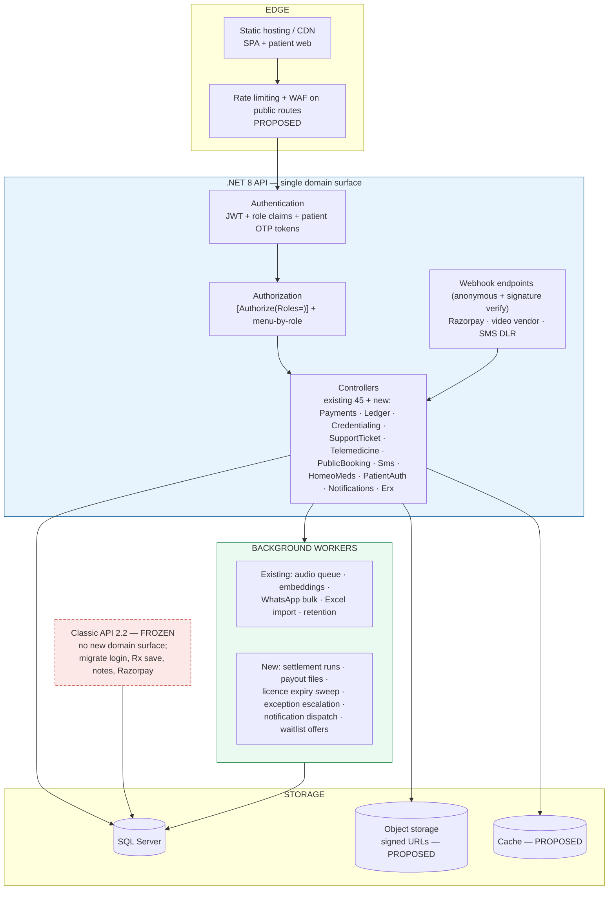

**Architectural decisions embedded above (all Recommended / Proposed):**

| # | Decision | Rationale |
|---|---|---|
| AD-1 | All new domain modules on **.NET 8**; **no third backend** | Avoids a third drift surface; .NET 8 is the active stack |
| AD-2 | Classic API **frozen** — no new endpoints; migrate login, prescription save, history notes and Razorpay order generation | ASP.NET Core 2.2 is end-of-life and will sit behind a public perimeter |
| AD-3 | **Webhook is the source of truth** for every payment | Client callbacks cannot be trusted once volume and money increase |
| AD-4 | **Append-only ledger**; never mutate financial rows | Auditability, dispute resolution, GST defensibility |
| AD-5 | **Medicine money in a separate ledger view** from consult money | Explicit client instruction (HomeoMeds bullet 8) |
| AD-6 | **OTP control plane** over high-risk actions with an audit log | Explicit client instruction (HomeoMeds bullet 11 / SC-03) |
| AD-7 | Mobile apps consume the **same APIs** as web — no mobile-only backend | SC-01 |
| AD-8 | Public endpoints are **rate-limited and separately namespaced** (`/api/PublicBooking/*`, `/api/PatientAuth/*`) | Blast-radius containment |
| AD-9 | Object storage with **signed URLs** for patient documents, eRx PDFs and licences; directory browsing disabled | Current static-file exposure is unsafe for PHI |

---

## 11. END-TO-END WORKFLOWS

Each workflow below follows: **User Action → Frontend → API → Backend Logic → Database/External → Response → Frontend Update → Outcome**, with alternative, exception and edge paths.

### 11.1 Workflow A — Patient self-service booking with online consult payment (GST-01, GST-02)

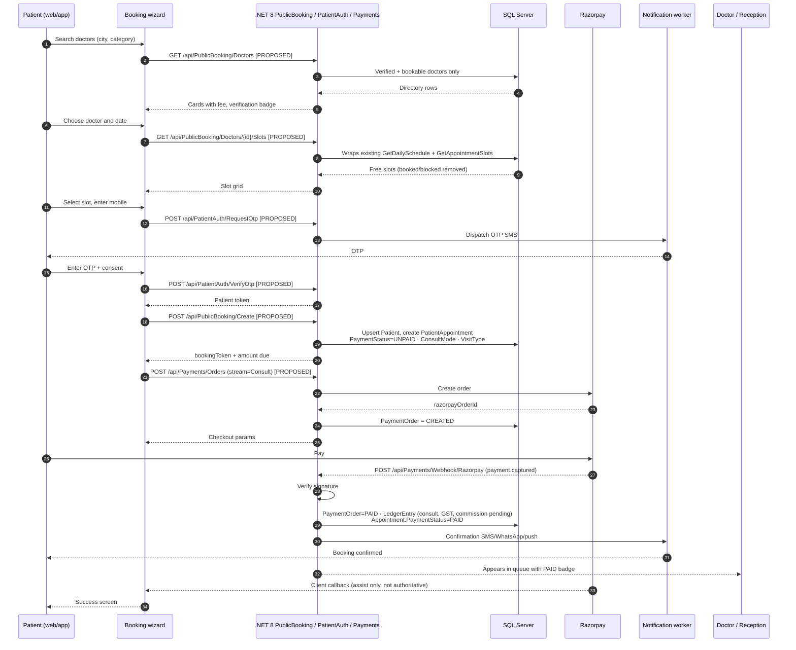

**Happy path outcome:** appointment exists, money is captured, ledger row written, all roles see a paid booking.

**Alternative flows**

| Scenario | Behaviour |
|---|---|
| Doctor has `PayAtClinicEnabled` | Booking is created with `PAY_AT_CLINIC`; no order is generated; reception collects later (Workflow C) |
| Slot taken between selection and submit | Concurrency check on create returns a conflict; UI offers the nearest alternatives |
| Existing patient mobile number | `Create` links to the existing `PatientId` rather than duplicating; family members are offered |
| Waitlist | If no slot is acceptable, `POST /api/PublicBooking/Waitlist` records interest; a worker offers freed slots on cancellation |
| Instant consult | `POST /api/PublicBooking/InstantConsult` routes to any doctor currently online (Workflow D) |

**Exception flows**

| Failure | Handling |
|---|---|
| OTP not delivered | Resend with cooldown; after N attempts, offer assisted booking (PAT-M10) |
| Payment fails (`payment.failed`) | `PaymentOrder=FAILED`; `PaymentException` row created; appointment remains `UNPAID`; patient may retry; **appears in the Admin/Account exception queue** |
| Webhook never arrives | Reconciliation job polls the gateway for orders in `CREATED` beyond a threshold and raises a `Webhook-mismatch` exception |
| Client closes the browser after paying | Irrelevant — the webhook, not the browser, writes the ledger (AD-3) |
| Duplicate webhook delivery | Idempotency on `razorpayPaymentId`; second delivery is a no-op |

**Edge cases:** patient books for a family member (caregiver authorisation); patient in a different time zone (store UTC, render clinic-local); doctor cancels the day after payment (refund rule, Workflow F); partial capture; refund initiated while a reschedule is in flight.

### 11.2 Workflow B — Formal reschedule and cancel (DOC-01, DOC-02, REC-01, REC-02)

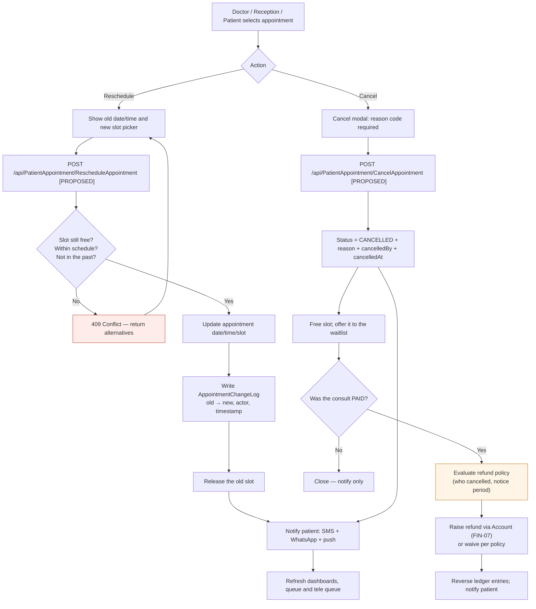

> **Why this is New and not a rename of `UpdateAppointmentTime`:** the existing endpoint changes a time. It does not check conflicts against the daily schedule, does not release the previous slot, does not write an audit record, does not notify anyone, and has no cancelled state to move into. Each of those is a separate requirement in the client document.

### 11.3 Workflow C — Consult payment at reception (REC-03, stream S3)

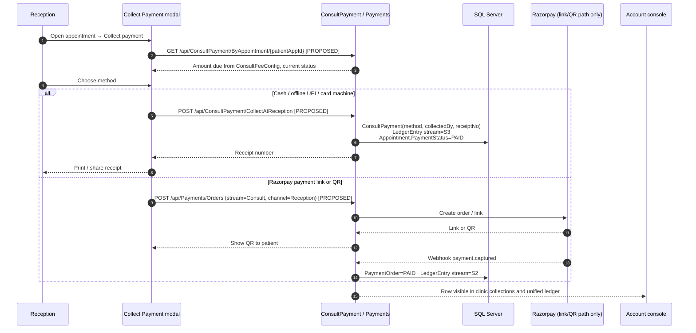

**Policy point requiring client confirmation:** cash collected at the clinic is physically held by the clinic. The ledger must still record it (SC-03). Whether it is *clinic-retained* or *remitted to Homeocentrum* is a commercial decision — see Open Question OQ-A2.

### 11.4 Workflow D — Telemedicine consultation (DOC-09 to DOC-13, PAT-M4)

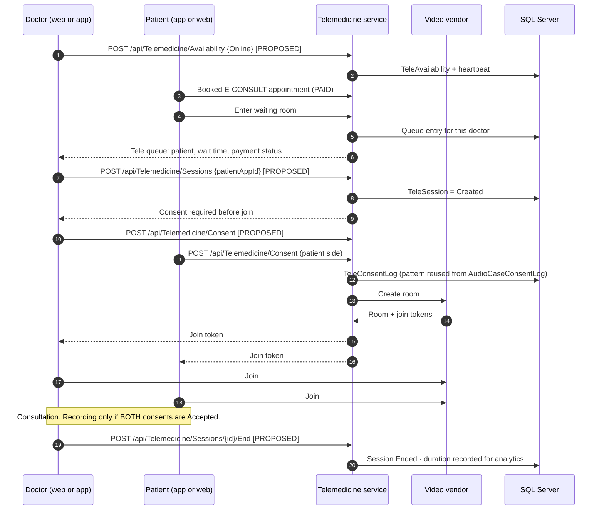

**Rejoin (DOC-12):** while the session state is `Active`, `POST /api/Telemedicine/Sessions/{id}/Rejoin` re-issues a token to either party and writes a reconnect audit entry. Once `Ended`, rejoin is refused and a new session is required.

**Exception flows:** device permission denied (device-check screen guides the user); vendor room creation fails (fallback to reschedule or audio-only, ticket raised); one party never joins (no-show policy and refund rule); network drop (rejoin); consent declined (consultation may proceed **without** recording — recording is blocked, the consult is not).

### 11.5 Workflow E — Signed eRx, code-then-name disclosure, and pharmacy fulfilment (DOC-07, DOC-08, DOC-22, PHR-03 to PHR-10)

This is the most commercially and clinically sensitive flow in the programme.

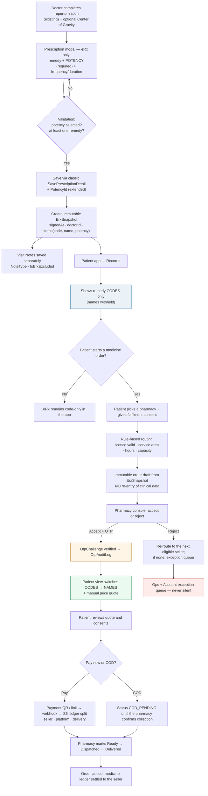

**Reading of the client's requirement, for confirmation:** the document states that the patient cannot see the prescription remedies and sees remedy **codes**; when someone accepts the prescription, the changes to that prescription are visible and a payment QR or link is generated. Our interpretation is: *names are withheld until a licensed pharmacy accepts the order under OTP, at which point names and the priced quote are revealed and payment is generated.* This interpretation is significant enough to require explicit sign-off — see Open Question OQ-B1.

### 11.6 Workflow F — Money: capture, reconcile, settle, pay out (FIN-01 to FIN-10, SC-02 to SC-04)

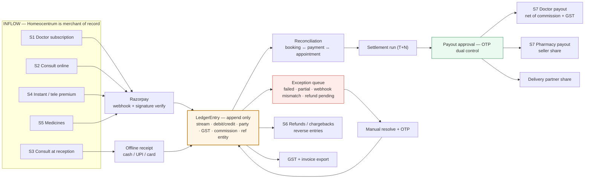

**Non-negotiable rules encoded above:**

1. `PackageEntryDetail` remains **subscription-only**. It must not be overloaded for consult or medicine money.
2. Every inflow produces a ledger row — including reception cash and COD.
3. Consult money and medicine money are reported through **separate ledgers**.
4. No payout leaves the platform without an OTP-approved settlement.
5. No failed payment is silent.

### 11.7 Workflow G — Doctor credentialing gate (ADM-01, GST-07)

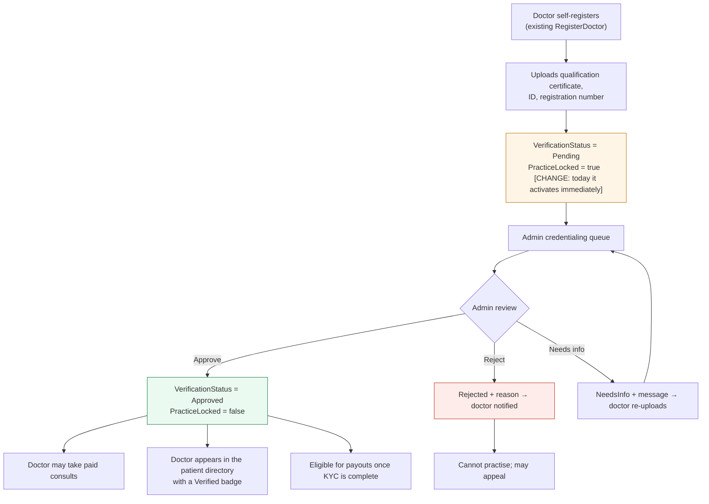

### 11.8 Generic request/data flow (all new modules)

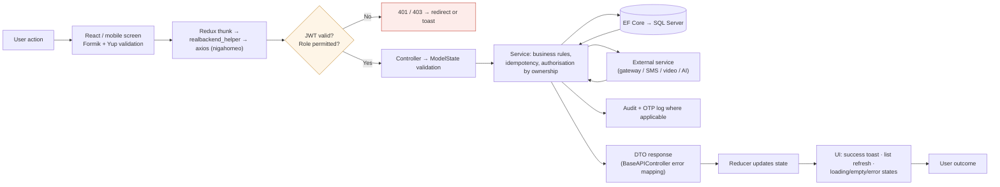

### 11.9 Error and exception handling flow (cross-cutting)

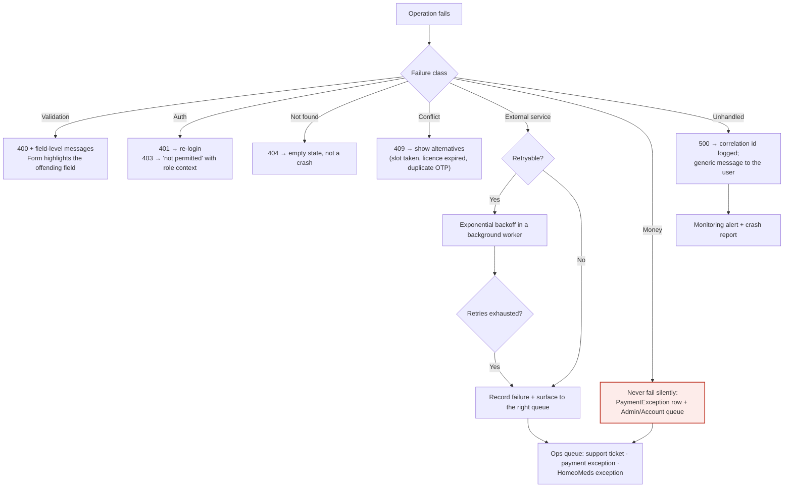

---

## 12. FEATURE-BY-FEATURE SPECIFICATIONS

**How to read this section.** Full specifications are given for the features that carry the greatest business risk, integration complexity or ambiguity. Features that are enhancements to proven, documented existing modules are specified in condensed form in §12.15 — not because they are unimportant, but because their behaviour is already established and only the delta needs definition.

Every endpoint marked **[PROPOSED]** is a target contract requiring design sign-off. Endpoints without that marker are **Existing Functionality** confirmed in `CODEBASE_DEEP_ANALYSIS.md`.

---

### 12.1 F-01 — Doctor Credentialing & Verification Review (ADM-01, GST-07, GST-08)

#### Objective
Prevent unverified practitioners from appearing in a public patient-facing directory or taking paid consultations. Today, `POST /users/RegisterDoctor` activates a doctor immediately — acceptable when the only user was a paying subscriber, unacceptable when patients choose a doctor based on the platform's implied endorsement.

#### Business Requirement
Client Requirement: *"Doctor credentialing / verification review view [New]"* under Admin → Business Management. Trust is also a stated patient-side need (Hello Homeo Doc module 2: *credentials & verification*, *ranking explanation*).

#### User / Actor
Primary: Admin reviewer. Secondary: Doctor (submits documents, views own status). Consumers: Patient app/web directory, payments (payout eligibility).

#### Preconditions
- Doctor has self-registered; `Doctor` record exists with `QualificationId`, `PassingUniversity`, `PassingCertNo` (**Existing Functionality**).
- Object storage with signed URLs is available (AD-9).
- Role `Admin` has the credentialing menu permission (PLT-05).

#### User Flow
1. Doctor registers and is prompted to upload credential documents.
2. System sets `VerificationStatus = Pending`, `PracticeLocked = true`; doctor may log in and configure a profile but cannot accept paid consults or appear in the directory.
3. Admin opens `/admin/doctor-credentialing`, filters by Pending.
4. Admin opens a doctor's detail view: registration data, qualification, university, certificate number, uploaded documents (viewed via time-limited signed URLs), and prior review history.
5. Admin selects Approve, Reject (with reason), or Request Info (with a message).
6. Doctor is notified by email/SMS; on Approve, practice unlocks and a Verified badge becomes visible to patients.

#### UI Changes

| Screen | Route | Change |
|---|---|---|
| Credentialing queue | `/admin/doctor-credentialing` | **New**: tabs Pending / Approved / Rejected / Needs Info; columns doctor, submitted date, qualification, days waiting, SLA flag |
| Credentialing detail | `/admin/doctor-credentialing/:doctorId` | **New**: identity panel, credential panel, document viewer, review history, action bar |
| Platform users list | `/admin/listusers` | **Modified**: Verification column with badge; link to the credentialing detail |
| Doctor profile | `/profile` (doctor) | **Modified**: Credentials tab showing status, reviewer feedback, re-upload |
| Registration | `/register` | **Modified**: document upload step; post-submit "pending verification" message |
| Menu | `LayoutMenuData.js` | **Modified**: entry under Business Management |

#### Fields

| Field | Type | Required | Validation | Default | Description |
|---|---|---|---|---|---|
| `DoctorId` | int (FK) | Yes | Must exist | — | Subject of the review |
| `VerificationStatus` | enum | Yes | Pending / Approved / Rejected / NeedsInfo | Pending | Governs practice lock and directory visibility |
| `ReviewedBy` | int (FK User) | On decision | Must be an Admin | null | Reviewer identity |
| `ReviewedAt` | datetime | On decision | ≥ submission | null | Decision timestamp |
| `Reason` | text | Required for Reject / NeedsInfo | 10–1000 chars | null | Shown to the doctor |
| `DocType` | enum | Yes | Degree / Registration certificate / Government ID / Clinic proof / Other | — | Document classification |
| `FileUrl` | string | Yes | Stored path; served by signed URL only | — | Never a public path |
| `FileSize` / `MimeType` | int / string | Yes | ≤ 10 MB; PDF, JPG, PNG | — | Upload constraints (**Proposed**) |
| `ExpiryDate` | date | Optional | Future date | null | For registrations that expire |

#### Actions

| Action | Effect |
|---|---|
| **Approve** | `Approved`; `PracticeLocked = false`; directory visibility on; notify doctor; audit |
| **Reject** | `Rejected` with mandatory reason; practice remains locked; notify; audit |
| **Request Info** | `NeedsInfo` with message; doctor may re-upload, which returns the record to Pending |
| **View document** | Issues a short-lived signed URL; access is logged |
| **Reassign / add note** | Internal reviewer note not visible to the doctor |

#### Business Logic
- Approval is the **only** transition that unlocks practice. No other module may set `PracticeLocked = false`.
- Re-upload after `NeedsInfo` returns the record to `Pending` and restarts the SLA clock.
- A doctor already holding an active subscription who is *not* approved may continue using clinic-facing features (their own patients) but must not appear in the patient directory or receive platform-routed paid consults. **This split requires client confirmation — OQ-A5.**
- Expiring registration documents trigger a scheduled re-verification prompt (**Proposed**).

#### API Requirements

| API | Method | Purpose | Request | Response | Auth | Validation |
|---|---|---|---|---|---|---|
| `/api/DoctorCredentialing/Queue` **[PROPOSED]** | GET | Paginated review queue | status, page, size, search | Rows + counts | Admin | Status enum valid |
| `/api/DoctorCredentialing/{doctorId}` **[PROPOSED]** | GET | Detail + documents + history | path id | Doctor, credentials, docs, history | Admin | Doctor exists |
| `/api/DoctorCredentialing/{doctorId}/Approve` **[PROPOSED]** | POST | Approve | optional note | Updated status | Admin | Not already Approved |
| `/api/DoctorCredentialing/{doctorId}/Reject` **[PROPOSED]** | POST | Reject | reason | Updated status | Admin | Reason required |
| `/api/DoctorCredentialing/{doctorId}/RequestInfo` **[PROPOSED]** | POST | Request more information | message | Updated status | Admin | Message required |
| `/api/DoctorCredentialing/{doctorId}/Documents` **[PROPOSED]** | POST | Upload (multipart) | file, docType | Document record | Admin or the doctor | Type/size/MIME |
| `/api/DoctorCredentialing/MyStatus` **[PROPOSED]** | GET | Doctor self-view | — | Status + reviewer feedback | Doctor | Own record only |
| `POST /users/RegisterDoctor` | POST | **Existing — modify** | + documents | Pending status | Anonymous | Must not auto-activate practice |

#### Database Impact

| Object | Change |
|---|---|
| `DoctorVerification` | **New**: DoctorId, Status, ReviewedBy, ReviewedAt, Reason, SubmittedAt, Version |
| `DoctorCredentialDocument` | **New**: DoctorId, DocType, FileUrl, FileSize, MimeType, UploadedAt, UploadedBy, ExpiryDate |
| `Doctor` | **Modified**: `PracticeLocked` (bit), optional denormalised `VerificationStatus` for directory queries |
| `UserMaster` | **Modified**: `VerificationStatus` where user-level lock is needed |
| Indexes | `DoctorVerification(Status, SubmittedAt)`; `DoctorCredentialDocument(DoctorId)` |
| Migration | Existing active doctors backfilled as `Approved` to avoid locking out live practices — **requires client confirmation, OQ-A5** |

#### Validation
Reason mandatory on Reject/NeedsInfo · file type and size · one Approved record per doctor · reviewer must not be the subject · status transitions restricted to the defined set · document count limit per type (**Proposed**).

#### Error Handling

| Error | Behaviour |
|---|---|
| Doctor not found | 404, queue row marked stale, refresh |
| Concurrent review by two admins | Optimistic concurrency on `Version`; second reviewer sees "already decided by X" |
| Upload rejected | 400 with the specific rule violated |
| Storage unavailable | 503; upload retryable; review not blocked for already-stored documents |

#### Permissions
Admin: full. Doctor: own status and own uploads only. Account: read-only (payout eligibility). Reception/Patient: no access. Patient app sees only the derived verified badge.

#### Audit / Logging
Every status transition (who, when, from, to, reason); every document view (signed-URL issuance); every upload and deletion. Retained per the data-retention policy — **not specified in the provided documentation**.

#### Notifications
Doctor on Approve / Reject / NeedsInfo (email + SMS via DOC-05); admin digest of Pending items breaching SLA (**Proposed**).

#### Edge Cases
Doctor deletes an account mid-review · duplicate registration with the same certificate number · document expires after approval · doctor approved but with incomplete bank KYC (may practise, cannot be paid out) · a doctor rejected who re-registers with a different email.

#### Dependencies
Object storage with signed URLs (AD-9) · notification channel (DOC-05) · role ACL (PLT-05) · directory ranking rules (**client input required, OQ-B4**).

#### Acceptance Criteria
1. A newly registered doctor cannot appear in `/api/PublicBooking/Doctors` results.
2. A newly registered doctor cannot be the subject of a successful consult payment.
3. Admin can approve, reject and request information, each producing a notification and an audit row.
4. Rejection without a reason is refused by the API, not only by the UI.
5. Documents are never retrievable from a guessable public URL.
6. The users list shows verification state without opening the detail page.
7. Re-upload after NeedsInfo returns the record to the Pending queue.

---

### 12.2 F-02 — Platform Payments & Ledger Spine (FIN-01, GST-02, DOC-19, SC-02, SC-03)

> **This is the keystone feature of the programme.** Booking, telemedicine, reception collection, HomeoMeds, doctor earnings and the entire Account role depend on it. It should be treated as infrastructure, not as one feature among many.

#### Objective
Establish Homeocentrum as merchant of record for all money, with server-verified capture, an immutable ledger, exception visibility, and settlement/payout capability.

#### Business Requirement
Client Requirement (Special Considerations): all payments received and maintained by Homeocentrum; every transaction passes through Homeocentrum; modelled on Zomato/Blinkit; one Account department handles all transactions.

#### User / Actor
System (webhook), Patient, Doctor, Reception, Account, Admin, Pharmacy.

#### Preconditions
- A Homeocentrum-owned gateway account with webhook capability and settlement configuration.
- Gateway keys held in a secret store, not `appsettings.json` (PLT-08).
- Roles `Account` and `Patient` seeded (PLT-09).

#### Money streams modelled

| Stream | Payer | Collected by | Settles to | Existing? |
|---|---|---|---|---|
| S1 SaaS subscription | Doctor | Homeocentrum | Platform revenue | **Yes** (`PackageEntryDetail` + Razorpay) |
| S2 Consult fee (online) | Patient | Homeocentrum | Doctor payout net of commission + GST | New |
| S3 Consult fee (reception) | Patient | Clinic; still ledgered | Per policy: retained or remitted | New |
| S4 Instant / tele premium | Patient | Homeocentrum | As S2 plus surge | New |
| S5 Medicines | Patient (prepaid or COD) | Homeocentrum or logged at collection | Pharmacy + platform + delivery, **separately ledgered** | New |
| S6 Refunds / chargebacks | Platform | — | Reverse entries; exception queue | New |
| S7 Payouts | Homeocentrum | — | Doctor / pharmacy bank | New |

#### User Flow (generic capture)
1. A payable event occurs (booking, subscription renewal, medicine quote acceptance).
2. Client requests an order; server creates a `PaymentOrder` and a gateway order.
3. Patient pays at the gateway.
4. Gateway posts a webhook; server verifies the signature.
5. Server writes ledger entries and updates the business entity's payment status.
6. All roles observe consistent state; Account sees the ledger row immediately.

#### Fields (`PaymentOrder` / `LedgerEntry`)

| Field | Type | Required | Validation | Default | Description |
|---|---|---|---|---|---|
| `Stream` | enum | Yes | S1–S7 | — | Which money stream |
| `Amount` | decimal(12,2) | Yes | > 0 | — | Gross amount |
| `Currency` | char(3) | Yes | INR | INR | Currency |
| `RefEntityType` / `RefEntityId` | string / int | Yes | Must resolve | — | Appointment, package or medicine order |
| `Gateway` | string | Yes | Razorpay | Razorpay | Provider |
| `GatewayOrderId` | string | Yes | Unique | — | Provider order id |
| `GatewayPaymentId` | string | On capture | Unique — **idempotency key** | null | Provider payment id |
| `Status` | enum | Yes | Created / Paid / Failed / Refunded / PartiallyRefunded / Cancelled | Created | Order state |
| `CommissionAmount` | decimal | Computed | ≥ 0 | 0 | Platform cut |
| `GstAmount` | decimal | Computed | ≥ 0 | 0 | Tax component |
| `PayeeType` / `PayeeId` | enum / int | For settlement | Doctor / Pharmacy / Platform | — | Settlement target |
| `SettlementRunId` | int (FK) | On settlement | — | null | Links to a payout cycle |
| `Method` | enum | For S3 | Cash / UPI / Card / PayLink | — | Reception collection method |
| `CollectedBy` | int (FK User) | For S3 | Reception or Doctor | — | Accountability for cash |
| `ReceiptNo` | string | For S3 | Unique per clinic | — | Printed receipt |

#### Actions
Create order · Verify webhook · Record offline collection · Raise exception · Resolve exception (OTP) · Create settlement run · Approve payout (OTP) · Issue refund · Export GST report.

#### Business Logic
1. **Webhook is authoritative** (AD-3). Client verification endpoints may exist for responsiveness but never as the sole basis for marking a payment paid.
2. **Idempotency** on `GatewayPaymentId`. Duplicate webhook deliveries are no-ops.
3. **Append-only ledger** (AD-4). Corrections are new reversing entries, never updates.
4. **Commission and GST are computed at capture** from configuration effective on that date, and stored — not recomputed later from current config.
5. **Reception cash still produces a ledger row** (SC-03), with `CollectedBy` and a receipt number.
6. **Consult and medicine money are reported separately** (AD-5) even though they share the ledger table, via `Stream` partitioning.
7. **Settlement** aggregates eligible paid entries older than `SettlementHoldDays`, nets commission and GST, and produces payout instructions requiring OTP approval.
8. **Refunds** create reversing entries and adjust any pending settlement.
9. **Orders stuck in `Created`** beyond a threshold are polled against the gateway by a reconciliation worker and raised as `Webhook-mismatch` exceptions.

#### API Requirements

| API | Method | Purpose | Auth | Notes |
|---|---|---|---|---|
| `/api/Payments/Orders` **[PROPOSED]** | POST | Create order for a stream | Patient / Doctor / Reception | Amount is derived server-side; never accepted from the client |
| `/api/Payments/Webhook/Razorpay` **[PROPOSED]** | POST | Capture / failure events | **Anonymous + signature verification** | Source of truth |
| `/api/Payments/Verify` **[PROPOSED]** | POST | Client-assist confirmation | Authenticated | Advisory only |
| `/api/ConsultPayment/CollectAtReception` **[PROPOSED]** | POST | S3 offline collection | Reception / Doctor | Receipt + ledger |
| `/api/ConsultPayment/ByAppointment/{patientAppId}` **[PROPOSED]** | GET | Badge data | Doctor / Reception / Patient (own) | — |
| `/api/Payments/Admin/Reconciliation` **[PROPOSED]** | GET | Reconciliation grid + KPIs | Admin / Account | — |
| `/api/Payments/Exceptions` **[PROPOSED]** | GET | Exception queue | Admin / Account | — |
| `/api/Payments/Exceptions/{id}/Resolve` **[PROPOSED]** | POST | Manual resolution | Account | **OTP required** |
| `/api/Ledger` **[PROPOSED]** | GET | Unified ledger | Account (Admin read) | Filterable by stream |
| `/api/Ledger/Medicine` **[PROPOSED]** | GET | S5 only | Account | Separate view |
| `/api/Settlements` **[PROPOSED]** | GET | Settlement runs | Account | — |
| `/api/Settlements/{id}/ApprovePayout` **[PROPOSED]** | POST | Approve payout | Account | **OTP required** |
| `/api/Refunds` **[PROPOSED]** | POST | Issue refund | Account | Reversing entries |
| `/api/ConsultFee/Config` **[PROPOSED]** | GET/PUT | Per-doctor consult fee | Doctor / Admin | Drives booking amounts |
| `/api/Earnings/Summary` **[PROPOSED]** | GET | Doctor earnings | Doctor | Web + mobile |
| `POST /Order/GenerateOrderId` (classic) | POST | **Existing — port** | Doctor | Migrate to .NET 8 and remove hardcoded keys |
| `POST /Subscription/SaveUpdateSubscription` (classic) | POST | **Existing — keep, extend** | Doctor | Must also write an S1 ledger entry |

#### Database Impact

| Object | Change |
|---|---|
| `PaymentOrder` | **New** — all streams |
| `LedgerEntry` | **New** — immutable, append-only |
| `ConsultPayment` | **New** — appointment-level payment facts including offline collection |
| `PaymentException` | **New** — kind, status, resolution, resolver, OTP reference |
| `SettlementRun`, `Payout` | **New** — cycle, payee, gross, commission, GST, net, OTP reference |
| `ConsultFeeConfig` | **New** — DoctorId, amount, currency, `PayAtClinicEnabled` |
| `OtpChallenge`, `OtpAuditLog` | **New** — control plane |
| `Invoice` / numbering series | **New (Proposed)** — no invoice entity exists today |
| `PatientAppointment` | **Modified** — `PaymentStatus`, `ConsultMode` |
| `PackageEntryDetail` | **Unchanged in shape**; linked to S1 ledger entries. **Must not be reused for S2–S7** |
| Indexes | `LedgerEntry(Stream, CreatedAt)`, `LedgerEntry(PayeeType, PayeeId, SettlementRunId)`, `PaymentOrder(GatewayPaymentId)` unique, `PaymentOrder(Status, CreatedAt)` |

#### Validation
Server-derived amounts only · signature verification mandatory · currency INR · refund ≤ captured minus prior refunds · settlement excludes entries inside the hold window · OTP required for resolve, payout and refund above a configurable threshold · payee must have complete KYC.

#### Error Handling

| Error | Behaviour |
|---|---|
| Signature mismatch | 400, event stored as suspicious, security alert; **no ledger write** |
| Duplicate webhook | 200 no-op (idempotent) |
| Gateway timeout on order create | 503; client retries; no orphan order |
| Capture without a matching order | `Orphan-payment` exception for Account |
| Amount mismatch webhook vs order | `Amount-mismatch` exception; never auto-accepted |
| Payout file rejected by the bank | Payout `Failed`; ledger unchanged; exception raised |
| Refund fails at the gateway | `Refund-pending` exception; retried by a worker |

#### Permissions
Account: full money operations. Admin: read all, plus operational retry; **no payout approval without the Account role** (separation of duties, SC-04). Doctor: own earnings only. Reception: collect for its own doctor only. Patient: own payments and refund requests only.

#### Audit / Logging
Every ledger write with actor and correlation id; every webhook payload (redacted of card data); every OTP challenge and outcome; every exception transition; every settlement approval. Ledger rows are never deleted.

#### Notifications
Patient: payment success, failure, refund. Doctor: payment received, payout initiated/completed. Account: exception raised, settlement ready. Admin: daily reconciliation summary (**Proposed**).

#### Edge Cases
Payment captured after cancellation · patient pays twice for one appointment · partial capture · chargeback weeks later · reception marks cash paid while an online payment is in flight · doctor's consult fee changes between booking and payment (the amount at booking prevails) · COD collected but never remitted · settlement run spanning a GST rate change.

#### Dependencies
Gateway account and KYC · settlement model decision (Route vs platform-held + NEFT, OQ-A1) · commission and GST configuration from the client's finance function (OQ-A3) · `ConsultFeeConfig` before any consult can be priced · roles seeded.

#### Acceptance Criteria
1. A payment captured while the patient's browser is closed is still recorded, ledgered and visible to Account.
2. A replayed webhook does not create a second ledger entry.
3. Reception cash appears in the unified ledger with collector and receipt number.
4. Consult money and medicine money can be reported separately without manual filtering.
5. No payout can be released without an OTP-approved settlement and a completed payee KYC.
6. A failed payment is visible in the exception queue within the polling interval and cannot be closed without a reason.
7. `PackageEntryDetail` contains no consult or medicine rows.
8. Every ledger row traces to a business entity (`RefEntityType` + `RefEntityId`).

---

### 12.3 F-03 — Admin Reconciliation & Payment Exception Queue (ADM-02, ADM-03, FIN-04, FIN-06)

#### Objective
Give operations a single place to confirm that bookings, payments and appointments agree, and to resolve every discrepancy rather than discovering it at month end.

#### Business Requirement
Client Requirement: *"Consult booking & payment reconciliation dashboard [New]"* and *"Payment exception / failed payment queue [New]"*.

#### User / Actor
Admin (operational view), Account (owns resolution and money movement).

#### Preconditions
F-02 in place; at least one consult money stream live.

#### UI Changes

| Screen | Route | Content |
|---|---|---|
| Reconciliation dashboard | `/admin/consult-payments` | KPI cards: collected, pending, failed, refunded, cash vs online mix. Grid joining booking ↔ payment ↔ appointment. Filters: date range, doctor, status, method, channel. CSV export. Drill-through to the appointment |
| Exception queue | `/admin/payment-exceptions` | Kinds: Failed, Partial, Webhook-mismatch, Orphan-payment, Amount-mismatch, Refund-pending, COD-unremitted. Detail drawer with gateway identifiers, event timeline, and Resolve / Retry actions |
| Account mirror | `/account/consult-recon`, `/account/exceptions` | Same data with money-movement actions enabled |

#### Business Logic
- The exception queue is a **state machine**: `Open → Investigating → Resolved | WrittenOff`, with a mandatory resolution note and, for financial impact, an OTP.
- Reconciliation compares three independent facts: the appointment's expected fee, the payment order, and the ledger. Any disagreement produces an exception automatically.
- A background worker sweeps for orders in `Created` past a threshold and for gateway payments with no local order.
- Exceptions cannot be bulk-closed without individual reasons.

#### API Requirements
As listed in F-02 (`/api/Payments/Admin/Reconciliation`, `/api/Payments/Exceptions`, `/api/Payments/Exceptions/{id}/Resolve` — all **[PROPOSED]**).

#### Validation & Error Handling
Resolution note ≥ 20 characters · OTP for any resolution that adjusts money · retry limited and rate-controlled · export capped by row count with async generation beyond the cap (**Proposed**).

#### Permissions
Admin: view, investigate, retry. Account: additionally resolve with financial effect, refund, write off.

#### Audit / Logging
Every state change with actor, note and OTP reference; export downloads logged (they contain financial data).

#### Acceptance Criteria
1. Every failed gateway event appears in the queue automatically — none is discovered manually.
2. Reconciliation totals match the ledger for any selected period.
3. An exception cannot be closed without a note; financial closure additionally requires OTP.
4. CSV export reproduces the on-screen grid exactly.

---

### 12.4 F-04 — Account / Finance Department Role (FIN-01 … FIN-10, SC-04)

#### Objective
Create an operating role that owns money movement, distinct from Admin (who owns masters and clinical configuration).

#### Business Requirement
Client Requirement: *"One Account department or role need for the handel all transactions by the homeocentrum."*

#### User / Actor
Account/Finance users; Admin has read-only visibility into the same queues.

#### Preconditions
`Account` role seeded (PLT-09); RBAC enforced (PLT-05); ledger live (F-02).

#### Screens

| Screen | Route | Purpose |
|---|---|---|
| Unified ledger | `/account/ledger` | All streams S1–S7 with filters and export; links to OTP audit |
| Consult reconciliation | `/account/consult-recon` | S2 and S3 |
| Medicine ledger | `/account/medicine-ledger` | S5 only — seller / platform / delivery split |
| Exceptions | `/account/exceptions` | Shared queue with resolution powers |
| Settlements | `/account/settlements` | Cycles, payees, gross, commission, GST, hold, net |
| Payouts | `/account/payouts` | Approve under OTP; payout status tracking |
| Refunds | `/account/refunds` | Initiate and track |
| Tax | `/account/tax` | Invoice numbers and GST reports |
| Payees | `/account/payees` | Doctor and pharmacy bank details and PAN |
| Clinic collections | `/account/clinic-collections` | Reception cash/UPI versus online mix |

#### Business Logic
- **Separation of duties:** Account cannot edit repertory, materia medica or any clinical master. Admin cannot approve payouts. Both can read the exception queue.
- **Dual control:** payout approval and manual financial resolution require OTP delivered to the Account user's registered number, recorded in `OtpAuditLog`.
- Settlement cycle, hold days and commission are configuration, not code.

#### Permissions Matrix (extract)

| Capability | Admin | Account | Doctor | Reception |
|---|:--:|:--:|:--:|:--:|
| View unified ledger | Read | Full | Own earnings only | No |
| Approve payout | **No** | Yes (OTP) | No | No |
| Issue refund | No | Yes | No | No |
| Resolve payment exception | Investigate | Resolve | No | No |
| Edit clinical masters | Yes | **No** | No | No |
| Edit consult fee | Yes | No | Own fee | No |
| Collect at reception | No | No | Yes | Yes |

#### Acceptance Criteria
1. An Account user can settle doctor and pharmacy money but cannot open any repertory master screen.
2. An Admin user can see every ledger row but cannot approve a payout.
3. Every payout carries an OTP audit reference.
4. Medicine money is reportable without consult money in the same total.

---

### 12.5 F-05 — Patient Self-Service Booking (GST-01, PAT-M3)

#### Objective
Allow a patient to discover a verified doctor and book a slot without any clinic staff involvement, on web and mobile, using the same appointment record the clinic already uses.

#### Business Requirement
Client Requirement: *"Patient-facing self-service booking [New]"*; Hello Homeo Doc modules 2 and 3.

#### User / Actor
Guest / Patient (primary); Doctor and Reception (observers of the resulting appointment).

#### Preconditions
Doctor is Approved (F-01) · daily schedule saved (DOC-17) · `ConsultFeeConfig` present if payment is required · SMS provider live for OTP (DOC-05) · public endpoints rate-limited (AD-8).

#### User Flow
See Workflow A (§11.1).

#### Fields (booking creation)

| Field | Type | Required | Validation | Default | Description |
|---|---|---|---|---|---|
| `MobileNumber` | string(10–15) | Yes | Format + OTP verified | — | Patient identity anchor |
| `PatientName` | string | Yes | 2–100 chars | — | — |
| `Age` / `DateOfBirth` | int / date | Yes | Plausible range | — | Clinical necessity |
| `Gender` | enum | Yes | From master | — | Existing master |
| `DoctorId` | int | Yes | Approved + bookable | — | — |
| `AppointmentDate` | date | Yes | Not past; within booking horizon | — | Horizon configurable |
| `SlotId` / `AppointmentTime` | int / time | Yes | Free at commit time | — | Concurrency-checked |
| `ConsultMode` | enum | Yes | In-clinic / E-Consult | In-clinic | Drives telemedicine |
| `VisitType` | enum | Yes | First / Follow-up | First | Feeds follow-up analytics |
| `ChiefComplaint` | text | Optional | ≤ 500 chars | null | Pre-consult context |
| `ConsentAccepted` | bool | Yes | Must be true | false | Privacy + terms |
| `FamilyMemberId` | int | Optional | Belongs to the account | null | Booking for a dependant |

#### Business Logic
- Slot availability is derived from the **existing** `GetDailySchedule` and `GetAppointmentSlots` logic — not reimplemented — with booked, cancelled and blocked slots excluded.
- Mobile number is the identity key: an existing `Patient` is linked rather than duplicated.
- Booking outcome depends on doctor configuration: `PAY_AT_CLINIC` creates a confirmed unpaid appointment; otherwise the appointment is held `UNPAID` and confirmed on capture. **Hold-and-release semantics require confirmation — OQ-A4.**
- Public endpoints are rate-limited per IP and per mobile number; OTP attempts are throttled with lockout.

#### API Requirements

| API | Method | Purpose | Auth |
|---|---|---|---|
| `/api/PublicBooking/Doctors` **[PROPOSED]** | GET | Verified, bookable directory | Anonymous, rate-limited |
| `/api/PublicBooking/Doctors/{id}/Profile` **[PROPOSED]** | GET | Credentials, fee, ranking explanation | Anonymous |
| `/api/PublicBooking/Doctors/{id}/Slots` **[PROPOSED]** | GET | Wraps existing slot logic | Anonymous |
| `/api/PatientAuth/RequestOtp` **[PROPOSED]** | POST | Send OTP | Anonymous, throttled |
| `/api/PatientAuth/VerifyOtp` **[PROPOSED]** | POST | Issue patient token | Anonymous, throttled |
| `/api/PublicBooking/Create` **[PROPOSED]** | POST | Create patient + appointment | Patient token |
| `/api/PublicBooking/{bookingToken}` **[PROPOSED]** | GET | Booking summary | Token-scoped |
| `/api/PublicBooking/Waitlist` **[PROPOSED]** | POST | Waitlist interest | Patient token |
| `/api/PublicBooking/InstantConsult` **[PROPOSED]** | POST | Instant consult request | Patient token |
| `GetDailySchedule`, `GetAppointmentSlots`, `SavePatientApp` | — | **Existing — reused internally** | — |

#### Database Impact
`Patient` — **Modified**: self-registered flag, SMS opt-in, mobile-verified flag. `PatientAppointment` — **Modified**: `ConsultMode`, `VisitType`, `PaymentStatus`, booking channel. **New**: `PatientAuthOtp` / `OtpChallenge`, `FamilyMember`, `CaregiverAuth`, `ConsentRecord`, `BookingWaitlist`. Index on `Patient(MobileNumber)` and `PatientAppointment(DoctorId, AppointmentDate, SlotId)`.

#### Error Handling
Slot conflict → 409 with alternatives · OTP expired/incorrect → attempt counter with lockout · doctor goes offline or unverified mid-flow → block with explanation · duplicate booking for the same patient, doctor and slot → 409.

#### Permissions
Anonymous for discovery and slots; patient token required to create; the created appointment is owned by the doctor and visible to their reception.

#### Audit / Logging
OTP challenges, booking creation with channel and IP, consent capture (text version and timestamp).

#### Notifications
Patient: OTP, booking confirmation, payment status, reminders. Doctor/Reception: new booking alert (push + dashboard).

#### Edge Cases
Two patients booking the last slot simultaneously · patient books then immediately cancels · booking for a family member with caregiver authorisation · doctor cancels the whole day · patient with an existing clinic record whose stored mobile number differs · low-connectivity submission retries producing duplicates (idempotency key required).

#### Acceptance Criteria
1. A guest completes a booking end-to-end with no staff login.
2. Only Approved doctors are returned by the public directory.
3. A double-booking attempt on the same slot fails cleanly for the second patient.
4. The resulting appointment is indistinguishable, to the doctor, from a staff-created one apart from its channel and payment fields.
5. OTP brute force is throttled and locked out.
6. All public endpoints are rate-limited and cannot enumerate patient data.

---

### 12.6 F-06 — Formal Reschedule & Cancel (DOC-01, DOC-02, REC-01, REC-02, PAT-M3)

#### Objective
Replace an untracked time edit with an auditable lifecycle event that frees slots, notifies patients and interacts correctly with money.

#### Business Requirement
Client Requirement: `[New]` for both Doctor and Reception; also part of the patient app's appointment detail.

#### User / Actor
Doctor, Reception, and later Patient (app/web).

#### Preconditions
Appointment exists and is not Completed or already Cancelled; the actor is authorised for that doctor.

#### User Flow
See Workflow B (§11.2).

#### Fields

| Field | Type | Required | Validation | Default | Description |
|---|---|---|---|---|---|
| `PatientAppId` | int | Yes | Exists; not Completed/Cancelled | — | Target |
| `NewAppointmentDate` | date | Reschedule | Not past; within schedule | — | — |
| `NewSlotId` / `NewTime` | int / time | Reschedule | Free; within working hours | — | Conflict-checked |
| `RescheduleReason` | enum + text | Optional | From list | null | Analytics input |
| `CancelReasonCode` | enum | Cancel | Patient request / Doctor unavailable / No-show / Duplicate / Payment failed / Other | — | Mandatory |
| `CancelReasonText` | text | If Other | 10–500 chars | null | — |
| `NotifyPatient` | bool | Yes | — | true | Channel selection follows the patient's opt-in |

#### Business Logic
- Reschedule validates against the daily schedule, existing bookings and the past; on success it releases the old slot, occupies the new one, and writes an `AppointmentChangeLog` row.
- Cancel introduces the **new** status `CANCELLED` (the existing set has no such value), records reason, actor and timestamp, frees the slot and offers it to the waitlist.
- If the consult was paid, a refund rule is evaluated by policy (who cancelled and how much notice) — the rule itself requires client definition (OQ-A6).
- `DeleteStatus` (soft delete) remains a separate, administrative concept and is **not** reused for cancellation.
- Reception is authorised for its own doctor's appointments; `isReceptionUser` gating must not block these two actions.

#### API Requirements

| API | Method | Purpose | Auth |
|---|---|---|---|
| `/api/PatientAppointment/RescheduleAppointment` **[PROPOSED]** | POST | Date/time/slot change with audit and notify | Doctor / Reception / Patient (own) |
| `/api/PatientAppointment/CancelAppointment` **[PROPOSED]** | POST | Cancel with reason | Doctor / Reception / Patient (own) |
| `/api/PatientAppointment/ChangeLog/{id}` **[PROPOSED]** | GET | Audit trail | Doctor / Reception / Admin |
| `PATCH /api/PatientAppointment/{id}/VisitType` **[PROPOSED]** | PATCH | First / Follow-up | Doctor / Reception |
| `UpdateAppointmentTime`, `UpdateAppointmentStatus` | — | **Existing — retained**, wrapped by the above | — |

#### Database Impact
`PatientAppointment` — **Modified**: `CANCELLED` status value, `CancelReasonCode`, `CancelReasonText`, `CancelledBy`, `CancelledAt`, `VisitType`. **New**: `AppointmentChangeLog` (PatientAppId, Action, OldValue, NewValue, ByUserId, ByRole, At). Index on `PatientAppointment(Status, AppointmentDate)`. Migration: existing rows default `VisitType = First` unless inferable.

#### Error Handling
Slot no longer free → 409 with alternatives · appointment already Completed → 422 · already Cancelled → 409 idempotent response · notification failure must **not** roll back the reschedule (queued and retried).

#### Permissions
Doctor: own appointments. Reception: appointments of the doctor in its JWT. Patient: own appointments only, subject to a cancellation window. Admin: read-only audit.

#### Audit / Logging
Every change with old and new values, actor, role and channel.

#### Notifications
Patient: reschedule confirmation with old→new, cancellation with reason. Doctor/Reception: dashboard refresh; push on the doctor app.

#### Edge Cases
Reschedule into a slot the patient has already booked with another doctor · cancellation after the consultation has begun · patient cancels while the doctor is joining the video room · reschedule across a schedule change · bulk cancellation when a doctor blocks a day.

#### Acceptance Criteria
1. All three roles can reschedule and cancel through the same API with correct authorisation.
2. Cancelled appointments leave active buckets and appear in a Cancelled filter.
3. The freed slot is immediately bookable, including by public booking.
4. Every change is retrievable from the change log.
5. Cancelling a paid consult triggers the configured refund path rather than silently keeping the money.

---

### 12.7 F-07 — Potency Module (DOC-07, DOC-22)

#### Objective
Replace an empty free-text `Dose` with a structured, master-driven potency that is safe to print, transmit to a pharmacy and audit.

#### Business Requirement
Client Requirement: *"Save prescription → introduce Potency module [New]"*. It is also a hard prerequisite for HomeoMeds, where a pharmacy must dispense against an unambiguous prescription.

#### User / Actor
Doctor (prescriber); Admin (maintains the potency master); Pharmacy and Patient (consumers of the result).

#### Preconditions
Prescription modal reachable from the Patient Board (**Existing Functionality**); potency master seeded.

#### Fields

| Field | Type | Required | Validation | Default | Description |
|---|---|---|---|---|---|
| `PotencyId` | int (FK) | **Yes** | From `PotencyMaster`; active | — | Structured potency |
| `PotencyCode` | string | — | Derived | — | e.g. 6C, 30C, 200C, 1M |
| `Frequency` | string / enum | Recommended | From list or free text | — | Dosing frequency |
| `Duration` | string / int | Recommended | Positive | — | Course length |
| `Instructions` | text | Optional | ≤ 250 chars | null | Patient-facing note |
| `Dose` | string | Legacy | Retained for display compatibility | derived | Not the source of truth after this change |

#### Business Logic
- Saving a prescription remedy **without** a potency is rejected by the API, not only by the UI.
- The potency list is master-driven so that scales can be extended without a release.
- `Dose` is retained for backward compatibility with existing records and printouts, but new writes populate `PotencyId` and derive `Dose` for display.
- The potency value is captured into the immutable `ErxSnapshot` (F-08) at signing.

#### API Requirements

| API | Method | Purpose | Auth |
|---|---|---|---|
| `/api/PotencyMaster` **[PROPOSED]** | GET | Dropdown list | Doctor |
| `/api/PotencyMaster` **[PROPOSED]** | POST/PUT/DELETE | Admin CRUD | Admin |
| `SavePrescriptionDetail` (classic) | POST | **Existing — extend** payload with `potencyId` | Doctor |

#### Database Impact
**New:** `PotencyMaster` (Code, Label, Scale, SortOrder, IsActive). **Modified:** `PrescriptionRemedyDetail` gains `PotencyId` (nullable for historical rows, required for new writes), optional `Frequency`, `Duration`. **Migration:** existing rows retain their `Dose` text; no back-fill of `PotencyId` is attempted, and reporting must treat historical rows as unstructured.

#### Validation
Potency required per remedy · potency must be active · frequency and duration validated if the client mandates them (OQ-B2) · no duplicate remedy rows with identical potency in one prescription.

#### Permissions
Doctor writes; Admin maintains the master; Reception has no prescription write access.

#### Acceptance Criteria
1. A prescription cannot be saved with a blank potency, via UI or API.
2. Potency options come from a master an admin can extend.
3. Historical prescriptions still render correctly.
4. Saved potency appears identically on the eRx, the patient view (after disclosure) and the pharmacy order.

---

### 12.8 F-08 — Visit Notes vs eRx Separation and Signed Snapshot (DOC-08, DOC-22)

#### Objective
Stop clinical narrative from leaking into a document that will be sent to a pharmacy and shown to a patient, and make the prescription immutable once signed.

#### Business Requirement
Client Requirement: *"Visit notes distinct from prescription (eRx) [New]"*. Reinforced by HomeoMeds, which requires a signed eRx as the input to an immutable order draft with no re-entry.

#### User / Actor
Doctor (author); Patient and Pharmacy (recipients of the eRx only).

#### Preconditions
`AppointmentHistoryNote` exists and is currently exposed as a tab **inside** the prescription modal (**Existing Functionality**).

#### UI Changes
- **Visit Notes** becomes a standalone panel on the Patient Board, outside the prescription modal.
- The prescription modal is reduced to **eRx content only**: remedies (with potency) and labs/imaging.
- eRx print/export view excludes visit notes entirely.
- Note types are selectable: Chief complaint / Follow-up / General.

#### Business Logic
- `AppointmentHistoryNote` gains `NoteType` and `IsErxExcluded`; the eRx payload filters on these.
- On save, an **immutable `ErxSnapshot`** is created: `PatientAppId`, `SignedAt`, `SignedByDoctorId`, and items containing remedy code, remedy name, potency, frequency and duration.
- A snapshot is never edited. A correction produces a new version with a supersede link, and the pharmacy order references a specific version.
- The snapshot carries **both** code and name; disclosure is controlled at read time by the caller's role and the order state (F-09).

#### API Requirements

| API | Method | Purpose | Auth |
|---|---|---|---|
| `SaveUpdateAppointmentHistoryNote` (classic) | POST | **Existing — extend** with `noteType`, `isErxExcluded` | Doctor |
| `/api/Erx/ByAppointment/{patientAppId}` **[PROPOSED]** | GET | eRx payload; **codes only for patients until pharmacy acceptance** | Doctor / Patient (own) / Pharmacy (assigned) |
| `/api/Erx/Export/{patientAppId}` **[PROPOSED]** | GET | Printable / PDF eRx | Doctor / Patient (own) |
| `/api/Erx/RefillInbox` **[PROPOSED]** | GET | Doctor mobile refill queue | Doctor |
| `/api/Erx/Refill/{id}/Approve` · `/Reject` **[PROPOSED]** | POST | Refill decision | Doctor (mobile) |

#### Database Impact
**New:** `ErxSnapshot`, `ErxSnapshotItem`, `RefillRequest`. **Modified:** `AppointmentHistoryNote` gains `NoteType`, `IsErxExcluded`. **Migration:** existing notes default to `General` with `IsErxExcluded = true` so that no historical narrative is exposed on a new eRx surface.

#### Validation
At least one remedy before signing · potency present (F-07) · snapshot immutable after `SignedAt` · superseding requires a reason.

#### Error Handling
Attempt to modify a signed snapshot → 409 · export before signing → 422 · patient requesting another patient's eRx → 403 with an audit entry.

#### Permissions
Doctor: create and supersede. Patient: read own, subject to code/name disclosure. Pharmacy: read only the assigned order's snapshot, and only after OTP acceptance. Reception: **no access**.

#### Audit / Logging
Signing, superseding, every read by a pharmacy, and every patient download (linked to OTP where applicable).

#### Acceptance Criteria
1. Visit notes never appear on the eRx print or in the pharmacy payload.
2. A signed eRx cannot be edited; corrections create a new version.
3. The patient view shows codes until acceptance and names afterwards, driven by one flag rather than duplicated logic.
4. The pharmacy order contains no re-typed clinical data.

---

### 12.9 F-09 — Center of Gravity (COG) Repertorization Module (DOC-06)

#### Objective
Add a decision-support view that identifies the remedy or remedy group at the centre of the case, alongside — not instead of — existing common/uncommon scoring and elimination.

#### Business Requirement
Client Requirement: *"Repertorization → Center of Gravity module introduce [New]"*.

#### ⚠ Requirement status
**The algorithm is not defined in any provided document.** "Center of Gravity" has more than one accepted meaning in homeopathic practice (weighted centroid across rubric groups; miasmatic or kingdom-based centre; hierarchical section weighting). Building before this is fixed would be speculative. This is the highest-priority clinical clarification — **OQ-B3**.

#### User / Actor
Doctor, within the Patient Board's Repertorize tab.

#### Preconditions
Rubrics selected on the clipboard with intensities (**Existing Functionality**); existing repertorization endpoints available.

#### User Flow
Doctor selects rubrics → opens Repertorize → switches to the **Center of Gravity** sub-panel → reviews ranked remedies with gravity scores and contribution breakdown → optionally drills into which rubrics pulled a remedy toward the centre → carries the selection into the prescription.

#### UI Changes
New sub-panel inside the Repertorize tab with a toggle against classic elimination; gravity visualisation; per-remedy contribution list; explainability drawer consistent with the existing audio-rubric explainability panel.

#### Business Logic (structure defined; formula pending)
Inputs: selected rubric ids, intensities, remedy grades by author, and rubric hierarchy position. Output: ranked remedies with a gravity score and per-rubric contributions. The service must be deterministic, explainable and reproducible for the same inputs, and must not mutate the clipboard.

#### API Requirements

| API | Method | Purpose | Auth |
|---|---|---|---|
| `/api/Repertorization/CenterOfGravity` **[PROPOSED]** | POST | Compute COG from selected rubrics + intensities | Doctor |

#### Database Impact
None mandatory. Optional weight-configuration table if the algorithm is parameterised (**Proposed**).

#### Performance
Must complete within the interaction budget for the largest realistic clipboard; the existing rubric-details cache and fetch queue patterns should be reused rather than re-fetching.

#### Acceptance Criteria
1. COG output is reproducible for identical inputs.
2. Every ranked remedy exposes which rubrics contributed and by how much.
3. Classic elimination remains available and unchanged.
4. The algorithm implemented matches a client-signed definition.

---

### 12.10 F-10 — Telemedicine Suite (DOC-09 … DOC-13, PAT-M4, DOCM-08)

#### Objective
Deliver first-party video consultation with availability, queueing, consent and reconnection — replacing an `E-CONSULT` status plus a WhatsApp alert.

#### Business Requirement
Client Requirement: five `[New]` items under Doctor → Telemedicine, plus the patient app's Consultation module.

#### User / Actor
Doctor (web and mobile), Patient (app and web).

#### Preconditions
Video vendor selected and contracted (**OQ-A7**) · appointment exists with `ConsultMode = E-Consult` · payment gate satisfied if the client requires payment before joining (**OQ-A8**) · device permissions granted.

#### User Flow
See Workflow D (§11.4).

#### Sub-features

| Sub-feature | Behaviour |
|---|---|
| Availability | Doctor toggles Online/Offline; heartbeat maintains liveness; stale status auto-expires |
| Waiting queue | Doctor sees waiting patients with wait time, payment status and visit type; call-next ordering |
| Join in browser | Full-page room with local/remote video, mute, camera toggle, end call |
| Rejoin | While the session is `Active`, either party may rejoin with a re-issued token; every reconnect is audited |
| Recording consent | Captured **before** join; recording is blocked unless consent is recorded; reuses the `AudioCaseConsentLog` pattern |

#### API Requirements

| API | Method | Purpose |
|---|---|---|
| `/api/Telemedicine/Availability` **[PROPOSED]** | POST | Set Online/Offline |
| `/api/Telemedicine/Availability/{doctorId}` **[PROPOSED]** | GET | Public/doctor status |
| `/api/Telemedicine/Queue` **[PROPOSED]** | GET | Waiting patients |
| `/api/Telemedicine/Sessions` **[PROPOSED]** | POST | Create a session for an appointment |
| `/api/Telemedicine/Sessions/{id}` **[PROPOSED]** | GET | Session + join tokens |
| `/api/Telemedicine/Sessions/{id}/End` **[PROPOSED]** | POST | End |
| `/api/Telemedicine/Sessions/{id}/Rejoin` **[PROPOSED]** | POST | Re-issue token while Active |
| `/api/Telemedicine/Consent` **[PROPOSED]** | POST | Record consent |

#### Database Impact
**New:** `TeleAvailability`, `TeleSession` (PatientAppId, RoomId, Status, StartedAt, EndedAt, Duration), `TeleConsentLog`, `TeleSessionEvent` (join, leave, reconnect, failure). **Modified:** `PatientAppointment` — `ConsultMode`.

#### Validation
Only Approved doctors may go online · session may be created only for a valid, non-cancelled appointment · consent required before recording · rejoin refused after End · tokens are short-lived.

#### Error Handling
Vendor room creation failure → retry, then fall back to audio-only or reschedule, and raise a ticket · permission denied → device-check guidance · one party never joins → no-show handling and refund evaluation · token expiry mid-call → silent refresh.

#### Permissions
Doctor joins own sessions only. Patient joins own appointment only. Reception may see the queue but cannot join. Admin/Account see metadata (duration, outcome), never content.

#### Audit / Logging
Session lifecycle, consent, joins, reconnects and failures. **Recording storage, retention and access policy are not specified in the provided documentation** and must be defined before recording is enabled (**OQ-C2**).

#### Acceptance Criteria
1. A patient in the waiting room appears in the doctor's tele queue with correct payment status.
2. Both parties join the same room from web and mobile.
3. A dropped call can be rejoined without creating a new appointment.
4. Recording cannot start unless consent is stored.
5. Session duration is available to clinic performance analytics.

---

### 12.11 F-11 — SMS Outreach & Notification Layer (DOC-05, plus push for mobile)

#### Objective
Deliver transactional messaging that the platform's operations depend on: OTP, booking confirmations, reschedule/cancel notices and doctor-unavailable alerts.

#### Business Requirement
Client Requirement: *"SMS Integration — Send Appointment confirmation, Registration SMS, Doctor Not available. [New]"*. Push notifications are separately required by both mobile apps.

#### User / Actor
System (event-driven), Doctor (template configuration), Patient and Reception (recipients).

#### Preconditions
SMS provider contracted; for India, DLT registration of sender ID and template content is a **regulatory prerequisite** (**OQ-A9**).

#### Business Logic
- Event keys: `AppointmentConfirmation`, `PatientRegistration`, `DoctorUnavailable`, plus `Otp`, `Reschedule`, `Cancel`, `PaymentReceipt`, `RefillApproved` (**Proposed extensions**).
- Templates are stored, versioned and mapped to registered DLT template ids.
- Sending is asynchronous through a queue with retry and delivery-report capture, mirroring the existing WhatsApp bulk-queue pattern.
- Opt-out / DND is honoured per patient; **transactional OTP is exempt** from marketing opt-out but must still respect regulatory rules.
- WhatsApp remains a separate channel; SMS does not replace it.

#### API Requirements

| API | Method | Purpose |
|---|---|---|
| `/api/Sms/Templates` **[PROPOSED]** | GET/POST/PUT | Template CRUD |
| `/api/Sms/Send` **[PROPOSED]** | POST | Ad-hoc send |
| `/api/Sms/History` **[PROPOSED]** | GET | Logs and delivery reports |
| `/api/Sms/Events/{eventKey}/Test` **[PROPOSED]** | POST | Test an event template |
| `/api/Devices/Register` **[PROPOSED]** | POST | FCM/APNs token registration |
| `/api/Notifications/Send` **[PROPOSED]** | POST | Internal dispatch |
| `/api/Notifications` **[PROPOSED]** | GET | In-app notification list |

#### Database Impact
**New:** `SmsTemplate`, `SmsMessageLog`, `DeviceToken`, `AppNotification`. **Modified:** `Patient` — SMS opt-in / DND flag.

#### Error Handling
Provider failure → retry with backoff, then dead-letter and alert · invalid number → mark undeliverable, surface to reception · delivery report failure → not fatal; logged.

#### Acceptance Criteria
1. All three client-named events send with logs and delivery status.
2. OTP delivery is measured and alerted on failure rate.
3. Opt-out suppresses marketing messages and not OTP.
4. Every message is traceable to a triggering entity.

---

### 12.12 F-12 — Support Ticket / Issue Queue (ADM-04, PAT-M10)

#### Objective
Give patients and doctors a channel for problems, and give the platform a workflow to resolve them.

#### Business Requirement
Client Requirement: *"Patient & doctor reported issue queue [New]"*; the patient app requires Help centre & tickets.

#### Explicit constraint
The marketing `EnquiryDetail` form and the Velzon demo ticket pages must **not** be used as the ticket system. An enquiry may *spawn* a ticket; it is not one.

#### Business Logic
Statuses: `Open → InProgress → Resolved → Closed`, with reopen. Priority, reporter role, assignee, SLA timestamps and an optional link to an appointment, payment or order. Threaded messages with attachments.

#### API Requirements

| API | Method | Purpose |
|---|---|---|
| `/api/SupportTicket` **[PROPOSED]** | GET / POST | List (role-filtered) / create |
| `/api/SupportTicket/{id}` **[PROPOSED]** | GET | Thread |
| `/api/SupportTicket/{id}/Messages` **[PROPOSED]** | POST | Reply |
| `/api/SupportTicket/{id}/Status` **[PROPOSED]** | POST | Transition |
| `/api/SupportTicket/{id}/Assign` **[PROPOSED]** | POST | Assign |

#### Database Impact
**New:** `SupportTicket`, `SupportTicketMessage`, `SupportTicketAttachment`. **Modified:** `EnquiryDetail` gains an optional `TicketId`.

#### Acceptance Criteria
1. A doctor or patient can raise a ticket that reaches an admin queue with SLA visibility.
2. Threaded replies are visible to the reporter.
3. Tickets can be linked to the appointment, payment or medicine order that caused them.
4. No product ticket flow routes through Velzon demo pages.

---

### 12.13 F-13 — Follow-up Analysis & Clinic Performance (DOC-03, DOC-04)

#### Objective
Turn appointment and payment data into clinic decisions: who is due for follow-up, and how the practice is performing.

#### Business Requirement
Client Requirement: *"follow up analysis [New]"* and *"Clinic Performance analysis [New]"*.

#### Preconditions
`VisitType` persisted on appointments (F-06) · cancellation data present (F-06) · revenue data present (F-02) · telemedicine duration present (F-10) for consultation-length metrics.

#### Metrics

| Page | Metrics |
|---|---|
| Follow-up analysis | Follow-ups due in range · overdue · first-visit → follow-up conversion · adherence by doctor and period · outcome tags |
| Clinic performance | Appointments per day · slot utilisation · no-show rate · cancellation rate by reason · average wait time · completed vs cancelled · **revenue collected** · cash vs online mix · average consult duration · reception load |

#### API Requirements

| API | Method | Purpose |
|---|---|---|
| `/api/Analytics/FollowUpDue` **[PROPOSED]** | GET | Due list |
| `/api/Analytics/FollowUpSummary` **[PROPOSED]** | GET | Rates and outcomes |
| `/api/Analytics/ClinicPerformance` **[PROPOSED]** | GET | Operational KPIs |
| `/api/AdminDashboard/Overview` **[PROPOSED]** | GET | Admin KPI widgets (PLT-06) |
| `GetPatientStats`, `GetPatientStatsCharts` | — | **Existing — extend, do not replace** |

#### Business Logic
Aggregations are computed server-side with date-range parameters and doctor scoping; the existing ApexCharts patterns and `patientStatsChartsHelper` conventions are reused for consistency. Heavy aggregations should be cached or pre-aggregated if response times degrade (**Proposed**).

#### Acceptance Criteria
1. Follow-up due lists are derived from persisted visit types, not inferred at render time.
2. Revenue figures on the clinic performance page reconcile with the Account ledger for the same period.
3. A doctor sees only their own clinic's data.

---

### 12.14 F-14 — HomeoMeds Pharmacy Marketplace (PHR-01 … PHR-11, PAT-M8)

#### Objective
Convert a signed eRx into a fulfilled medicine order through licensed pharmacy partners, with Homeocentrum holding the money and the audit trail.

#### Business Requirement
Client Requirement: the 11-item HomeoMeds go-live list, including licence gating, immutable handoff, manual quoting, code-then-name disclosure, a separate medicine ledger, a non-silent exception queue and OTP-based monitoring.

#### Explicit constraints from the client document
1. **No live inventory** — stock is confirmed manually by the pharmacy.
2. **No re-entry** — the order draft is generated from the signed eRx.
3. **Codes before names** — the patient sees codes until acceptance.
4. **Separate medicine ledger** — never mixed with consult money.
5. **Never silent** — stuck, rejected or failed orders are surfaced to ops.
6. **OTP-based** — so Homeocentrum can monitor and trace the system.

#### Actors
Patient, Pharmacy Partner, Admin (activation), Account (medicine ledger and settlements), Ops (exceptions), Doctor (refill approval only).

#### Order state machine

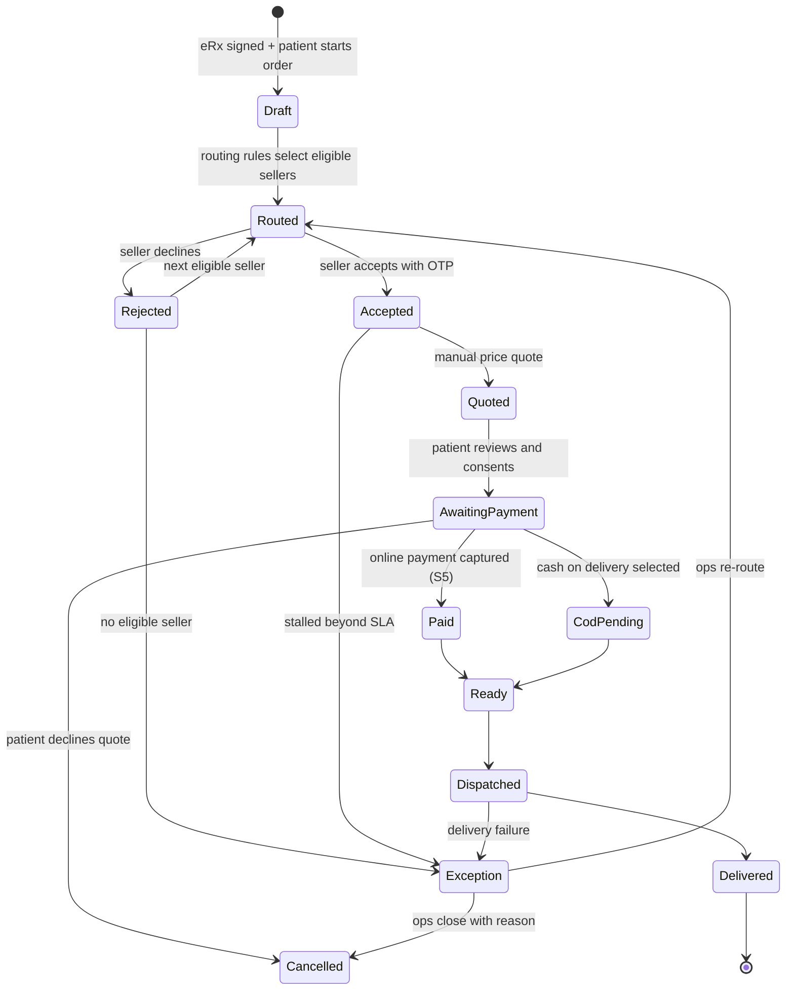

#### API Requirements (all **[PROPOSED]**)

| API | Method | Purpose |
|---|---|---|
| `/api/Pharmacy/Onboard` | POST | Partner application |
| `/api/Pharmacy/Licence` | GET/PUT | Licence records and expiry |
| `/api/Admin/Pharmacy/{id}/Activate` | POST | Activation checklist |
| `/api/HomeoMeds/Sellers` | GET | Eligible sellers for a patient |
| `/api/HomeoMeds/Orders` | POST | Create from signed eRx (immutable draft, codes) |
| `/api/HomeoMeds/Orders/{id}/Accept` | POST | Pharmacy accept — **OTP** |
| `/api/HomeoMeds/Orders/{id}/Reject` | POST | Reject with reason |
| `/api/HomeoMeds/Orders/{id}/Quote` | POST | Manual price quote |
| `/api/HomeoMeds/Orders/{id}/Pay` | POST | S5 payment or COD |
| `/api/HomeoMeds/Orders/{id}/Status` | POST | Ready / dispatched / delivered |
| `/api/HomeoMeds/Orders/{id}` | GET | Track |
| `/api/HomeoMeds/Exceptions` | GET | Ops and Account queue |
| `/api/HomeoMeds/RefillRequest` | POST | Patient → doctor refill inbox |

#### Database Impact
**New:** `PharmacyPartner`, `PharmacyLicence`, `MedicineOrder`, `MedicineOrderItem`, `MedicineQuote`, `MedicineOrderEvent`, `SellerRoutingRule`, `RefillRequest`. Ledger entries use stream S5 with seller / platform / delivery split.

#### Business Logic highlights
- **Licence gating is enforced at routing time and by a scheduled sweep**; an expired or suspended licence removes a pharmacy from routing immediately.
- Routing considers licence validity, service area, operating hours and capacity — a rule engine, not a manual assignment.
- Acceptance requires OTP to the pharmacy's registered mobile; the OTP event is what flips patient-visible codes to names and unlocks the quote.
- Quote is always shown **before** payment.
- COD orders remain `CodPending` until the pharmacy confirms collection, and unremitted COD is an exception category.

#### Acceptance Criteria
1. A pharmacy with an expired licence receives no routed orders.
2. An order draft contains no clinical data typed by a human.
3. The patient sees names only after an OTP-verified acceptance.
4. Payment is never requested before a quote is shown.
5. Medicine money is reportable independently of consult money.
6. No order can sit in a terminal-failure state without appearing in the exception queue.

---

### 12.15 Condensed specifications — enhancements to existing modules

These items extend proven modules. Behaviour, screens and APIs already exist; only the delta is specified.

| ID | Feature | Delta specification | APIs | DB | Acceptance |
|---|---|---|---|---|---|
| PLT-01/02 | Password hashing + tokenised reset | Hash + salt on write; verify with legacy fallback then re-hash on next successful login; reset token table with TTL and single use; replace the fake/Firebase thunk; **stop emailing plaintext passwords** | `/api/users/ForgotPassword`, `/ResetPassword`, `/ChangePassword` **[PROPOSED]** | `UserMaster` modified; `PasswordResetToken` new | No plaintext password exists or is emailed; reset link expires and cannot be reused |
| PLT-03 | Server logout | Invalidate the session server-side; persist `UserLoginStatus`; optional token denylist | `/api/Account/Logout` **[PROPOSED]** | `UserLoginStatus` activated | A token presented after logout is rejected |
| PLT-04 | Real profiles | Role-appropriate profile: name, email, mobile, photo, password change; doctor adds clinic, fee, hours, qualifications, KYC and verification status; reception gains a profile (0% today) | `/api/Profile/Me`, `/api/Profile/Photo` **[PROPOSED]** | Profile fields; no role escalation via profile | Each role edits its own real fields; role cannot be changed through this endpoint |
| PLT-05 | RBAC | Restore `GetMenuByRole`; per-route ACL in `allRoutes.js`/`AuthProtected`; `[Authorize(Roles=)]` on every new controller; re-enable commented `[Authorize]` attributes | Existing menu API | `RoleDetail` / `MenuMaster` reused | A doctor typing an admin URL is refused by both UI and API |
| PLT-06 | Admin home | Replace the Velzon ecommerce dashboard; fix `getHomeDashboardPath` to `/admin/dashboard`; KPI widgets from real aggregates | `/api/AdminDashboard/Overview` **[PROPOSED]** | — | Admin lands on real KPIs |
| ADM-06 | Platform users 100% | Wire the dead Import/Export buttons; add a Verification column; add activate/lock | User import/export **[PROPOSED]** | `VerificationStatus` | Buttons perform real work |
| DOC-15/16 | Doctor profile and dashboard | Add online toggle, tele queue, payment badges and follow-up-due to the dashboard; complete the doctor profile | Reuses F-02, F-10, F-13 | — | Doctor sees payment and tele state without leaving the dashboard |
| DOC-17 | Daily schedule as a screen | Promote `DailyScheduleSetupModal` to `/doctor/schedule` with a week grid and copy-day; add a reception read-only view at `/reception/schedule` | `GetDailySchedule`, `SaveDailySchedule` **(existing)** | — | Public booking slots respect the saved schedule |
| DOC-18 | Reception staff UI | Build list/add/edit/disable pages over the **existing** `api/ReceptionStaff` CRUD; authorise that the doctor owns the staff record | Existing | — | Doctor manages staff without developer intervention |
| DOC-20 | WhatsApp completion | Finish bulk campaign UX, template approval states, failure list and opt-out | Existing `/WhatsApp/*` | Opt-out flag | A bulk campaign completes with a downloadable failure list |
| DOC-21 | Audio rubric accuracy | Continue per the existing `AUDIO_CASE_TAKING_*` engine roadmap; metaphor/alias QA; benchmark-driven acceptance | Existing `/AudioCaseIntelligence/*` | Existing | Benchmark improvement demonstrated against the current baseline |
| DOC-23 | Complaints & case details | Wire the Patient Board to the **existing** `SaveComplaints` / `SaveCaseDetails` endpoints | Existing (classic) | — | Complaints entered on the board persist and reload |
| DOC-24 | Back history timeline | Unified timeline: visits, notes, eRx, labs, payments | Composite read **[PROPOSED]** | — | One chronological view per patient |
| DOC-25 | Export case data | Board toolbar action using the **existing** `ExportCasesToExcel`; add a PDF renderer | Existing + `/api/Erx/Export` **[PROPOSED]** | — | Doctor downloads a case from the board |
| DOC-26 | 3D anatomy completion | Complete mesh and hotspot coverage; UX polish; mobile fallback | Existing 3D masters | Existing | Named body regions resolve to rubric searches |
| DOC-27/28/31/32 | Patient Board polish | Repertorization stability; faster MM head navigation; clipboard delete confirmation and intensity edit; header status strip for payment/tele/eRx | Existing | — | No regression; measurable interaction improvements |
| DOC-29/30 | Patient list and new appointment | Filters for last visit, unpaid and family; appointment gains visit type, consult mode and fee | Existing + F-02/F-06 | `PatientAppointment` modified | Filters return correct sets; new fields persist |
| REC-04/05/06/07/08 | Reception completion | Reception profile; read-only doctor schedule; case-paper/chief-complaint form (no repertory or Rx); dedicated waiting-queue UX with payment gate and call-next; reception-first chrome | Existing + `SaveComplaints` | Reception profile fields | Reception operates without seeing clinical tools it must not use |
| GST-03…06, GST-09 | Marketing and legal | Booking CTAs, verified-doctor trust content, app links; enquiry confirmation and SLA; privacy rewritten for DPDP, recording, pharmacy consent and data rights; terms rewritten for payments, refunds, telemedicine and HomeoMeds; per-doctor consult fee display | — | — | Legal pages reviewed and signed off by counsel before patient go-live |
| PAT-M1…M11 | Patient mobile app | New application consuming the same APIs; OTP identity, directory, booking, payment, telemedicine, records with code-then-name disclosure, follow-up, HomeoMeds, trust/account, support, push. **No clinical case-taking.** | All patient APIs above | Patient ecosystem entities | Feature parity with patient web where both exist; offline and low-data states handled |
| DOCM-01…12 | Doctor mobile app | New application sharing `DoctorId` and web auth; today's queue, availability, push, read-only patient card, join consultation, refill approve/reject, earnings, error/offline states, crash monitoring. **Patient Board remains web-only.** | Existing doctor APIs + tele + earnings + refill | `DeviceToken` | Doctor can run a consulting day from the phone without case-taking |

---

## 13. FRONTEND IMPACT ANALYSIS

### 13.1 Existing screens affected

| Screen / file | Change type | Detail |
|---|---|---|
| `pages/Admin/Dashboard/*` | **Replace** | Velzon ecommerce widgets replaced with real KPI widgets |
| `helpers/dashboard_helper.js` (`getHomeDashboardPath`) | Modify | Admin home → `/admin/dashboard` |
| `pages/Admin/BusinessManagement/Users/ListUser.js` | Modify | Wire dead Import/Export; add Verification column and link |
| `pages/Authentication/ForgetPassword.js` + `slices/auth/forgetpwd/thunk.js` | **Replace logic** | Remove the fake/Firebase path; call the real reset APIs |
| `pages/Authentication/user-profile.js` | **Replace** | Role-appropriate profile forms |
| `pages/Authentication/Register.js` | Modify | Document upload; pending-verification messaging |
| `pages/Doctor/Dashboard/Widgets.js` (~3.5k lines) | Modify | Online toggle, tele queue entry, payment badges, follow-up due, consult checkout separated from subscription checkout |
| `pages/Doctor/Dashboard/BestSellingProducts.js` | Modify | Reschedule and Cancel actions; payment badge column; filters |
| `pages/Doctor/PatientBoard/PatientBoard.js` (~13.5k lines) | **Modify heavily** | COG panel, potency picker, visit-notes split, export action, complaints wiring, header status strip |
| `Components/Common/DailyScheduleSetupModal.js` | Promote | Becomes a first-class screen plus a reception read-only variant |
| `Components/WhatsAppModal/*` | Modify | Bulk campaign completion, failure list, opt-out |
| `Layouts/LayoutMenuData.js` | Modify | New menus: Credentialing, Payments, Support, Pharmacies; new Account sidebar |
| `Routes/allRoutes.js`, `Routes/AuthProtected.js` | Modify | New routes **and** per-route ACL |
| `Components/constants/roles.js` | Modify | Add `Account`, `Patient`, `Pharmacy` |
| `helpers/url_helper.js`, `helpers/realbackend_helper.js` | Extend | All new endpoint constants and typed wrappers |
| `App.js` | Modify | Remove the fake backend from the production path |
| Landing pages | Modify | Booking CTAs, trust content, app store links, legal rewrites |

### 13.2 New screens

| Area | Screens |
|---|---|
| Admin | Credentialing queue and detail · Consult reconciliation · Payment exceptions · Support tickets list and detail · Enquiries inbox · Pharmacy activation · HomeoMeds exceptions · Admin KPI home |
| Account | Ledger · Consult reconciliation · Medicine ledger · Exceptions · Settlements · Payouts · Refunds · Tax · Payees · Clinic collections |
| Doctor | Schedule · Reception staff · Follow-up analysis · Clinic performance · SMS templates · Teleconsult room · Doctor profile |
| Reception | Reception home / queue · Read-only schedule · Case paper · Reception profile · Collect payment modal |
| Public | Booking funnel (`/book`, `/book/:id`, `/book/:id/slots`, `/book/confirm`) · Consult payment (`/book/pay/:bookingId`) · Success and failure |
| Pharmacy | Onboarding · Licence · Order inbox · Order detail (OTP accept, quote, dispatch) · History |

### 13.3 New and modified components

| Component | Purpose |
|---|---|
| `RescheduleModal`, `CancelAppointmentModal` | Shared by Doctor and Reception |
| `PaymentStatusBadge` | Appointment lists, board header, queue |
| `CollectPaymentModal` + receipt printer | Reception |
| `PotencySelect` | Prescription remedy rows |
| `VisitNotesPanel` | Extracted from the prescription modal |
| `CenterOfGravityPanel` + explainability drawer | Repertorize tab |
| `TeleAvailabilityToggle`, `TeleQueuePanel`, `VideoRoom`, `ConsentModal`, `DeviceCheck` | Telemedicine |
| `BookingWizard` (doctor card, slot picker, OTP step, consent, checkout) | Public booking |
| `LedgerTable`, `SettlementRunView`, `OtpConfirmDialog` | Account console |
| `CredentialingQueue`, `DocumentViewer` (signed URLs) | Admin |
| `TicketThread` | Support |
| `AccountLayout`, `PharmacyLayout` | New role shells |

**Recommended refactor:** extract `PatientBoard.js` sub-panels (Repertorize, Prescription, Notes, History) before adding COG, potency and the notes split. Four concurrent changes in a 13.5k-line file is the largest avoidable delivery risk in the programme.

### 13.4 Navigation, state and cross-cutting frontend concerns

| Concern | Requirement |
|---|---|
| Navigation | Role-driven menus; Account and Pharmacy get their own layouts; doctor layout continues to hide the admin sidebar |
| Permissions | Per-route ACL in `AuthProtected`; menu built from `GetMenuByRole`; UI hiding is **never** the only control — the API must also refuse |
| Loading states | Skeletons on ledger, reconciliation, queue and booking slot loads; existing rubric prefetch patterns retained |
| Error states | Field-level validation errors; 409 conflicts rendered as actionable alternatives; payment failures never rendered as generic errors |
| Empty states | Explicit copy for empty queues, no slots available, no exceptions, no tickets |
| Responsive | Public booking and patient-facing web must be mobile-first; the teleconsult room must work on tablet; the admin console remains desktop-first |
| Accessibility | Keyboard operability and labelled controls for public booking and payment screens at minimum; colour is never the sole carrier of payment status (**Recommended**) |
| i18n | The patient app requires language selection (Hello Homeo Doc module 1). Whether patient **web** must be multilingual is **not specified in the provided documentation** — OQ-C4 |
| Demo isolation | Velzon demo routes must be excluded from production builds or at minimum blocked by ACL |

### 13.5 Screen → module mapping (extract)

| Screen | Role | Module | Requirement |
|---|---|---|---|
| `/admin/doctor-credentialing` | Admin | Business Management | ADM-01 |
| `/admin/consult-payments` | Admin | Payments | ADM-02 |
| `/admin/payment-exceptions` | Admin | Payments | ADM-03 |
| `/admin/support-tickets` | Admin | Support | ADM-04 |
| `/account/ledger` | Account | Finance | FIN-01 |
| `/account/settlements`, `/account/payouts` | Account | Finance | FIN-02, FIN-03 |
| `/book/*` | Guest/Patient | Booking | GST-01 |
| `/book/pay/:bookingId` | Guest/Patient | Payments | GST-02 |
| `/doctor/schedule` | Doctor | Scheduling | DOC-17 |
| `/doctor/reception-staff` | Doctor | Staff | DOC-18 |
| `/doctor/follow-up-analysis` | Doctor | Analytics | DOC-03 |
| `/doctor/clinic-performance` | Doctor | Analytics | DOC-04 |
| `/doctor/sms` | Doctor | Outreach | DOC-05 |
| `/teleconsult/:sessionId` | Doctor / Patient | Telemedicine | DOC-11 |
| `/doctor/patientboard` | Doctor | Clinical | DOC-06, 07, 08, 22, 23, 25 |
| `/reception/schedule`, `/reception/case-paper` | Reception | Reception | REC-05, REC-06 |
| `/pharmacy/orders` | Pharmacy | HomeoMeds | PHR-06 |

---

## 14. BACKEND IMPACT ANALYSIS

### 14.1 Existing services affected

| Service | Change |
|---|---|
| `UserService` (both APIs) | Password hashing, reset tokens, logout, verification status |
| `PatientAppointmentService` (.NET 8) | Reschedule, cancel, change log, visit type, consult mode, payment status projection |
| `PrescriptionService` (classic write, .NET 8 read) | Potency, snapshot creation, eRx payload |
| `DoctorDashBoardService` | Payment badges, tele queue counts, follow-up due |
| `OrderService` / `SubscriptionService` (classic) | Ported to .NET 8; webhook; signature verification; S1 ledger write; secrets removed from source |
| `WhatsAppService` | Bulk completion, opt-out, template governance |
| `AudioCaseTakingService` and intelligence services | Accuracy roadmap per existing engine documents |
| `ReceptionStaffService` | No change — surfaced by new UI |
| `PatientService` | Self-registration flag, mobile verification, SMS opt-in, family links |

### 14.2 New services / controllers (all on .NET 8)

| Controller | Domain |
|---|---|
| `PaymentsController`, `LedgerController`, `SettlementController`, `RefundController` | Money spine |
| `ConsultPaymentController`, `ConsultFeeController` | Consult money |
| `DoctorCredentialingController` | Trust |
| `PublicBookingController`, `PatientAuthController` | Patient access |
| `TelemedicineController` | Video consultation |
| `SmsController`, `NotificationsController`, `DevicesController` | Messaging |
| `SupportTicketController` | Support |
| `ErxController` | Prescription as a document |
| `RepertorizationController` extension (`CenterOfGravity`) | Clinical |
| `PotencyMasterController` | Clinical master |
| `AnalyticsController`, `AdminDashboardController` | Insight |
| `HomeoMedsController`, `PharmacyController` | Marketplace |
| `OtpController` | Control plane |

### 14.3 Background processing (extends the existing hosted-service pattern)

| Job | Purpose |
|---|---|
| Payment reconciliation sweep | Poll orders stuck in `Created`; raise webhook-mismatch exceptions |
| Settlement run | Aggregate eligible entries; produce payout instructions |
| Payout dispatch | Submit and track payout status |
| Notification dispatcher | SMS, WhatsApp, push and email with retry and dead-letter |
| Licence expiry sweep | Block pharmacies with expired or suspended licences |
| Order SLA escalation | Move stalled medicine orders into the exception queue |
| Waitlist offer | Offer freed slots on cancellation |
| Tele session janitor | Close abandoned sessions; expire stale availability |
| OTP expiry cleanup | Purge expired challenges; retain the audit log |
| **Existing** | Audio queue, embeddings, WhatsApp bulk, Excel import, retention sweepers — unchanged |

### 14.4 Authentication and authorisation changes

1. Hash passwords; verify with a legacy fallback and re-hash on successful login (migration without lockout).
2. Add role claims for all roles including `Account`, `Patient` and `Pharmacy`.
3. Separate token audiences: staff tokens versus patient tokens versus pharmacy tokens (**Recommended**).
4. Enable JWT issuer and audience validation — currently **not validated** on .NET 8.
5. Re-enable commented `[Authorize]` attributes; apply `[Authorize(Roles=)]` to every new controller.
6. Server-side logout with `UserLoginStatus` and an optional denylist.
7. Ownership checks, not just role checks: a doctor may only act on their own appointments; reception only on its doctor's; a pharmacy only on assigned orders; a patient only on their own records.

### 14.5 Validation, error handling, logging, performance

| Concern | Approach |
|---|---|
| Validation | Continue with `ModelState` plus service-level rules; **Recommended** to introduce a validation library for the new money and booking modules where rule density is high |
| Error handling | Extend the existing `BaseAPIController` error mapping; add correlation ids; never return gateway errors verbatim to clients |
| Logging | Structured logs with correlation id, actor, role and entity reference; financial and OTP events logged separately and retained longer |
| Idempotency | Required on webhooks, booking creation and payment order creation |
| Concurrency | Optimistic concurrency on slot booking, credentialing decisions and order state transitions |
| Performance | Reuse the existing indexing approach (`RubricDetails_Performance_Indexes.sql` precedent) for ledger, appointment and directory queries; paginate every list; pre-aggregate analytics if needed |
| Rate limiting | Mandatory on all public endpoints (booking, OTP, directory) |

---

## 15. API IMPACT ANALYSIS

### 15.1 Classification summary

| Status | Count (approximate) |
|---|---|
| Existing — No Change | The great majority of ~348 classic actions plus ~45 .NET 8 controllers serving masters, clinical and AI functions |
| Existing — Modification | 8 (login, RegisterDoctor, ActivateUser, ForgetPassword, SavePrescriptionDetail, SaveUpdateAppointmentHistoryNote, SaveUpdateSubscription, appointment list DTOs) |
| Existing — Port / Migrate | 2 (`Order/GenerateOrderId`, `Subscription/SaveUpdateSubscription` → .NET 8) |
| New API | ~70 proposed endpoints across 13 new controllers |
| Integration API (inbound webhooks) | 3 (payment gateway, video vendor, SMS delivery reports) |
| Deprecated | Legacy `POST api/Login/authenticate` (second auth path with a different signing key) — **Recommended for removal** |

### 15.2 API impact table (representative)

| API | Status | Purpose | Frontend consumer | Backend logic | DB impact | Auth | Notes |
|---|---|---|---|---|---|---|---|
| `POST /Account/Login` | Existing — Modification | Login | All staff clients | Add role claim; hashed verification | `UserMaster` | Anonymous | Currently on the classic API; migration target |
| `POST /Account/Logout` | **New** | Session invalidation | All staff clients | Login status, denylist | `UserLoginStatus` | Authenticated | PLT-03 |
| `POST /users/ForgotPassword` | Existing — Modification | Reset request | Forgot screen | Token, not plaintext email | `PasswordResetToken` | Anonymous | Security defect fix |
| `POST /users/RegisterDoctor` | Existing — Modification | Doctor sign-up | Register screen | Do **not** auto-activate practice | `DoctorVerification` | Anonymous | GST-07 |
| `GET /api/DoctorCredentialing/Queue` | **New** | Review queue | Admin | Filter by status | `DoctorVerification` | Admin | ADM-01 |
| `POST /api/Payments/Orders` | **New** | Create order | Patient, Doctor, Reception | Server-derived amount | `PaymentOrder` | Role-scoped | F-02 |
| `POST /api/Payments/Webhook/Razorpay` | **New (Integration)** | Capture events | — | Signature verify; ledger write | `PaymentOrder`, `LedgerEntry` | **Anonymous + signature** | Source of truth |
| `POST /api/ConsultPayment/CollectAtReception` | **New** | Offline collection | Reception | Receipt + S3 ledger | `ConsultPayment`, `LedgerEntry` | Reception/Doctor | REC-03 |
| `GET /api/Ledger` | **New** | Unified ledger | Account | Stream filters | `LedgerEntry` | Account (Admin read) | FIN-01 |
| `POST /api/Settlements/{id}/ApprovePayout` | **New** | Payout approval | Account | OTP dual control | `SettlementRun`, `Payout`, `OtpAuditLog` | Account | FIN-03 |
| `GET /api/PublicBooking/Doctors` | **New (Public)** | Directory | Booking wizard, patient app | Verified only | Read | Anonymous, rate-limited | GST-01 |
| `POST /api/PublicBooking/Create` | **New (Public)** | Create booking | Booking wizard, patient app | Patient upsert + appointment | `Patient`, `PatientAppointment` | Patient token | GST-01 |
| `POST /api/PatientAuth/RequestOtp` / `VerifyOtp` | **New (Public)** | Patient identity | Booking, patient app | Throttled OTP | `OtpChallenge` | Anonymous, throttled | PAT-M1 |
| `POST /api/PatientAppointment/RescheduleAppointment` | **New** | Reschedule | Doctor, Reception, Patient | Conflict check, audit, notify | `AppointmentChangeLog` | Role + ownership | DOC-01 |
| `POST /api/PatientAppointment/CancelAppointment` | **New** | Cancel | Doctor, Reception, Patient | Status, slot release, refund hook | `PatientAppointment` | Role + ownership | DOC-02 |
| `POST /api/Repertorization/CenterOfGravity` | **New** | COG compute | Patient Board | Algorithm pending definition | Read-only | Doctor | DOC-06 / OQ-B3 |
| `GET /api/PotencyMaster` | **New** | Potency list | Prescription modal | Master read | `PotencyMaster` | Doctor | DOC-07 |
| `POST SavePrescriptionDetail` (classic) | Existing — Modification | Save Rx | Prescription modal | Accept `potencyId`; create snapshot | `PrescriptionRemedyDetail`, `ErxSnapshot` | Doctor | DOC-22 |
| `GET /api/Erx/ByAppointment/{id}` | **New** | eRx payload | Patient app, pharmacy | **Code/name disclosure logic** | `ErxSnapshot` | Role-scoped | F-08 |
| `POST /api/Telemedicine/Sessions` | **New** | Create session | Doctor, patient app | Vendor room creation | `TeleSession` | Doctor | DOC-11 |
| `POST /api/Sms/Send` | **New (Integration)** | SMS dispatch | Doctor SMS screen, system | Provider + DLT template | `SmsMessageLog` | Role-scoped | DOC-05 |
| `POST /api/SupportTicket` | **New** | Raise ticket | Patient app, doctor, admin | Workflow | `SupportTicket` | Role-scoped | ADM-04 |
| `POST /api/HomeoMeds/Orders/{id}/Accept` | **New** | Pharmacy accept | Pharmacy console | **OTP; unlocks names** | `MedicineOrder`, `OtpAuditLog` | Pharmacy | PHR-06 |
| `GET /api/Analytics/ClinicPerformance` | **New** | Clinic KPIs | Doctor | Aggregations | Read | Doctor | DOC-04 |
| `POST api/Login/authenticate` (classic) | **Deprecated (Recommended)** | Legacy auth | None known | Different signing key | — | Anonymous | Removal reduces attack surface |

> **Contract note:** endpoint paths above are consolidated from both planning documents. Where the two disagree (`/api/ConsultPayment/*` in the new-features plan versus a unified `/api/Payments/*` in the ecosystem plan), this document adopts the **unified Payments namespace with a ConsultPayment sub-surface**, because a single ledger requires a single order-creation path. See Conflict C-2 in §23.

---

## 16. DATABASE IMPACT ANALYSIS

### 16.1 Existing tables affected

| Table | Change | Reason |
|---|---|---|
| `UserMaster` | Hashed password column/format; `VerificationStatus` | PLT-01, ADM-01 |
| `Doctor` | `PracticeLocked`, `ConsultFee` link, bank KYC fields | ADM-01, F-02 |
| `Patient` | Self-registered flag, mobile-verified flag, SMS opt-in / DND | GST-01, DOC-05 |
| `PatientAppointment` | `CANCELLED` status value, `CancelReason*`, `CancelledBy/At`, `VisitType`, `ConsultMode`, `PaymentStatus` | F-06, F-05, F-02, F-10 |
| `AppointmentHistoryNote` | `NoteType`, `IsErxExcluded` | F-08 |
| `PrescriptionRemedyDetail` | `PotencyId` (+ optional frequency, duration) | F-07 |
| `PackageEntryDetail` | **Shape unchanged**; linked to S1 ledger entries only | F-02 (explicit non-goal: no overloading) |
| `RoleMaster` / `RoleDetail` / `MenuMaster` | New roles and menu rows | PLT-09, PLT-05 |
| `EnquiryDetail` | Optional `TicketId` | ADM-04 |
| `DoctorReceptionStaff` | **No change** — UI only | DOC-18 |
| `UserLoginStatus` | Activated (currently unused) | PLT-03 |

### 16.2 New tables required

| Domain | Tables |
|---|---|
| Trust | `DoctorVerification`, `DoctorCredentialDocument` |
| Money | `PaymentOrder`, `LedgerEntry`, `ConsultPayment`, `ConsultFeeConfig`, `PaymentException`, `SettlementRun`, `Payout`, `Refund`, `Invoice` *(Proposed)* |
| Control plane | `OtpChallenge`, `OtpAuditLog` |
| Appointments | `AppointmentChangeLog`, `BookingWaitlist` |
| Patient ecosystem | `PatientAuthOtp` *(may be folded into `OtpChallenge`)*, `FamilyMember`, `CaregiverAuth`, `ConsentRecord`, `PasswordResetToken` |
| Prescription | `PotencyMaster`, `ErxSnapshot`, `ErxSnapshotItem`, `RefillRequest` |
| Telemedicine | `TeleAvailability`, `TeleSession`, `TeleConsentLog`, `TeleSessionEvent` |
| Messaging | `SmsTemplate`, `SmsMessageLog`, `DeviceToken`, `AppNotification` |
| Support | `SupportTicket`, `SupportTicketMessage`, `SupportTicketAttachment` |
| HomeoMeds | `PharmacyPartner`, `PharmacyLicence`, `SellerRoutingRule`, `MedicineOrder`, `MedicineOrderItem`, `MedicineQuote`, `MedicineOrderEvent` |
| Continuity | `Review`, `SymptomDiary`, `FollowUpTask` |

### 16.3 Proposed ER model — new commercial and patient domains

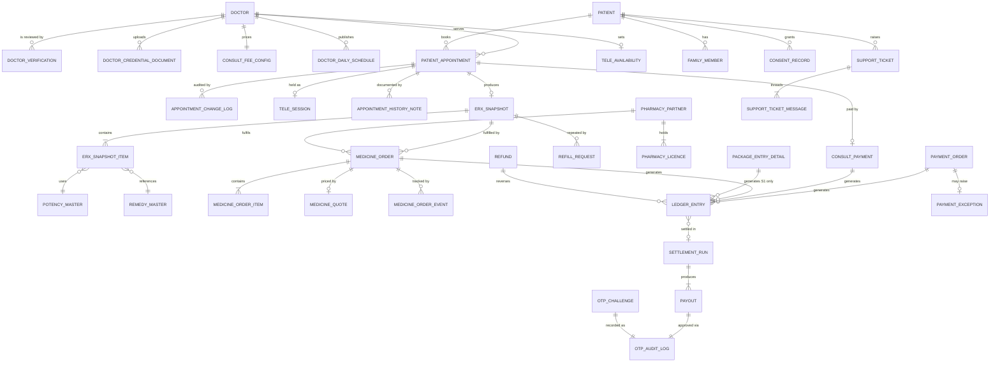

> The diagram covers **new and newly-linked** entities. Existing clinical knowledge structures (repertory, materia medica, questions, diagnosis, AI) are unchanged and omitted for clarity. Exact column definitions for existing tables are **not specified in the provided documentation** and must be confirmed against the live schema before migration scripts are written.

### 16.4 Relationships, constraints and indexes

| Concern | Requirement |
|---|---|
| Referential integrity | Every `LedgerEntry` must resolve to a business entity through `RefEntityType` + `RefEntityId`; enforce by application invariant plus reporting checks |
| Uniqueness | `PaymentOrder.GatewayPaymentId` unique (idempotency) · one Approved `DoctorVerification` per doctor · one active `PharmacyLicence` per licence number · `ConsultPayment.ReceiptNo` unique per clinic |
| Immutability | `LedgerEntry` and `ErxSnapshot` are append-only; enforce by permissions and application rules, and consider database-level protection (**Proposed**) |
| Check constraints | Amounts > 0 · refund ≤ captured · appointment status within the enumerated set |
| Indexes | `LedgerEntry(Stream, CreatedAt)` · `LedgerEntry(PayeeType, PayeeId, SettlementRunId)` · `PaymentOrder(Status, CreatedAt)` · `PatientAppointment(DoctorId, AppointmentDate, SlotId)` · `PatientAppointment(Status, AppointmentDate)` · `Patient(MobileNumber)` · `DoctorVerification(Status, SubmittedAt)` · `MedicineOrder(Status, PharmacyId)` · `OtpAuditLog(EntityType, EntityId)` |

### 16.5 Data migration

| Migration | Approach | Risk |
|---|---|---|
| Password hashing | Hash on next successful login with a legacy-compare fallback; force reset for dormant accounts after a cut-off | Lockout if the fallback is removed too early |
| Appointment status | Backfill is **not** required — `CANCELLED` is additive. Confirm that no existing report assumes a fixed status set | Report breakage |
| `VisitType` | Default existing rows to `First`; do not infer retrospectively unless the client requests it | Skewed follow-up analytics if inferred badly |
| Existing prescriptions | `PotencyId` left null; historical rows treated as unstructured in reporting | Mixed-quality analytics |
| History notes | Default `NoteType = General`, `IsErxExcluded = true` so no historical narrative surfaces on a new eRx | Notes disappearing from where doctors expect them — mitigate with UX messaging |
| Doctor verification | Backfill active doctors as Approved (**requires client confirmation, OQ-A5**) | Locking live practices out |
| Historical subscription payments | Optionally back-populate S1 ledger entries for reporting continuity | Double counting if run twice — must be idempotent |

### 16.6 Backward compatibility and data-integrity risks

| Risk | Control |
|---|---|
| Two APIs writing the same tables with different rules | Freeze the classic API; migrate write paths deliberately; add integration tests that exercise both |
| Schema evolution partly through raw SQL scripts | Adopt one migration path for new tables; version and review scripts |
| Financial rows edited by a support action | Append-only enforcement plus restricted permissions |
| Orphan payments (money without a business entity) | Exception category; never auto-matched |
| Patient duplication via public booking | Mobile-number identity key plus a merge tool (**Proposed**) |

---

## 17. INTEGRATION ANALYSIS

| Integration | Purpose | Direction | Data exchanged | Auth | Trigger | Failure handling | Retry | Timeout | Dependency | Security |
|---|---|---|---|---|---|---|---|---|---|---|
| **Razorpay** (existing, to be extended and ported) | Orders, capture, refunds, payouts | Outbound + **inbound webhook** | Order id, amount, payment id, status, refund id | API key/secret; **webhook signature** | Booking, subscription, medicine payment; gateway events | Signature failure → reject and alert; capture without order → exception | Webhook retried by the provider; internal reconciliation sweep | Short on create; webhook processing must be fast and idempotent | Merchant account, KYC, settlement config | Keys in a secret store; never log card data; verify every webhook |
| **SMS provider** (new) | OTP, confirmations, reschedule/cancel, doctor-unavailable | Outbound + inbound DLR | Mobile number, template id, variables | API key | Event-driven and ad-hoc | Retry with backoff; dead-letter; alert on OTP failure rate | Yes, bounded | Short | **DLT registration (India)** | Rate limit; mask numbers in logs; suppress on DND except transactional |
| **Video vendor** (new) | Telemedicine rooms and tokens | Outbound + inbound events | Room id, participant tokens, session events | API key / JWT | Session creation and join | Room-create failure → retry, then fallback or reschedule + ticket | Bounded | Short | Vendor selection **pending (OQ-A7)** | Short-lived tokens; recording only with stored consent |
| **Push — FCM / APNs** (new) | Mobile notifications | Outbound | Device token, payload | Service credentials | Domain events | Invalid token → prune | Yes | Short | Mobile apps exist | No PHI in notification payloads |
| **OpenAI / Azure OpenAI** (existing) | Whisper, GPT, embeddings | Outbound | Audio, transcripts, text | API key | Audio pipeline and embedding jobs | Existing queue and retry patterns | Existing | Long-running by design | Existing | Consent captured before upload; review data-residency for patient audio |
| **Meta WhatsApp Cloud** (existing) | Outreach | Outbound | Template, recipient, variables | Access token | Manual and campaign | Existing bulk queue; add a failure list | Existing | Short | Existing | Opt-in enforcement |
| **SMTP** (existing) | Registration, activation, reset, invoices | Outbound | Email content | SMTP credentials | Events | Retry; log failure | Yes | Short | Existing | **Stop sending passwords**; use tokenised links |
| **Object storage** (new/hardened) | Documents, audio, eRx PDFs, licences | Outbound | Files | Signed URLs | Uploads and reads | Upload retry | Yes | Medium | Provider selection | **Disable directory browsing**; time-limited signed URLs; per-object authorisation |
| **Bank / payout rail** (new) | Doctor and pharmacy payouts | Outbound | Payout instructions, KYC references | Provider credentials | Settlement approval | Failed payout → exception; ledger unchanged | Manual re-submission | Medium | Settlement model decision (OQ-A1) | OTP dual control; maker-checker |

---

## 18. SECURITY ANALYSIS

The system is moving from a **closed clinic tool** to a **public, money-handling, PHI-bearing platform**. That change raises the severity of every existing weakness.

### 18.1 Findings requiring remediation before public exposure

| # | Finding (Existing) | Severity | Remediation |
|---|---|---|---|
| S-1 | Plaintext password comparison on `UserMaster` (both APIs) | **Critical** | Hash and salt; migrate with legacy fallback (PLT-01) |
| S-2 | `ForgetPassword` emails the plaintext password | **Critical** | Tokenised reset with TTL and single use (PLT-02) |
| S-3 | No per-route frontend ACL; `[Authorize]` commented out on many controllers | **Critical** | Restore attributes; per-route ACL; ownership checks (PLT-05) |
| S-4 | JWT issuer and audience are not validated | **High** | Enable validation; separate audiences per client type |
| S-5 | Secrets in `appsettings.json` | **High** | Secret store; rotate all exposed keys (PLT-08) |
| S-6 | Directory browsing enabled on `/attachments` and `/Blogs` | **High** | Disable; move patient documents behind signed URLs |
| S-7 | Fake auth backend still mounted in `App.js` | **Medium** | Remove from the production path (PLT-07) |
| S-8 | No server-side logout or token revocation | **Medium** | Logout API and login status (PLT-03) |
| S-9 | Two auth paths with different signing keys on the classic API | **Medium** | Deprecate the legacy path |
| S-10 | CORS `AllowAnyOrigin` on both APIs | **Medium** | Restrict to known origins |
| S-11 | ASP.NET Core 2.2 (EOL) on the critical login path | **High** | Migrate login and remaining write paths to .NET 8 |

### 18.2 New security requirements introduced by this programme

| Area | Requirement |
|---|---|
| Payment security | Webhook signature verification; server-derived amounts; idempotency; no card data stored or logged; PCI scope minimised by using hosted checkout |
| OTP control plane | Rate limiting, attempt lockout, short expiry, single use, full audit; OTP required for payout, exception resolution, pharmacy acceptance and sensitive eRx access |
| Separation of duties | Account approves payouts; Admin cannot; both are audited |
| PHI protection | Prescriptions, notes, audio and documents accessible only to the treating doctor, the owning patient and, for a specific order, the accepting pharmacy — enforced at the API, not the UI |
| Code-then-name disclosure | Remedy names withheld until OTP-verified pharmacy acceptance; enforced server-side in the eRx payload, never by hiding fields client-side |
| Public endpoint hardening | Rate limiting, throttling, bot protection, no patient enumeration, generic errors on public surfaces |
| Mobile security | Certificate pinning (**Recommended**), secure token storage, no PHI in push payloads, device binding for doctor tokens |
| Recording policy | Consent stored before recording; access restricted; retention defined — **currently unspecified (OQ-C2)** |
| Data rights | DPDP-aligned consent records, consent centre, export and deletion handling — required by Hello Homeo Doc module 9 |
| Audit | Immutable audit for money, credentialing, prescriptions, OTP and document access |
| Third-party security | Vendor security review for the video provider and SMS provider; data-processing agreements |

---

## 19. NON-FUNCTIONAL REQUIREMENTS

### 19.1 Explicit requirements from the provided documents

The requirement document states **no numeric non-functional targets**. The following are the only NFR-adjacent statements it makes:

| Statement | Source |
|---|---|
| Every transaction must be traceable/monitorable by Homeocentrum | Special Considerations |
| Order exceptions must never be silent | HomeoMeds list |
| No live inventory — manual stock confirmation | HomeoMeds list |
| Mobile apps must handle offline states, failed actions, expired sessions and crash monitoring | Mobile — Doctor list |
| Low-data mode for patients | Hello Homeo Doc module 10 |

**All quantitative targets below are therefore Recommended and require client confirmation.**

### 19.2 Recommended non-functional requirements

| Category | Recommended target |
|---|---|
| Performance — interactive APIs | 95th percentile under 500 ms for list and detail reads at expected load |
| Performance — booking slots | Under 1 s including schedule computation; cacheable |
| Performance — Patient Board | No regression against current interaction latency; COG must not block the tab |
| Performance — audio pipeline | Unchanged; existing polling budget (2.5 s interval, ~8 minute cap) retained |
| Scalability | Horizontal scale on the API tier; background workers scale independently; ledger designed for multi-year growth with partitioning if required |
| Availability | 99.5% for clinical and booking surfaces; payment webhook endpoint must be the most available surface in the system |
| Reliability | At-least-once processing with idempotency for webhooks and notifications; no message loss for money events |
| Data integrity | Financial and prescription records append-only; reconciliation must balance daily |
| Security | See §18 |
| Maintainability | No new domain code on the classic API; `PatientBoard.js` decomposed; consistent thunk/helper conventions preserved |
| Usability | Public booking completable in under two minutes; reception collection under 30 seconds |
| Accessibility | Keyboard operability and labelling on public and payment screens (**Recommended baseline**) |
| Compatibility | Modern evergreen browsers; teleconsult on desktop and tablet; patient app on current iOS and Android majors |
| Logging | Structured, correlation-id based; financial and OTP logs retained longer |
| Monitoring | Uptime, error rate, webhook lag, OTP delivery rate, payment failure rate, queue depth, crash-free sessions on mobile |
| Backup / recovery | Point-in-time restore; documented RPO/RTO — **currently not specified in the provided documentation** |
| Disaster recovery | Documented and tested runbook including gateway reconciliation after an outage |

---

## 20. TESTING & QA STRATEGY

### 20.1 Test scope by type

| Type | Focus |
|---|---|
| **Unit** | COG algorithm (once defined), commission/GST computation, refund arithmetic, slot conflict logic, potency validation, code/name disclosure rule, OTP expiry and attempt counting |
| **API** | Every new endpoint: happy path, validation failure, authorisation failure, ownership violation, idempotency, pagination |
| **Integration** | Gateway sandbox (capture, failure, refund, duplicate webhook, signature mismatch), SMS sandbox, video vendor sandbox, storage signed URLs |
| **UI / E2E** | Public booking end-to-end; reception collection; reschedule and cancel across roles; prescription with potency; eRx code→name transition; teleconsult join and rejoin |
| **Regression** | **Critical.** All 25 admin master modules, Patient Board tabs, repertorization, audio pipeline, WhatsApp, 3D, import/export, board backup/restore — these are at 100% today and must remain so |
| **Negative** | Booking a taken slot, paying twice, replaying a webhook, tampering with an amount, accessing another patient's eRx, pharmacy accepting an unassigned order, reception approving a payout |
| **Boundary** | Booking horizon edges, midnight and timezone boundaries, settlement hold-window edges, maximum clipboard size for COG, maximum upload size |
| **Permission** | A matrix test per role × per route × per API — the single most important suite given that no ACL exists today |
| **Security** | Authentication bypass, IDOR on patient and appointment ids, signature bypass, rate-limit bypass, OTP brute force, signed-URL leakage, XSS on free-text fields |
| **Performance** | Booking slot load under concurrency, ledger queries over volume, Patient Board with a large clipboard, dashboard aggregations |
| **Data validation & migration** | Password migration without lockout, note-type defaults, historical prescriptions rendering, ledger back-population idempotency |
| **UAT** | Role-based scripts: doctor day-in-the-life, reception day-in-the-life, patient booking journey, Account month-end close, pharmacy order fulfilment |

### 20.2 Environment and data requirements

| Need | Detail |
|---|---|
| Gateway sandbox | Test keys, webhook tunnel, simulated failure and refund cases |
| SMS sandbox | DLT-registered test templates; a whitelist of test numbers |
| Video sandbox | Vendor test project with token issuance |
| Test data | Doctors in each verification state; patients with and without prior visits; appointments in every status including CANCELLED; prescriptions with and without potency; orders in every HomeoMeds state |
| Money test discipline | A dedicated finance test account; ledger assertions after every payment scenario; a reconciliation report that must balance to zero |

### 20.3 Entry and exit criteria (per phase)

**Entry:** requirement signed off · API contracts frozen in Swagger · test data seeded · dependent integrations available in sandbox.
**Exit:** all P0 and P1 defects closed · regression suite green on the 100% modules · permission matrix fully passed · for money phases, a reconciliation that balances across at least one simulated settlement cycle · security review completed for any phase that opens a public surface.

---

## 21. DEPENDENCY ANALYSIS

### 21.1 Business dependencies

| Dependency | Owner | Impact if delayed |
|---|---|---|
| Commission, GST and settlement policy | Client finance / CA | Ledger cannot compute splits; **blocks all of Phase 2** |
| Consult fee policy (per doctor, per mode, surge) | Client product | Blocks booking pricing |
| Refund and cancellation policy | Client product + legal | Cancel flow ships without a money path |
| Reception cash policy (retained vs remitted) | Client finance | Ledger semantics for S3 undefined |
| Doctor credentialing acceptance criteria | Client clinical governance | Reviewers have no standard |
| Directory ranking rules | Client product | Ranking explanation screen cannot be built honestly |
| Pharmacy commercial terms | Client business development | HomeoMeds ledger split undefined |
| Legal review of privacy, terms, telemedicine and recording | Client legal | **Blocks patient go-live** |

### 21.2 Technical dependencies

| Dependency | Blocks |
|---|---|
| Payment gateway account + webhook endpoint reachable in each environment | F-02, and transitively F-03, F-04, F-05, F-14 |
| SMS provider + DLT template approval | OTP → booking → patient app |
| Video vendor selection | F-10 → both mobile apps' consultation flow |
| Object storage with signed URLs | Credentialing documents, eRx PDFs, patient uploads |
| Mobile build and release capability (Apple and Google accounts, signing, store review) | All mobile scope |
| Secret management | Any production deployment of the money spine |

### 21.3 Internal sequencing dependencies

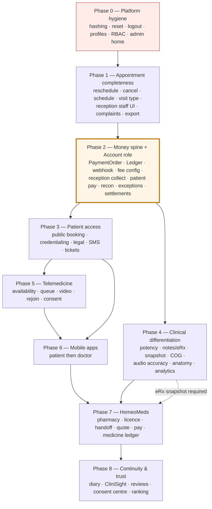

**The critical statement for the client:** Phase 2 is the programme's spine. Booking without payment is a lead form. Telemedicine without payment is a video call. HomeoMeds without payment and without a signed eRx is a messaging app. Everything commercially meaningful depends on Phase 2 landing correctly.

### 21.4 What happens if a dependency slips

| Slipping dependency | Consequence | Mitigation |
|---|---|---|
| Gateway/finance policy | Phase 2 stalls; Phases 3, 5, 6, 7 all slip | Build the ledger with configurable commission/GST and default to a placeholder configuration; do **not** hardcode |
| Video vendor | Phase 5 stalls | Abstract the video provider behind an interface; build availability, queue and consent independently of the vendor |
| DLT/SMS | OTP unavailable → public booking cannot launch | Interim email OTP or staff-assisted booking; the app cannot launch without SMS |
| Legal sign-off | Patient go-live blocked regardless of engineering | Start legal work in Phase 0, not Phase 3 |
| Mobile capability | Phase 6 and 7 patient surfaces slip | Deliver responsive patient **web** for booking, payment and records as an interim |
| COG algorithm definition | F-09 cannot start | Sequence COG last within Phase 4; ship potency and the notes split first |

---

## 22. RISK ANALYSIS

| # | Risk | Description | Probability | Impact | Severity | Mitigation |
|---|---|---|---|---|---|---|
| R-1 | Money handled without verified capture | Client-side confirmation, no ledger, no reconciliation → silent revenue loss and unresolvable disputes | High if unaddressed | Critical | **Critical** | Phase 2 as designed: webhook + signature, append-only ledger, exception queue, daily reconciliation |
| R-2 | Security posture under a public perimeter | Plaintext passwords, no route ACL, commented `[Authorize]`, unvalidated JWT issuer/audience, exposed static directories, secrets in config | High | Critical | **Critical** | Phase 0 before any public exposure; independent security review before patient launch |
| R-3 | EOL classic API on the critical path | ASP.NET Core 2.2 handles login and prescription save | High | High | **High** | Freeze it; port login, Rx save, notes and Razorpay to .NET 8 on a dated plan |
| R-4 | Requirement ambiguity in clinical and financial rules | COG undefined; commission, GST, refund and cash policies undefined; code-then-name is an interpretation | High | High | **High** | Written sign-off before build; treat §25 Critical items as gating |
| R-5 | Patient Board concentration | COG, potency, notes split and export all land in one 13.5k-line file | High | High | **High** | Decomposition spike first; feature-flag each addition; heavy regression |
| R-6 | Dual-API drift | Two backends over one database with overlapping entities | Medium | High | **High** | No new domain code on classic; contract tests over shared entities |
| R-7 | Vendor dependency (video) | Telemedicine is unbuildable until a vendor is chosen; both mobile apps depend on it | High | High | **High** | Abstract behind an interface; build availability, queue and consent vendor-independently |
| R-8 | Regulatory exposure | Telemedicine practice rules, DPDP consent, e-pharmacy rules, DLT SMS registration, GST invoicing | Medium | Critical | **High** | Legal engagement from Phase 0; compliance sign-off as a go-live gate |
| R-9 | Data migration harm | Password migration lockout; historical notes surfacing on eRx; doctors locked out by credentialing | Medium | High | **High** | Legacy-compare fallback; safe defaults; explicit backfill decision (OQ-A5); rehearsal on a production copy |
| R-10 | Scope breadth versus capacity | Four applications, six roles, seven money streams, ~70 endpoints, ~30 tables | High | High | **High** | Strict phase gating; no phase starts before its dependencies are met; Phase 2 protected from descoping |
| R-11 | Regression in proven modules | 25 admin masters and the clinical core are at 100% and must stay there | Medium | High | **High** | Automated regression suite established in Phase 0, run every phase |
| R-12 | Mobile delivery capability absent | No mobile code exists in any repository | High | Medium | **Medium** | Decide the approach early; interim responsive patient web for booking and payment |
| R-13 | Performance under public load | Booking slot computation and directory search are new public read paths | Medium | Medium | **Medium** | Cache slots and directory; load-test before launch; rate limit |
| R-14 | Pharmacy partner supply | HomeoMeds requires licensed partners willing to onboard | Medium | Medium | **Medium** | Validate partner pipeline before committing to Phase 7 |
| R-15 | Fraud and abuse on public surfaces | OTP abuse, fake bookings, payment testing, scraping the doctor directory | Medium | Medium | **Medium** | Rate limiting, throttling, lockout, monitoring, bot protection |
| R-16 | Notification failure hidden | OTP or confirmation failures block bookings silently | Medium | High | **Medium** | Delivery-report capture, failure-rate alerting, dead-letter queue |
| R-17 | Estimation risk | Timelines requested before vendor and policy decisions | High | Medium | **Medium** | Estimate after §31 steps 1–5; use effort bands until then |
| R-18 | Velzon demo confusion | Demo tickets, KYC and ecommerce pages mistaken for product | Medium | Low | **Low** | Explicit non-goals in the backlog; block or remove demo routes |

---

## 23. CONFLICTS BETWEEN SOURCE DOCUMENTS

Identified and reported rather than silently resolved.

| # | Conflict | Version A | Version B | Assessment | Resolution taken here |
|---|---|---|---|---|---|
| C-1 | **Mobile scope** | `NEW_FEATURES_DEVELOPMENT_PLAN.md`: *"Mobile — N/A in current codebase… No native modules planned in this phase."* | `NIGA_DEV_2.docx` and `COMPLETE_ECOSYSTEM_DEVELOPMENT_PLAN.md`: full Patient and Doctor mobile applications | The DOCX is the client requirement and the ecosystem plan is the later, self-declared superseding document | **Mobile is in scope.** The new-features plan is treated as a web-only subset |
| C-2 | **Payment API namespace** | New-features plan: `/api/ConsultPayment/*` including its own webhook | Ecosystem plan: unified `/api/Payments/*` with a ConsultPayment sub-surface | A single ledger requires a single order-creation and webhook path | **Unified `/api/Payments/*`**, with `/api/ConsultPayment/*` retained for appointment-scoped reads and reception collection |
| C-3 | **Razorpay placement** | New-features plan: *"or thin reuse of classic `Order/GenerateOrderId` initially"* | Ecosystem plan: *"Port Razorpay off classic `OrderController`"* | Classic is EOL and will sit behind a public perimeter | **Port to .NET 8.** Thin reuse is acceptable only as a time-boxed interim with an agreed removal date |
| C-4 | **Daily schedule completion** | DOCX: `[Existing] [completed 0%]` | Codebase: modal plus `GetDailySchedule` / `SaveDailySchedule` exist | Both are defensible — 0% as a *product screen*, non-zero as *capability* | Recorded as **Partial**; scope is promotion, not construction |
| C-5 | **Manage reception staff** | DOCX: 50% | Codebase: full CRUD API, **zero** UI | Split completion | Recorded as backend-complete, frontend-absent |
| C-6 | **Export case data / complaints** | DOCX: 0% / 20% | Codebase: APIs exist and are unused by the board | Effort is lower than the percentages imply | Recorded as wiring work |
| C-7 | **Support tickets vs enquiry** | DOCX lists a new issue queue; an `EnquiryDetail` API already exists | Both plans: do **not** reuse enquiry as tickets | Consistent across plans | Enquiry may spawn a ticket; it is not the ticket system |
| C-8 | **Which plan governs** | New-features plan is narrower | Ecosystem plan states it *"supersedes"* the new-features plan for planning | Explicit statement | **Ecosystem plan governs**; the new-features plan is retained for its deeper web-feature detail |

---

## 24. ASSUMPTIONS

Each assumption is a place where the analysis had to fill a gap. If any is wrong, scope changes.

| # | Assumption | Impact if wrong |
|---|---|---|
| A-1 | Razorpay remains the payment gateway and supports the required marketplace settlement model | Rework of the payments integration layer |
| A-2 | Homeocentrum will hold the merchant account for all streams, including medicines | Fundamentally different ledger and compliance model |
| A-3 | Mobile applications will be delivered as new projects (native or cross-platform) consuming existing APIs; no mobile-specific backend | Additional backend scope |
| A-4 | Both APIs continue to address one shared database during the transition | Migration and consistency work increases substantially |
| A-5 | The existing repertorization scoring remains authoritative; COG is additive rather than a replacement | Clinical re-validation of the core product |
| A-6 | Patient-facing web parity with the mobile app is limited to booking, payment and basic records unless stated otherwise | Larger patient web scope |
| A-7 | Doctors already live on the platform will not be locked out by credentialing | Operational disruption to paying customers |
| A-8 | The clinic operates in India; DPDP, telemedicine practice guidelines, DLT SMS rules and e-pharmacy rules apply | Different compliance regime and different scope |
| A-9 | "CliniSight progress" (Hello Homeo Doc module 6) is a progress-tracking view over existing clinical data rather than a separate product | Unplanned module |
| A-10 | Reviews (module 9) are patient reviews of doctors with an appeal path, moderated by Admin | Moderation and policy scope |
| A-11 | Existing audio-AI accuracy work follows the roadmap in the existing `AUDIO_CASE_TAKING_*` documents, which were not supplied with this pack | Accuracy scope is unestimated |
| A-12 | Velzon demo surface can be removed or blocked without breaking product routes | Cleanup effort increases |

---

## 25. OPEN QUESTIONS / CLIENT CLARIFICATIONS

Ordered by priority. Only questions that genuinely require a client or business decision are listed.

### Critical — blocks Phase 2 and therefore most of the programme

| # | Question | Why it matters |
|---|---|---|
| OQ-A1 | Which settlement model: gateway marketplace split (e.g. Razorpay Route / linked accounts) or Homeocentrum-held funds with periodic NEFT payouts operated by Account? | Determines the entire payout architecture. The ecosystem plan recommends platform-held + NEFT for v1 and Route for v2 |
| OQ-A2 | Is cash collected at reception **retained by the clinic** or **remitted to Homeocentrum**? | Changes the meaning of S3 ledger entries and doctor settlement arithmetic |
| OQ-A3 | What are the commission percentages, GST treatment (on platform fee, on consult, or both), invoice numbering series and settlement hold period? | Cannot compute or report money without these |
| OQ-A4 | When a patient books but does not pay, is the slot **held** (and for how long) or **released immediately**? | Determines booking concurrency behaviour and no-show economics |
| OQ-A5 | Are doctors currently live on the platform automatically treated as Approved? Can an unverified doctor continue to serve their own clinic patients while being invisible to the public directory? | Risk of locking out paying customers, or of exposing unverified doctors |
| OQ-A6 | What is the refund policy for cancellations — by whom, within what notice period, at what percentage? | Cancel flow ships incomplete without it |
| OQ-A7 | Which video vendor (Twilio / Daily / Agora / self-hosted WebRTC), and is recording required at launch? | Largest single engineering variable in Phase 5 |
| OQ-A8 | Must a teleconsultation be **paid** before the patient can join? | Changes the queue and join gating |
| OQ-A9 | Which SMS provider, and who owns DLT sender-ID and template registration? | Regulatory prerequisite for OTP and confirmations |

### High — blocks specific features

| # | Question | Why it matters |
|---|---|---|
| OQ-B1 | Confirm the code-then-name rule: names are hidden from the patient until a licensed pharmacy OTP-accepts the order, at which point names, quote and a payment QR/link appear. Is this correct, and does it apply to the eRx **PDF/print** as well as the app view? | This is the most consequential interpretation in the document |
| OQ-B2 | Are frequency and duration mandatory alongside potency, or optional? | Prescription validation and pharmacy dispensing clarity |
| OQ-B3 | **What is the exact Center of Gravity algorithm?** Weighted centroid across rubric groups, miasmatic/kingdom centre, hierarchical section weighting, or another definition? A worked example from a practising homeopath is the ideal input | The feature cannot be built without this |
| OQ-B4 | What are the doctor directory ranking rules, and what does the "ranking explanation" screen disclose to patients? | Trust feature and potential regulatory sensitivity |
| OQ-B5 | Which roles may see remedy names before pharmacy acceptance — the treating doctor only, or also reception and admin? | Access control on the eRx payload |
| OQ-B6 | Do the unused roles Management, Supervisor and Inspector need real screens and permissions, or should they be retired? | Affects the RBAC matrix |

### Medium

| # | Question |
|---|---|
| OQ-C1 | What are the availability, RPO and RTO targets, and the data-retention periods for audio, recordings, documents and financial records? |
| OQ-C2 | What is the telemedicine recording policy — is recording enabled at launch, who may access recordings, and for how long are they retained? |
| OQ-C3 | The Hello Homeo Doc list runs 1–6, then 8, 9, 10. **What was module 7?** |
| OQ-C4 | Must the patient **web** experience be multilingual, or is language selection only a mobile-app requirement? |
| OQ-C5 | What defines "CliniSight progress" (module 6) precisely, and what data feeds it? |
| OQ-C6 | Is there a launch geography constraint (city or state) for booking, telemedicine and HomeoMeds? |
| OQ-C7 | Should patients have a full web portal (`/me/*`) at parity with the app, or is web limited to booking and payment? |
| OQ-C8 | Who operates the pharmacy console — the pharmacy's own staff, or Homeocentrum ops on their behalf at launch? |

### Low

| # | Question |
|---|---|
| OQ-D1 | Should the "Deep Analytics" placeholder be delivered in this programme or formally deferred? |
| OQ-D2 | Should the unused Velzon demo surface be removed from the repository, or only blocked? |
| OQ-D3 | Is a patient-facing loyalty, wallet or package concept anticipated? It would change the ledger design and is far cheaper to accommodate now than later |

---

## 26. DEVELOPMENT SCOPE

Phases follow the sequencing established by the source planning document, which is dependency-driven rather than calendar-driven. **No timelines are proposed** — the source documents provide none, and inventing them would misrepresent the estimate.

### Phase 0 — Platform hygiene (unblocks everything)
Password hashing and migration · tokenised reset and real thunk · server logout and session status · real profiles for Admin, Doctor and Reception · RBAC (menu-by-role, route ACL, `[Authorize(Roles=)]`) · admin home redirect and KPI widgets · new roles seeded · secrets moved and rotated · directory browsing disabled · fake backend removed · Razorpay order ported to .NET 8 with webhook and S1 ledger entry.

### Phase 1 — Appointment product completeness
Formal reschedule and cancel with change log and notifications (Doctor and Reception) · `CANCELLED` status · daily schedule as a first-class screen plus reception read-only view · reception staff UI over the existing API · `VisitType` and `ConsultMode` · waiting-queue UX · Patient Board wired to existing complaints and case-detail APIs · case export UI.

### Phase 2 — Money spine and Account role *(the critical phase)*
`PaymentOrder` and `LedgerEntry` · `ConsultFeeConfig` · reception collection (S3) · patient/web consult payment (S2) · webhook with signature verification · payment badges · admin reconciliation and exception queue · Account console (ledger, settlements, payouts with OTP, refunds, tax, payees, clinic collections) · subscription writes S1 ledger entries.

### Phase 3 — Patient access
Public booking funnel with OTP · doctor credentialing so the directory is trustworthy · legal pages rewritten for telemedicine, payments and pharmacy · SMS events and WhatsApp bulk completion · support tickets · enquiry inbox.

### Phase 4 — Clinical differentiation
Potency module · visit notes vs eRx split and immutable snapshot with code-then-name · Center of Gravity *(gated on OQ-B3)* · audio rubric accuracy per the existing engine roadmap · 3D anatomy completion · follow-up and clinic performance analytics · patient back-history timeline.

### Phase 5 — Telemedicine
Availability and heartbeat · tele queue · vendor-backed video room · rejoin · recording consent · duration capture feeding analytics.

### Phase 6 — Mobile applications
Patient app (Hello Homeo Doc modules 1–6, 9, 10 plus push) then Doctor app (queue, availability, join, refill, earnings, push, offline and crash monitoring).

### Phase 7 — HomeoMeds
Pharmacy onboarding and licence gating · eRx handoff with codes→names on OTP acceptance · routing · quote, pay or COD, tracking · medicine ledger · exception queue · patient module 8 and doctor-mobile refill.

### Phase 8 — Continuity and trust
Symptom diary · CliniSight progress · reviews and appeals · consent centre and data rights · ranking explanation.

### Explicitly out of scope / traps to avoid

| Trap | Correct approach |
|---|---|
| Building product features on Velzon demo routes (`/apps-tickets-*`, `/apps-crypto-kyc`, ecommerce dashboards) | Build real Support, Credentialing and Admin KPI modules |
| Overloading `PackageEntryDetail` for consult or medicine money | New `PaymentOrder` + `LedgerEntry` per stream |
| Treating a client-side Razorpay success as authoritative | Webhook plus signature verification |
| Treating `UpdateAppointmentTime` as a reschedule product | Dedicated API with audit and notification |
| Treating WhatsApp as "SMS done" | A separate SMS provider is required |
| Treating history notes inside the Rx modal as a notes/eRx split | Split UX plus typed notes plus snapshot |
| Treating an empty `Dose` as potency | Master plus a required picker |
| Treating `E-CONSULT` plus a WhatsApp alert as telemedicine | Real sessions with a vendor |
| Treating the enquiry form as support tickets | Tickets require workflow |
| Showing remedy names to patients immediately | Codes until pharmacy acceptance |
| Mixing medicine money into consult GMV | Separate medicine ledger |
| Building case-taking into the doctor mobile app | Patient Board remains web-only |
| Creating a third backend | Extend .NET 8; port from classic |
| Treating Account as a variant of Admin | Separate role: money versus masters |

---

## 27. PRIORITY MATRIX

All values are **Recommended Priority**. The client document states no priorities.

| Priority | Definition | Requirements |
|---|---|---|
| **P0 — Critical** | Security defects, or blockers without which money and public access cannot exist | PLT-01, PLT-02, PLT-05, PLT-08, PLT-09, FIN-01, FIN-02, FIN-03, FIN-04, FIN-06, GST-02, ADM-02, ADM-03, REC-03, DOC-19, SC-01–SC-04 |
| **P1 — High** | Core client-requested capability with direct operational or revenue impact | PLT-03, PLT-04, PLT-06, ADM-01, FIN-07, FIN-08, FIN-09, FIN-10, GST-01, GST-05, GST-06, GST-07, GST-09, DOC-01, DOC-02, DOC-05, DOC-07, DOC-08, DOC-14, DOC-15, DOC-16, DOC-17, DOC-22, DOC-23, DOC-30, REC-01, REC-02, REC-07 |
| **P2 — Medium** | Client-requested capability that depends on P0/P1 foundations, or completion of partial modules | ADM-04, ADM-05, ADM-06, DOC-03, DOC-04, DOC-06, DOC-09, DOC-10, DOC-11, DOC-12, DOC-13, DOC-18, DOC-20, DOC-21, DOC-24, DOC-25, DOC-27, DOC-29, DOC-31, DOC-32, REC-04, REC-05, REC-06, REC-08, GST-03, GST-08, PAT-M1–M11 |
| **P3 — Low** | Valuable but sequenced last, or dependent on all of the above | ADM-07, ADM-08, ADM-09, FIN-05, DOC-26, DOC-28, DOCM-01–12, PHR-01–11, continuity and trust features |

### Priority versus effort

| Effort band | Requirements |
|---|---|
| **S — days** | Cancel; reschedule formalisation; payment badge (once payments exist); potency picker; reception staff UI; case export button; complaints wiring; admin home redirect |
| **M — one to two sprints** | Reception collection; visit-notes/eRx split; SMS events; follow-up analysis; credentialing queue; support tickets MVP; profiles; RBAC; daily schedule screen; waiting queue |
| **L — multi-sprint** | Payments spine with webhooks, reconciliation and exceptions; Account console; public self-service booking; clinic performance; Center of Gravity; password migration across a live user base |
| **XL** | Full telemedicine; patient mobile app; doctor mobile app; HomeoMeds marketplace |

---

## 28. REQUIREMENT TRACEABILITY MATRIX

| Req ID | Requirement | Existing / New | Module | UI | API | Backend | DB | Integration | Testing | Acceptance criterion |
|---|---|---|---|---|---|---|---|---|---|---|
| PLT-01 | Password hashing | Existing — Mod | Auth | — | Login | UserService | `UserMaster` | — | Security, migration | No plaintext credential exists |
| PLT-02 | Tokenised reset | Partial | Auth | Forgot/Reset screens | ForgotPassword, ResetPassword | UserService | `PasswordResetToken` | SMTP | API, security | Link expires, single use, no password emailed |
| PLT-03 | Server logout | Partial | Auth | Header | Logout | UserService | `UserLoginStatus` | — | API, security | Post-logout token rejected |
| PLT-04 | Real profiles | Partial | Auth | `/profile` per role | Profile/Me, Profile/Photo | UserService | Profile fields | Storage | UI, permission | Each role edits real fields; no role escalation |
| PLT-05 | RBAC | Existing — Mod | Platform | Route ACL, menus | GetMenuByRole | All controllers | `RoleDetail` | — | Permission matrix | Cross-role URL access refused by UI and API |
| PLT-06 | Admin KPI home | New | Admin | `/admin/dashboard` | AdminDashboard/Overview | Aggregation | — | — | UI, API | Admin lands on real KPIs |
| ADM-01 | Doctor credentialing | New | Business Mgmt | Queue + detail | DoctorCredentialing/* | Credentialing service | `DoctorVerification`, `DoctorCredentialDocument` | Storage, SMTP/SMS | E2E, permission, security | Unverified doctor invisible and unpayable |
| ADM-02 | Consult reconciliation | New | Payments | `/admin/consult-payments` | Payments/Admin/Reconciliation | Recon queries | `LedgerEntry` joins | Gateway | API, data | Totals reconcile to the ledger |
| ADM-03 | Payment exceptions | New | Payments | `/admin/payment-exceptions` | Payments/Exceptions* | Exception state machine | `PaymentException` | Gateway | Negative, E2E | No failed payment is silent |
| ADM-04 | Support tickets | New | Support | List + detail | SupportTicket/* | Ticket service | `SupportTicket*` | — | E2E, permission | Reporter sees thread; SLA visible |
| FIN-01 | Unified ledger | New | Finance | `/account/ledger` | Ledger | Ledger service | `LedgerEntry` | Gateway | Data integrity | Append-only; every row traces to an entity |
| FIN-02/03 | Settlements & payouts | New | Finance | Settlements, Payouts | Settlements/* | Settlement job | `SettlementRun`, `Payout` | Payout rail | E2E, security | No payout without OTP and KYC |
| FIN-07 | Refunds | New | Finance | `/account/refunds` | Refunds | Refund service | `Refund`, `LedgerEntry` | Gateway | Negative, data | Reversing entries only; never edits |
| GST-01 | Public booking | New | Booking | `/book/*` | PublicBooking/*, PatientAuth/* | Booking service | `Patient`, `PatientAppointment`, `OtpChallenge` | SMS | E2E, security, load | Guest books with no staff login |
| GST-02 | Patient consult payment | New | Payments | `/book/pay/:id` | Payments/Orders, Webhook | Payment service | `PaymentOrder`, `LedgerEntry` | Gateway | Integration, negative | Capture survives a closed browser |
| GST-07 | Registration gate | Existing — Mod | Auth | `/register` | RegisterDoctor | User service | `DoctorVerification` | Storage | E2E | Practice not live until Approved |
| DOC-01 | Reschedule | New | Appointments | Reschedule modal | RescheduleAppointment | Appointment service | `AppointmentChangeLog` | SMS/WhatsApp | E2E, boundary | Audited, notified, old slot freed |
| DOC-02 | Cancel | New | Appointments | Cancel modal | CancelAppointment | Appointment service | `PatientAppointment` | SMS/WhatsApp | E2E, negative | CANCELLED status; slot freed; refund path triggered |
| DOC-03 | Follow-up analysis | New | Analytics | `/doctor/follow-up-analysis` | Analytics/FollowUp* | Aggregation | `VisitType` | — | Data | Derived from persisted visit types |
| DOC-04 | Clinic performance | New | Analytics | `/doctor/clinic-performance` | Analytics/ClinicPerformance | Aggregation | Reads | — | Data, performance | Revenue reconciles with the ledger |
| DOC-05 | SMS outreach | New | Outreach | `/doctor/sms` | Sms/* | SMS service + queue | `SmsTemplate`, `SmsMessageLog` | SMS provider | Integration | Three named events send with logs |
| DOC-06 | Center of Gravity | New | Patient Board | Repertorize sub-panel | Repertorization/CenterOfGravity | COG service | Read-only | — | Unit, performance | Reproducible and explainable |
| DOC-07 | Potency | New | Patient Board | Rx remedy row | PotencyMaster, SavePrescriptionDetail | Rx service | `PotencyMaster`, `PrescriptionRemedyDetail` | — | API, negative | Blank potency rejected by API |
| DOC-08 | Notes vs eRx | New | Patient Board | Visit Notes panel | Erx/ByAppointment, notes API | Rx + notes services | `AppointmentHistoryNote`, `ErxSnapshot` | — | E2E, security | Notes never on the eRx |
| DOC-09–13 | Telemedicine | New | Telemedicine | Toggle, queue, room, consent | Telemedicine/* | Tele service | `TeleSession`, `TeleConsentLog` | Video vendor | E2E, integration | Join, rejoin, consent enforced |
| DOC-14 | Payment badge | New | Payments | Appointment lists | ConsultPayment/ByAppointment | Projection | Reads | — | UI | Status correct across all lists |
| DOC-17 | Daily schedule screen | Partial | Scheduling | `/doctor/schedule` | GetDailySchedule, SaveDailySchedule | Existing | — | — | E2E | Public slots respect the schedule |
| DOC-18 | Reception staff UI | Partial | Staff | `/doctor/reception-staff` | ReceptionStaff (existing) | Existing | — | — | E2E, permission | Doctor manages own staff only |
| DOC-22 | Signed prescription | Partial | Patient Board | Rx modal | SavePrescriptionDetail + snapshot | Rx service | `ErxSnapshot` | — | API, security | Signed snapshot immutable |
| DOC-23 | Complaints wiring | Partial | Patient Board | Board | SaveComplaints (existing) | Existing | — | — | E2E | Complaints persist and reload |
| DOC-25 | Case export | Partial | Patient Board | Toolbar | ExportCasesToExcel (existing) + PDF | Existing + renderer | — | — | E2E | Case downloads from the board |
| REC-01/02 | Reception reschedule/cancel | New | Appointments | Shared modals | Same as DOC-01/02 | Ownership authorisation | Same | SMS | Permission | Reception acts only for its doctor |
| REC-03 | Reception collection | New | Payments | Collect modal | ConsultPayment/CollectAtReception | Payment service | `ConsultPayment`, `LedgerEntry` | Gateway (link/QR) | E2E, data | Cash appears in the ledger with receipt |
| REC-05/06 | Reception schedule & case paper | New | Reception | Read-only schedule, case paper | Existing APIs | Authorisation | — | — | Permission | No clinical tools exposed |
| PAT-M1–M11 | Patient app | New | Mobile | ~60 screens | All patient APIs | Shared services | Patient ecosystem tables | SMS, push, gateway, video | E2E, device, security | Full journey from discovery to medicines |
| DOCM-01–12 | Doctor app | New | Mobile | 10+ screens | Doctor + tele + earnings + refill | Shared services | `DeviceToken` | Push, video | E2E, offline | Consulting day runnable from a phone |
| PHR-01–11 | HomeoMeds | New | Marketplace | Console + patient module | HomeoMeds/*, Pharmacy/* | Routing, order, quote services | Pharmacy and order tables | Gateway | E2E, negative, security | Licence gate, immutable draft, quote-before-pay, separate ledger |
| SC-01 | One ecosystem | Constraint | Cross-cutting | Shared components | Shared APIs | Shared services | Shared keys | — | Integration | No module invents its own patient or appointment id |
| SC-02/03 | Homeocentrum holds all money | Constraint | Finance | All payment surfaces | Payments/* | Ledger | `LedgerEntry` | Gateway | Data integrity | Every rupee has a ledger row |
| SC-04 | Account department | Constraint | Finance | Account console | Ledger, Settlements | Role separation | `RoleMaster` | — | Permission | Account settles; Admin cannot |

---

## 29. CONSOLIDATED ACCEPTANCE CRITERIA

A single checklist the client can use to judge completion.

| Area | Done when |
|---|---|
| Password security | No plaintext password is stored, compared or emailed anywhere in the system |
| Password reset | A user resets via a time-limited single-use token; the fake/Firebase thunk is gone |
| Session | Logout invalidates the session server-side |
| Profiles | Every role edits its own real fields; reception has a profile for the first time |
| RBAC | A user typing another role's URL is refused by both the UI and the API |
| Admin home | Admin lands on a real KPI dashboard, not the Velzon ecommerce demo |
| Platform users | Import and Export perform real work; verification state is visible in the list |
| Credentialing | Unverified doctors cannot appear in the patient directory or take paid consults |
| Reschedule / Cancel | All three roles can act, with audit, notification and slot release |
| Daily schedule | Doctor sets hours; reception views them; public booking slots respect them |
| Reception staff | A doctor adds and disables staff from the UI without developer help |
| Complaints & case paper | Doctor board and reception case paper both persist through existing APIs |
| Case export | A doctor downloads a case from the board |
| Consult payment | Patient online payment **and** reception collection both appear in the Account ledger |
| Webhook | Captured and failed payments are recorded correctly even if the client closes the browser |
| Exceptions | No failed payment is silent; every one is resolvable with a reason and, where money moves, an OTP |
| Account role | Account can settle doctors and pharmacies and cannot edit repertory masters; Admin can read the ledger and cannot approve payouts |
| OTP audit | Account can list OTP challenges for any payment, payout or pharmacy acceptance |
| Potency | A prescription cannot be saved with a blank potency, via UI or API |
| Visit notes / eRx | Notes are editable outside the Rx modal and never appear on the eRx |
| eRx codes | The patient app shows codes until an OTP-verified pharmacy acceptance, then names plus a payment link |
| Center of Gravity | A dedicated, reproducible, explainable computation over selected rubrics, matching a client-signed definition |
| Telemedicine | Online toggle, queue, in-browser and in-app join, rejoin after a drop, and stored consent |
| SMS | The three named events send through a provider with delivery logs |
| WhatsApp | A bulk campaign completes with a downloadable failure list |
| Tickets | Doctor and patient issues reach an admin queue with a thread and SLA — not the enquiry form |
| Patient booking | A guest books a slot without any staff login |
| Patient app | Discovery, booking, payment, consultation, records, follow-up, medicines, support and notifications all function against the same APIs as web |
| Doctor app | Same `DoctorId` as web; queue, join, refill and earnings work; **no case-taking** |
| HomeoMeds | Licence gate enforced, order draft immutable, quote shown before payment, medicine ledger separate, no silent failures |
| Legal | Privacy and terms cover DPDP, recording, payments, refunds, telemedicine and pharmacy, reviewed by counsel |
| Regression | All 25 admin master modules, the Patient Board, repertorization, audio AI, WhatsApp, 3D and import/export function exactly as before |

---

## 30. CLIENT MEETING TALKING POINTS

A suggested presentation sequence.

**1. Current system — what already exists (5 min)**
Homeocentrum is a live, deep clinical product: 25 admin master modules complete, a full Patient Board, AI audio case-taking with embeddings and a knowledge graph, WhatsApp outreach, 3D anatomy and multi-session board backup. This is a foundation, not a starting point.

**2. Current challenges (5 min)**
One revenue stream. One user type that pays. Payments trust the browser. No ledger, no invoice, no refunds, no finance role. No per-route access control and plaintext passwords — acceptable in a closed clinic tool, not once patients and money arrive. Two backends, one of which is end-of-life. A 13,500-line clinical component that four new features all want to touch.

**3. The new business requirement (5 min)**
Four transformations: clinic tool → patient marketplace; one revenue stream → seven; in-clinic → telemedicine; prescription-as-text → signed eRx as a commercial instrument. Plus the four Special Considerations, which we have treated as governing constraints rather than footnotes.

**4. The proposed solution (10 min)**
One ecosystem enforced by shared keys — `DoctorId`, `PatientId`, `PatientAppId`, `CaseId`, `ErxId`, `LedgerTxnId`. All new modules on .NET 8. No third backend. Homeocentrum as merchant of record with webhook-verified capture and an append-only ledger. An Account department with real separation of duties from Admin.

**5. New features (10 min)**
Walk the role map: Admin gains credentialing, reconciliation, exceptions and support. Account is entirely new. Doctors gain reschedule/cancel, schedule, telemedicine, potency, notes/eRx, COG and analytics. Reception gains a queue, payment collection and a case paper. Patients gain everything. Pharmacies gain a console.

**6. System ecosystem (5 min)**
Show the ecosystem diagram (§10.1) and the cross-role event map (§10.3). Emphasise that interlinking is enforced by shared identifiers, not by good intentions.

**7. User workflows (10 min)**
Walk three: patient books and pays (§11.1); doctor prescribes and the patient orders medicines under code-then-name disclosure (§11.5); money flows from capture to payout (§11.6).

**8. Technical architecture (5 min)**
AS-IS versus TO-BE. Freeze the classic API, port Razorpay, place all new domain surface on .NET 8, harden the perimeter before opening it.

**9. Database and API impact (5 min)**
Roughly 30 new tables, 9 extended tables, ~70 new endpoints, 8 modified endpoints, 2 ported. Existing clinical schema is untouched.

**10. Integrations (5 min)**
Payment gateway (extend and port), SMS with DLT (new), video vendor (new, **selection pending**), push (new), object storage (new/hardened), plus existing OpenAI and WhatsApp.

**11. Security (5 min)**
Eleven existing findings, three of them critical, must be remediated **before** the public perimeter opens. This is Phase 0 and it is not optional.

**12. Testing (3 min)**
The permission matrix and the money reconciliation suite are the two most important suites. Regression on the 100% modules protects what already works.

**13. Risks and dependencies (7 min)**
Present the risk table (§22). Emphasise the six client decisions that gate Phase 2 and the four vendor decisions that gate Phases 3, 5 and 6.

**14. Scope and sequencing (7 min)**
Nine phases. Phase 2 is the spine — booking, telemedicine and HomeoMeds are commercially meaningless without it. No timelines until the open questions are answered and vendors are selected.

**15. Open questions (10 min)** — *the most valuable segment of the meeting*
Nine Critical, six High. Chief among them: settlement model, commission and GST, cash policy, refund policy, video vendor, the code-then-name confirmation, and the Center of Gravity algorithm definition.

**16. Next steps (3 min)**
See §30.

---

## 31. RECOMMENDED NEXT STEPS

| # | Step | Owner | Why now |
|---|---|---|---|
| 1 | Answer the nine **Critical** open questions (§25) | Client business, finance and legal | Phase 2 cannot start without them, and Phase 2 gates most of the programme |
| 2 | Obtain a written **Center of Gravity** definition with a worked example | Client clinical lead | Otherwise the feature is unbuildable and unestimable |
| 3 | Confirm the **code-then-name** rule (OQ-B1) in writing | Client product | It shapes eRx, patient app and HomeoMeds simultaneously |
| 4 | Select the **video vendor** and the **SMS provider**; begin DLT registration | Client + delivery team | Long procurement and regulatory lead times |
| 5 | Open the **payment gateway** account with marketplace/settlement configuration | Client finance | Blocks Phase 2 |
| 6 | Start **legal review** of privacy, terms, telemedicine and recording policy | Client legal | Long lead time; blocks patient go-live regardless of engineering progress |
| 7 | Approve **Phase 0** as an immediate, standalone workstream | Client sponsor | Security remediation is independent of every open question and should not wait |
| 8 | Confirm the **doctor backfill decision** (OQ-A5) | Client operations | Avoids locking out paying customers at credentialing go-live |
| 9 | Decide **mobile delivery approach** (native vs cross-platform) and secure store accounts | Client + delivery team | Determines team shape for Phases 6 and 7 |
| 10 | Freeze API contracts in Swagger once questions 1–3 are answered | Delivery team | Converts **PROPOSED** endpoints into agreed contracts and unblocks estimation |
| 11 | Schedule a **Patient Board decomposition** spike before Phase 4 | Delivery team | Four features landing in a 13.5k-line file is the largest avoidable delivery risk |
| 12 | Produce a phase-level estimate **after** steps 1–5 | Delivery team | An estimate before vendor and policy decisions would be fiction |

---

## 32. COMPLETENESS CHECK

Verification that no requirement from the source documents has been lost.

| Check | Result |
|---|---|
| Every Admin portal item from the DOCX represented | ✔ 40 items — 36 existing (25 at 100%, 11 partial) and 4 new — in §7.2 and §9.2 |
| Every Guest/Public item represented | ✔ 9 items in §7.4 |
| Every Doctor web item represented | ✔ 52 items in §7.5 (DOC-01 … DOC-33) |
| Every Reception item represented | ✔ 15 items in §7.6 |
| Mobile Patient list represented | ✔ 9 capability areas in §7.7 |
| Mobile Doctor list represented | ✔ 12 capability areas in §7.8 |
| Hello Homeo Doc modules represented | ✔ Modules 1–6, 8, 9, 10 mapped in §7.7; the absence of module 7 is raised as OQ-C3 |
| HomeoMeds go-live list represented | ✔ All 11 bullets as PHR-01 … PHR-11 in §7.9 and specified in §12.14 |
| Special Considerations represented | ✔ All four as SC-01 … SC-04, and treated as governing architectural constraints |
| Existing MD modules considered | ✔ All three repositories, both APIs, the full feature catalogue, data model and known gaps in §4 |
| Existing vs new clearly separated | ✔ Classification applied to every requirement in §9.2 |
| Database impacts covered | ✔ §16 including an ER diagram, indexes, constraints and migration |
| API impacts covered | ✔ §15 with existing / modified / ported / new / deprecated classification |
| Frontend impacts covered | ✔ §13 including screens, components, states and navigation |
| Backend impacts covered | ✔ §14 including services, background jobs and authorisation |
| Integrations covered | ✔ §17 — nine integrations with failure and retry behaviour |
| Security covered | ✔ §18 — eleven existing findings plus new requirements |
| Testing covered | ✔ §20 |
| Dependencies covered | ✔ §21 including the consequence of each slip |
| Risks covered | ✔ §22 — eighteen risks with severity and mitigation |
| Assumptions covered | ✔ §24 — twelve assumptions with impact if wrong |
| Open questions covered | ✔ §25 — nine Critical, six High, eight Medium, three Low |
| Conflicts handled without silent resolution | ✔ §23 — eight conflicts identified, explained and resolved with reasoning |
| Acceptance criteria covered | ✔ Per feature in §12 and consolidated in §29 |
| Traceability covered | ✔ §28 |
| Percentages validated against code | ✔ §5.3 — twelve items where the stated percentage and the codebase disagree |

---

## 33. CONCLUSION

Homeocentrum is not being rebuilt. It is being **completed and extended**.

The clinical product — repertory, materia medica, clinical patterns, questionnaires, 3D anatomy, the Patient Board and an AI case-taking pipeline that few competitors will match — is real, working and largely finished. Roughly 45 individual features are confirmed complete and require regression only. Several items the requirement document marks as barely started already have working backend APIs and need wiring rather than construction.

What is missing is not clinical. It is **commercial and structural**: there is no patient, no money spine, no finance function, no telemedicine, no fulfilment network, and no enforced access control. The requirement document asks for all of these at once, and its Special Considerations correctly identify the payment system as the most important element.

The single most important recommendation in this document is therefore about **sequence, not features**:

1. **Phase 0 first, unconditionally.** Hash the passwords, fix the reset flow, enforce access control, close the exposed static directories and move the secrets. These are independent of every open commercial question and must be done before a public perimeter exists.
2. **Phase 2 is the spine.** Build payments, the ledger and the Account role before booking, telemedicine or HomeoMeds. Each of those features is commercially meaningless without it, and retrofitting a ledger under live traffic is far more expensive than building it first.
3. **Answer the nine Critical questions before estimating.** The settlement model, commission and GST treatment, cash policy, refund policy, video vendor, the code-then-name confirmation and the Center of Gravity definition each change the shape of the build. An estimate produced before these answers would not survive contact with them.

With those three disciplines in place, the remaining scope is large but well understood: approximately 30 new tables, 70 new endpoints, four client applications and nine phases, built on a clinical foundation that already works.

---

*End of document. All endpoints marked **PROPOSED** require design sign-off before implementation. All priorities are **Recommended Priority** — the source requirement document states none. Items marked **"Not specified in the provided documentation"** require client input before they can be estimated or built.*
